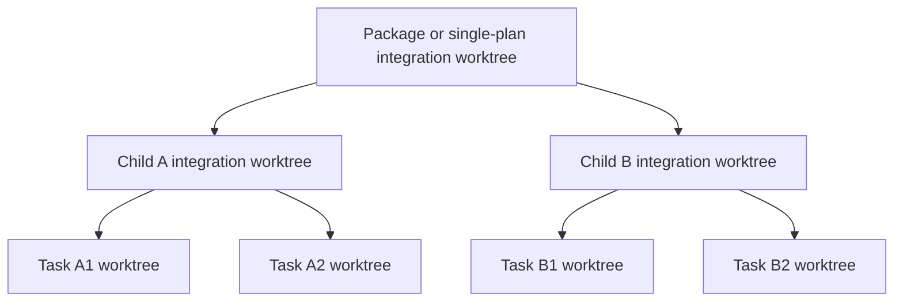

# 用分层 Git worktree 和显式 DAG 构建可审计的并行 subagent executor

Author(s): zhangyukun, Codex
Last updated: 2026-07-14
Status: Draft
Discussion: 当前对话
Source requirements: `.loopx/intake/2026-07-14-parallel-subagent-exec/`
Support lenses: architecture-designer, cli-developer

## Abstract / 摘要

我们新增一个手动调用的 `parallel-subagent-exec` skill，在不修改现有
`subagent-exec` 内容和行为的前提下，为显式声明依赖关系的 implementation
plan 提供有界并行执行。新 executor 不让多个 worker 共享写入同一个 worktree，
而是建立 package integration、child-plan integration 和 task worktree 的分层
Git 拓扑；所有 implementer、reviewer、fixer 和 reconciliation worker 仍是 leaf
worker，只有 controller 可以调度、提交、集成、重试、恢复和清理。[D-001][D-005]

`plan-to-exec` 为新计划增加严格、版本化、机器可读的 JSON contract：单 plan
和每个 task 声明 `max_parallel`、`depends_on`、`write_scope` 和
`parallel_safe`；multi-plan overview 另外声明 child plan DAG 和
`can_run_in_parallel`。现有 `exec`、`subagent-exec` 继续忽略这些附加 block，
新 executor 对缺失、未知版本、循环依赖、路径越界或并行写范围冲突 fail fast，
并明确 handoff 到 `$subagent-exec <same-path>`，不做运行时猜测或静默串行降级。
[D-002][D-003][D-015]

第一版保持 skill-first：不增加 public `loopx` CLI command，也不把新 executor
加入 `plan-to-exec` 的推荐策略或自动 resolver 路由。结构化解析、状态 CAS、
worktree 生命周期和 Git 集成由 bundled skill/shared helper scripts 承担；
task review、plan/spec final-review、finish gate 和 installer ownership 继续复用
现有合同。[D-012][D-013][D-014]

## Background / 背景与动机

当前 `subagent-exec` 已经具备成熟的 task brief、implementer report、provenance-bound
task review artifact、Critical/Important fix-review loop 和 final-review/finish gate，
但执行纪律默认保守：implementation tasks 通常顺序运行，multi-plan package 更明确
要求 child plans 严格串行。该设计对共享 worktree 是正确的，因为 task review
package 读取当前 working tree；同时并发写入会混合 diff、破坏 task evidence 身份，
并使冲突恢复依赖完成时序。

仓库中的具体证据：

- `skills/subagent-exec/SKILL.md` 为每个 task 顺序派发 implementer 和 reviewer，
  package mode 按 child plan 严格串行。
- `skills/subagent-exec/codex-subagents.md` 只在写范围明确不相交时允许并行，并要求
  controller 是唯一 orchestration owner。
- `skills/shared/agent-topology.md` 禁止 leaf worker 再派发 agent。
- `skills/subagent-exec/scripts/review-package` 以当前 worktree diff 作为 task review
  evidence，因此共享 worktree 并发无法产生稳定 task scope。
- `skills/plan-to-exec/SKILL.md` 已要求 exact files、Interfaces、`T-*`、AC/D/TC 和
  execution evidence，但 task 内没有显式 DAG contract；multi-plan overview 虽记录
  dependencies 和 parallel capability，当前 package executor 不消费它们。
- `skills/final-review/SKILL.md` 和 `skills/finish/SKILL.md` 已拥有 child plan
  plan-level review、package spec-level review 和一 child plan 一 commit 的 gate。
- `src/install-discovery.mjs`、`package.json`、`skills/RESOLVER.md` 和
  `test/fixtures/skill-contract-matrix.json` 共同定义 bundled skill 的安装和治理面。

问题因此不是简单增加多个 `spawn_agent`，而是增加一个能同时保证并行收益、
task evidence 隔离、commit 审计边界、可恢复状态和确定性冲突处理的新 execution
lane。

## Goals And Non-Goals / 目标与非目标

目标：

- 新增 `$parallel-subagent-exec <path> [--max-parallel N]` 手动入口。[D-001]
- 对显式 task DAG 和 package DAG 做有界并行调度；默认 `max_parallel: 4`，
  invocation override 优先。[D-004]
- 所有可写工作在隔离 worktree 中完成，review 通过前不得集成。[D-005][D-006]
- controller 创建 ephemeral task commit 作为传输身份，但最终历史仍保持 single
  plan 一个 commit、package 每个 child plan 一个 commit。[D-007][D-009]
- 集成顺序、冲突重建、retry 上限和 blocking 行为确定且可审计。[D-008]
- 每次状态转换原子持久化，可严格 resume，不重复已完成节点。[D-010]
- 复用现有 task review、final-review、finish 和 installer contract。[D-012]
- 新 skill 可安装、可发现、可治理，但第一版不自动推荐。[D-013][D-015]

非目标：

- 不修改 `skills/subagent-exec/` 下任何文件或改变其保守行为。
- 不让 leaf worker spawn、delegate、wait for、message 或管理其他 agent。
- 不从 plan prose、`Files` 或 `Interfaces` 临场推断 aggressive parallelism。
- 不为旧 plan 添加 migration 或兼容 parser。
- 不新增 `loopx parallel-exec` 等 public CLI command。
- 不替换 `exec` 或 `subagent-exec` 的默认/推荐地位。
- 不改变 final-review 和 finish 的 review ownership 或 package finish gate。

## Proposal / 设计方案

### 1. 新 execution lane 是 additive skill，不是 `subagent-exec` mode

`parallel-subagent-exec` 拥有自己的 root `SKILL.md`、parallel scheduler/state
references、worktree integration reference、platform adapter references 和 helper
scripts。它可以只读复用 `subagent-exec` 的 task brief、implementer/reviewer prompt、
review result schema 和 model-selection rules，但所有 output path 都显式写入自己的
run workspace，避免污染 `.loopx/subagent-exec/`。[D-001][D-014]

边界：现有 `subagent-exec` skill body、prompts、references 和 scripts 均不修改；
行为回归通过 source hash/negative diff 和原治理测试验证。

### 2. Plan 用严格 JSON fence 声明并行合同

新计划在 header 后包含一个 plan block：

```loopx-parallel-plan
{
  "schema": "loopx.parallel-plan.v1",
  "max_parallel": 4
}
```

每个 task 在 `Files` 之后包含一个 task block：

```loopx-parallel-task
{
  "schema": "loopx.parallel-task.v1",
  "task_anchor": "T-001",
  "depends_on": [],
  "write_scope": ["src/example.mjs", "test/example.test.mjs"],
  "parallel_safe": true
}
```

multi-plan `00-overview.md` 还包含：

```loopx-parallel-package
{
  "schema": "loopx.parallel-package.v1",
  "max_parallel": 4,
  "plans": [
    {
      "path": "docs/loopx/plans/2026-07-14-example/01-core.md",
      "depends_on": [],
      "can_run_in_parallel": true
    }
  ]
}
```

JSON 使用标准 parser；unknown field、unknown schema、重复 block、anchor/path
mismatch、cycle、missing dependency、absolute/traversal path 和 undeclared concurrent
write overlap 都是 validation error。`write_scope` 只接受 normalized repo-relative
exact paths，不接受 glob。package-level write scope 从 child task contract 的显式路径
集合计算，不从 prose 推断。[D-002]

`parallel_safe: false` 是 child integration scope 内的 exclusive barrier；
`can_run_in_parallel: false` 是 package scope 内的 exclusive child barrier。

### 3. Preflight 在任何 worker dispatch 前完成

controller 先完成：输入分类、JSON contract 解析、DAG 验证、write-scope 冲突检查、
runtime subagent capability、Git/worktree capability、worktree root ignore 检查、
baseline identity、required startup 和 run-state identity。[D-003][D-011]

缺少/非法 parallel metadata 时不运行 `execution-start`、不创建 worktree、不派发
worker，输出具体错误和：

```text
$subagent-exec <same-path>
```

Git baseline 使用当前 `HEAD`。tracked staged/unstaged code changes 会阻塞新 executor。
未提交的 source plan、overview、child plan 和 design artifact 可以作为只读、hash-bound
input 使用，因为 `plan-to-exec` 的正常 handoff 不要求先提交计划；其他 untracked path
只有在与 declared `write_scope` 冲突时才阻塞，否则记录为 invoking-worktree evidence
且永不修改。[D-003][D-017]

### 4. Scheduler 是 controller-owned fan-out/fan-in pipeline

有效 worker 上限：

```text
min(invocation override ?? plan/package max_parallel,
    runtime available worker capacity,
    currently ready worker stages)
```

controller 不计入 `max_parallel`；所有 implementer、reviewer、fixer、final reviewer
和 reconciliation worker 计入。runtime 不提供容量查询时，adapter 在 configured cap
内尝试 reservation；capacity-exhausted 只产生 backpressure，节点回到 ready/waiting，
不增加 task retry 次数。[D-004][D-011]

worker stage priority：reconciliation/fix > task review/plan review > new implementer。
controller-side integration 和 state persistence 不占 worker slot，并串行执行。
task dependency 只有在 predecessor 已 integrated 到相同 child/plan integration scope
后才满足；child dependency 只有在 predecessor boundary commit 已 integrated 到 package
scope 后才满足。[D-004][D-006]

### 5. 分层 worktree 保证 evidence 和 commit 边界



single plan 只有 root integration worktree 和 task worktrees。package 中，满足 DAG
条件的 child integration worktree 从当前 package integration HEAD 创建；child task
worktree 从该 child 当前 integration state 创建。worktree root 固定在 primary Git
worktree 的 `.worktrees/parallel-subagent-exec/<run-id>/`，preflight 必须证明该目录
被 Git ignore；executor 不自动修改 `.gitignore`。[D-005][D-017]

task 流水线保持在同一 task worktree：implement -> review -> fix/re-review。
review package、report 和 provenance artifact 使用绝对 output path 保存到 central run
workspace。review clean 后 controller 才 `git add --all` 并创建 ephemeral task commit；
worker 永不 stage 或 commit。[D-006][D-007]

### 6. Task integration 无 task commit，且冲突恢复有界

controller 将 reviewed ephemeral task commit 以 `cherry-pick --no-commit` 应用到
child/single-plan integration worktree。每次 apply 前用 `git write-tree` 保存当前
accumulated index tree；失败时只在 executor-owned worktree 中恢复该 tree，保证已集成
task 不丢失。多个 ready task 按 topological level、child path、task anchor 排序，
完成时序不改变 integration 结果。[D-007][D-008]

冲突后 controller 收集 conflicting paths/hunks，恢复 integration worktree，从最新
integration HEAD/state 创建 fresh retry worktree，并给 reconciliation worker 原 task
brief、reviewed commit diff 和 conflict evidence。worker 重新实现 task，不提交；随后
完整 verification + task review。最多两次 reconciliation，仍失败则 block 该 DAG
路径，保留 evidence/worktrees；无依赖且 write scope 不重叠的其他路径继续。[D-008]

### 7. Package 使用 child boundary commit 做第二级 fan-in

child 所有 task 集成后，在 child integration worktree 运行 plan-level final-review。
controller 为该 child 提供本地 package state snapshot；review 只更新该 snapshot 的
matching row。通过后 controller 创建唯一 child boundary commit，将 verified row
复制进 package integration state，再按 package DAG 顺序 cherry-pick child commit。
[D-009][D-012]

child commit 冲突时，controller 从最新 package HEAD 重建 child integration
worktree，按原 deterministic task order 重放 reviewed task commits；冲突部分走 child
reconciliation，运行受影响 verification，并重新执行 plan-level final-review，生成
replacement boundary commit。全部 child commits 集成后，package integration
worktree 运行唯一 spec-level final-review，然后 handoff 到 `finish`。[D-008][D-009]

### 8. Run state 是严格版本化的 CAS snapshot

central workspace：

```text
.loopx/parallel-subagent-exec/<run-id>/
├── .gitignore
├── manifest.json
├── state.json
├── reports/
├── reviews/
├── conflicts/
└── completion.json
```

`state.json` 使用 `loopx.parallel-exec-state.v1`，记录 input/source hashes、baseline、
integration heads、revision、config、task/child state、agent identity、worktree/branch、
artifact paths、ephemeral commits 和 attempts。所有 mutation 使用 same-directory temp
file + rename，并要求 `expected_revision`；dispatch 前先持久化 reservation，避免重复
controller 派发同一节点。[D-010]

resume 重新验证 repo root、input hash、baseline、integration heads、branch/worktree
identity 和 state schema。已完成节点不重跑；仍可观察的 agent 继续等待；已明确中断
且无可信 terminal result 的 worker 按 interrupted replacement 规则恢复。任何无法证明
的 identity mismatch fail fast，不猜测、不 normalize。[D-010][D-011]

成功后清理 task/retry/child worktrees 和 temp branches，保留 root integration
worktree 给 final-review/finish，并保留 reports 与 compact `completion.json`。blocked 或
中断时保留完整状态和相关 worktrees。[D-016]

### 9. Skill-first integration，不新增 public CLI

新 skill 的 user surface 只有：

```text
$parallel-subagent-exec <plan-or-package-path>
$parallel-subagent-exec <plan-or-package-path> --max-parallel 6
```

第一 positional 必须是合法 single plan、package directory 或 `00-overview.md`；
numbered direct child plan 在第一版明确拒绝并 handoff 到现有 `subagent-exec`，因为其
targeted commit/state 无法在不写 invoking branch 的情况下证明已进入 package HEAD。
`--max-parallel` 必须是正整数。无 prompts、无 mode inference、无 public `--json`。
内部 helper scripts 使用 JSON stdout、diagnostics stderr 和稳定 exit codes，供
controller 自动化消费。[D-014]

bundled install 增加 skill source、package files 和 semantic matrix entry；resolver
只增加 manual/experimental discovery row，默认 flow、preferred surface、next-skill、
`plan-to-exec` recommendation 和现有 handoff 示例保持不变。[D-013][D-015]

## Support Lens Checks / 专项设计检查

| Support lens | Trigger | Design checks applied | Result |
|---|---|---|---|
| architecture-designer | 新 scheduler、状态机、worktree ownership、失败恢复、资源上限 | 单一 owner、fan-out/fan-in 边界、CAS state、failure blast radius、cleanup、NFR | 选择 controller-owned hierarchical worktrees；失败隔离到 DAG path |
| cli-developer | 新 skill invocation 和 internal helper flags/errors | 显式 positional/flag、无 prompt、stdout/stderr、exit code、路径兼容、SIGINT/resume | 不新增 public loopx command；internal helpers 只输出 machine JSON |

## Boundary Scenarios / 边界场景

| 场景 | 设计行为 |
|---|---|
| 缺失、重复或 unknown-version metadata | dispatch 前拒绝，列出 block/path，handoff 到同路径 `subagent-exec` |
| task/package DAG cycle 或 missing dependency | validation error；不创建 run |
| 两个并行节点声明重叠 exact write scope 且无 dependency | metadata invalid；不通过“靠 Git 冲突发现”继续 |
| `parallel_safe: false` | 在本 child/single-plan integration scope 中作为 exclusive barrier |
| `can_run_in_parallel: false` | 在 package scope 中作为 exclusive child barrier |
| runtime worker slots 少于请求值 | backpressure；不计为 task failure，不启动 replacement storm |
| worker 超时但仍可观察为 running | 保持原 worker；不重复派发 |
| controller/会话中断 | state 已在 dispatch/transition 前持久化；严格 identity validation 后 resume |
| 同一输入重复调用 | deterministic run identity 定位 active run；CAS reservation 防止 duplicate dispatch |
| task review 有 Critical/Important | 同 task worktree fix/re-review；不 integration |
| task integration conflict | fresh reconciliation，最多两次；dependent path blocked |
| child boundary integration conflict | 从最新 package HEAD rebuild child，并重新 plan-level review |
| plan-level review 更新 state | child 本地 snapshot，controller 验证后串行合并 matching row |
| spec-level review 或 finish gate 不通过 | 保留 root integration worktree 和 run evidence；不清理为 complete |
| tracked invoking worktree code dirty | fail fast，避免 baseline 丢失用户变化 |
| uncommitted source plan/design | 允许只读使用，记录 canonical path 和 hash，不复制进 Git baseline |
| unrelated untracked files | 记录但不修改；与 declared write scope overlap 时阻塞 |
| worktree root 未 ignore 或权限不足 | preflight fail；不自动改 `.gitignore`、不降级共享 worktree |
| path traversal、absolute path、symlink escape | schema/path validation 拒绝 |
| SIGINT | controller 停止新 dispatch，持久化 interrupted 状态，保留 active evidence |
| legacy plan | 不迁移、不推断、不静默串行；明确使用现有 executor |
| numbered direct child plan | 第一版拒绝并使用现有 `subagent-exec` targeted mode |
| existing `subagent-exec` invocation | 内容、prompt、scripts、package behavior 全部保持不变 |
| 权限/认证/多租户 | 不涉及；该功能只操作当前用户有权限的本地 repo 和 agent runtime |

## Rationale / 理由与取舍

| Alternative | Why Not |
|---|---|
| 给 `subagent-exec` 增加 parallel mode | 会改变已稳定的保守合同，增加同一入口的行为不确定性，违反明确非目标 |
| 多 worker 共享主 worktree | task diff、review provenance 和冲突身份不可隔离，完成顺序会影响结果 |
| 只给每个 task 建平面 worktree | 无法自然保留 child plan 的 plan-level review 和一 child 一 commit |
| 从 `Files`/`Interfaces`/prose 推断 DAG | semantic dependency 无法可靠推断；aggressive executor 不能把模型猜测当 gate |
| 使用 task-level formal commits | 会改变已批准的 final history 和 finish audit boundary |
| 在 integration branch 保存 task checkpoint commits 后 squash | 虽便于 Git merge，但增加 rewrite/cleanup 复杂度；index tree snapshot 足够恢复 no-commit fan-in |
| 新增 `loopx parallel-exec` CLI command | 现有产品是 skill-first；CLI runtime 不负责 agent orchestration，新增 command 会制造空壳或重复 owner |
| 自动把新 skill 纳入 plan recommendation | 用户要求先手动验证；初版只做 additive metadata 和 explicit invocation |
| 旧 plan 静默降级到 serial | 调用者无法判断是否真的并行，测试结果也会掩盖 metadata 缺口 |

## Compatibility / 兼容性

该提案对现有 executor 是 additive、对新 executor 是 strict-current contract：

- Existing callers：`$exec`、`$subagent-exec` 和 current package mode 行为不变。
- Plan format：新增 JSON fences；现有 Markdown readers 和 task brief extractor 会把它们当普通
  task/header 内容保留，不要求旧 executor 消费。
- Legacy plans：继续可由现有 executor 执行；新 skill 明确拒绝。
- CLI：不新增或修改 `loopx` public command、stdout/JSON schema 或 exit code。
- Install/plugin：bundled list/package files/lock ownership additive；plugin 继续从 canonical
  root `skills/` 安装，不创建 plugin skill payload mirror。
- Runtime state：新 schema 写入独立 `.loopx/parallel-subagent-exec/`；不迁移或读取为
  `subagent-exec` state。
- Rollback：移除新 skill/bundled entry 和 additive plan metadata rules 即可；现有 plan 中的
  JSON fences 对旧 executor 无行为影响。

## Operational And Security Impact / 运行与安全影响

- 资源：默认最多 4 个 leaf workers；worktree 数量随 active/blocked task 增长，review/fix
  priority 和成功后清理限制积压。
- 可靠性：状态 mutation 先于 dependent action，CAS revision 防 duplicate controller；
  integration 由单 controller 串行化。
- 恢复：blocked/interrupted 保留 worktree、branches、reports 和 state；identity mismatch
  不自动修复。
- Git 安全：所有 destructive recovery 仅允许作用于 executor-owned worktree/branches；
  invoking checkout 永不被 reset、clean、checkout 或写入。
- 路径安全：所有 plan/write/worktree path 使用 Node path APIs 和 `execFile` 参数数组；
  禁止 shell interpolation、absolute write scope 和 `..` escape。
- 数据：state/report 可能包含本地路径、diff 和 agent IDs，文件 mode 使用 owner-only；
  不新增网络传输、凭证存储或遥测。
- 可观测性：human summary 报告 run id、active/ready/blocked counts、integration head、
  preserved paths 和 next action；internal helpers 输出结构化 JSON。

## Implementation And Transition / 实现与过渡

落地顺序必须先建立 versioned plan contract 和 validator，再建立 state/worktree helper，
最后接入 skill orchestration、installer/governance/docs。`plan-to-exec` 只在 validator
存在且 plan review 能验证 DAG 后才开始生成 metadata。新 executor 完成前不得在公开
文档中承诺可用；完成后仍标记 manual/experimental，不改变现有 recommendation。

现有 `subagent-exec` 不参与迁移。发布回滚只撤销 additive surfaces；已经 blocked 的
`.loopx/parallel-subagent-exec/` state 保留为诊断记录，不由旧版本读取。

## Open Questions / 待决问题

无阻塞问题。exact helper file split、测试 fixture 组织和文档段落位置可由
`plan-to-exec` 决定，但不得改变 proposal 中的 schema、state、worktree、review、
compatibility 或 routing 决策。

## Detailed Design Handoff / 详细设计交接

立即编写详细设计。详细设计必须把以下内容视为固定约束：

- additive manual `parallel-subagent-exec`；不修改 `skills/subagent-exec/`。
- strict versioned JSON plan/package/task contract；legacy fail-fast handoff。
- global bounded scheduler、leaf workers、review/fix priority。
- hierarchical worktrees、ephemeral task commits、formal plan/child commits。
- deterministic integration 和最多两次 reconciliation。
- CAS persisted state、strict resume、success cleanup/block preservation。
- 不新增 public loopx CLI，不自动 recommendation/routing。

## Appendix / 附录

- Canonical requirements: `.loopx/intake/2026-07-14-parallel-subagent-exec/requirements.md`
- Supporting clarification: `.loopx/intake/2026-07-14-parallel-subagent-exec/clarification.md`
- Existing conservative executor: `skills/subagent-exec/`
- Existing review ownership: `skills/shared/review-contract.md`
- Existing install contract: `docs/loopx/specs/installation.md`
