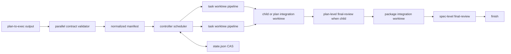
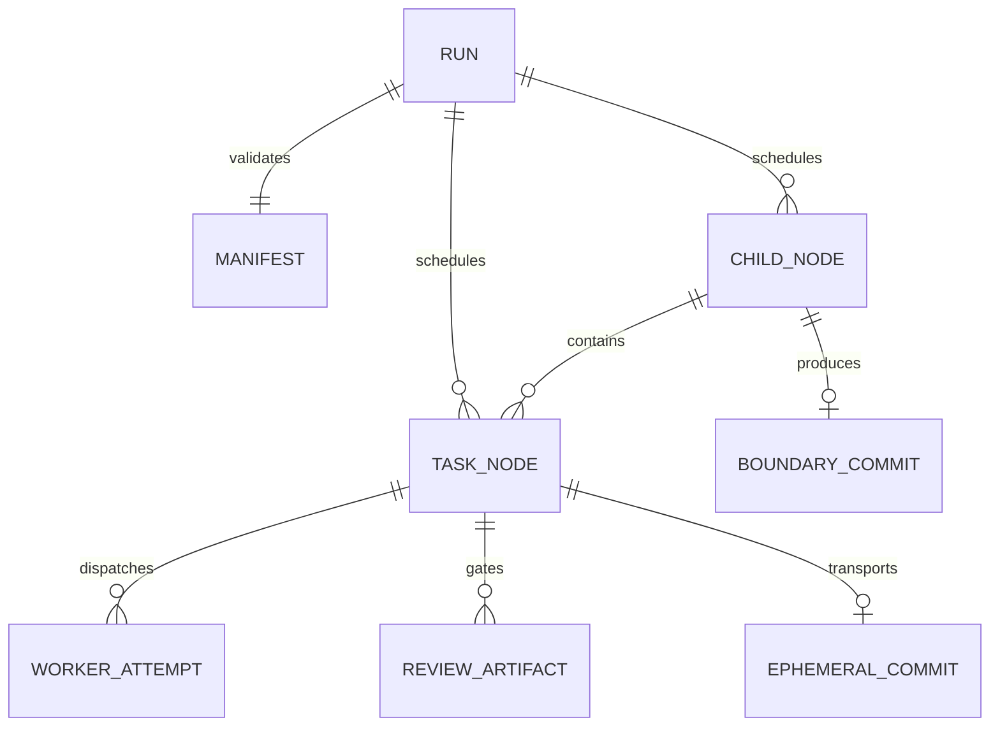

# parallel-subagent-exec 设计文档

> 本文详细化同目录 `设计提案.md`。提案中已选定的 additive skill、显式 DAG、
> 分层 worktree、controller-only integration、严格恢复和 manual opt-in 均为固定约束。

## 一、修订历史

| 版本号 | 修订内容 | 修订时间 | 修订人 |
|---|---|---|---|
| V1.0.0 | 新增并行 subagent executor 的详细设计 | 2026-07-14 | zhangyukun, Codex |

## 二、需求信息

### 2.1 需求背景

- 背景：现有 `subagent-exec` 在 task 内有成熟的 implement/review/fix gate，但默认顺序执行，multi-plan package 也严格串行。
- 需求目的：在不改变现有保守 executor 的前提下，为显式声明依赖的 plan 提供更积极、可恢复、可审计的并行执行 lane。
- 目标用户/使用方：手动试验并行执行的 loopx maintainers 和 Codex/Claude-style controller。
- 需求链接：当前对话。
- 关联原始材料：`.loopx/intake/2026-07-14-parallel-subagent-exec/requirements.md`；同目录 `设计提案.md`。
- Intake package contract：`requirements.md` 是 canonical `AC-*` / `TC-*` 来源；`clarification.md` 仅提供用户原话和决策过程。

### 2.2 需求范围

- 本期范围：新增 `parallel-subagent-exec` bundled skill；新增 plan/package/task parallel metadata；新增 validator、scheduler state 和 worktree helper；接入安装、治理和公开 discoverability。
- 非目标：修改 `skills/subagent-exec/`；自动 recommendation/routing；新增 public `loopx` command；迁移 legacy plans/state；共享可写 worktree；nested subagent delegation。
- 决策边界：新 executor 只消费 strict current metadata；旧 plan 明确 handoff 到 `$subagent-exec`。
- 依赖方：Git worktree/cherry-pick/write-tree、Node.js ESM/stdlib、agent runtime subagent tools、现有 task review/final-review/finish contracts。
- 约束条件：所有 leaf roles 共用 bounded worker budget；controller 是唯一调度和 Git integration owner；最终 commit/review gate 保持现有边界。
- 触发的辅助 skills：architecture-designer、cli-developer。

### 2.3 可行性分析

- 业务可行性：用户明确要求 manual experimental lane，并接受 strict metadata 和 fail-fast legacy behavior。
- 技术可行性：repo 已有 task brief、review artifact、multi-plan state、final-review、finish 和 bundled installer，可复用而不修改 `subagent-exec`。
- 团队接受能力：新入口独立且不自动推荐；失败保留证据，风险不会扩散到默认 lane。
- 时间成本：中高；复杂度集中在 DAG validator、state CAS、Git worktree/integration helper 和 runtime adapter。
- 资源成本：无新 npm dependency；默认最多 4 个 leaf workers，但会增加本地 worktree、模型调用和磁盘开销。
- 替代方案：修改现有 skill、共享 worktree、runtime 推断 DAG、新 public CLI 均已在提案中拒绝。
- 关键风险：metadata 错误、agent capacity 不可查询、Git conflict、controller interruption、child review state 并发写入。

## 三、概要设计

### 3.1 方案总述

- 设计目标：并行收益必须建立在显式依赖、写隔离、task review 和可恢复状态之上。
- 总体思路：plan JSON contract -> normalized manifest -> controller scheduler -> isolated worker pipeline -> deterministic fan-in -> existing final-review/finish。
- 核心模块：parallel plan contract、scheduler/runtime adapter、hierarchical worktree manager、task review adapter、run state store、package final-review adapter、installer/governance surface。
- 主要难点：保持 no-task-commit final history；在 accumulated no-commit integration state 上安全恢复冲突；并行 child review 不竞争同一个 state file。
- 技术指标：active leaf workers 不超过有效预算；duplicate dispatch 为 0；成功后临时 task commit 不出现在最终 branch history；所有 34 个 AC 和 29 个 TC 可追踪。

### 3.2 整体架构设计

- 业务模式：skill-first local workflow orchestration。
- 系统边界：skill/controller 管 agent lifecycle；Node helpers 管结构化 validation/state/Git；worker 只在指定 worktree 完成一个 leaf role。
- 上下游系统：上游是 `plan-to-exec` 生成的 plan/package；下游是 task review、plan/spec final-review 和 `finish`。
- 应用架构：bundled Markdown skill + shared versioned JSON contract + skill-local Node helper + existing review/final-review skills。
- 技术架构：Node.js ESM、`node:fs/promises`、`node:path`、`node:child_process.execFile`、Git CLI、JSON snapshot。
- 数据流转：AC/TC/D -> plan parallel blocks -> manifest -> run state -> reports/reviews/conflicts -> boundary commits -> final-review/finish。



### 3.3 核心流程设计

| 流程 | 触发条件 | 参与系统/模块 | 主流程 | 异常/补偿 | 输出 |
|---|---|---|---|---|---|
| Preflight | 手动调用新 skill | classifier, validator, Git/runtime checks | parse -> validate -> startup -> init run | metadata/identity/capability 失败即停止 | manifest + run state |
| Task pipeline | task DAG node ready | scheduler, implementer, reviewer, fixer | worktree -> implement -> review -> fix/re-review | BLOCKED/NEEDS_CONTEXT 按既有 retry rules | reviewed ephemeral task commit |
| Task fan-in | reviewed task integration-ready | controller, Git helper | deterministic queue -> no-commit apply | conflict -> fresh reconciliation, max 2 | accumulated child/plan state |
| Child fan-in | child tasks integrated | plan-level final-review, controller | review snapshot -> child boundary commit -> package cherry-pick | conflict -> rebuild child + re-review | integrated child commit/state row |
| Package completion | all child commits integrated | spec-level final-review, finish | package review -> finish gate | findings 保留 root worktree/state | finish-ready worktree |
| Resume | same input active run | state verifier, runtime adapter, Git helper | validate identities -> continue active/ready nodes | mismatch fail fast | resumed scheduler |

### 3.4 功能模块

| 模块 | 职责 | 关键功能 | 依赖 | 备注 |
|---|---|---|---|---|
| Parallel Plan Contract | 机器可读 source contract | parse、schema、DAG/path/write overlap validation | plan Markdown | shared owner |
| Scheduler | ready queue 与 worker budget | priority、reservation、backpressure、fan-out/fan-in | manifest/state/runtime adapter | controller-owned |
| Runtime Adapter | 平台 agent 生命周期 | capacity、spawn、observe、wait、close | Codex/Claude/Cursor native tools | leaf clause mandatory |
| Worktree Manager | 隔离和 Git integration | create、verify、snapshot tree、ephemeral commit、apply、cleanup | Git CLI | 只操作 owned refs/paths |
| Review Adapter | task gate | brief/report/package/result artifact | existing subagent-exec scripts | explicit output path |
| Run State Store | durable resume source | atomic CAS snapshot、identity verification | local JSON | no normalization |
| Package Adapter | child review/state merge | local snapshot、row validation、boundary commit | final-review/multi-plan v2 | controller serializes rows |
| Governance/Install | discoverability | bundled list、package files、resolver manual row、matrix/docs | existing installer/verifier | no auto routing |

### 3.5 新增/调整功能说明

新增 `$parallel-subagent-exec`；`plan-to-exec` 输出 additive JSON fences；
`plan-reviewer`/validator 检查并行合同。现有 `exec`/`subagent-exec` recommendation、
workflow default flow、next-skill 和 package mode 不变。

### 3.6 专项设计检查

| 辅助 skill | 触发原因 | 检查内容 | 设计结论 |
|---|---|---|---|
| architecture-designer | scheduler/state/worktree/recovery 边界 | owner、NFR、failure modes、blast radius、cleanup | controller 单 owner；state CAS；失败隔离到 DAG path |
| cli-developer | skill args 和 internal helper interface | explicit flags、non-interactive、stdout/stderr、exit code、SIGINT | 无 public CLI；helpers JSON stdout、diagnostic stderr |

## 四、详细设计

### 4.1 Parallel Plan Contract 详细设计

#### 4.1.1 需求内容

- 入口：single plan、package directory 或 `00-overview.md`。
- 操作人/调用方：`plan-to-exec` writer、plan reviewer、新 executor preflight。
- 前置条件：plan 使用 current `T-*` task structure。
- 输出结果：严格验证的 normalized execution manifest。

#### 4.1.2 方案设计

**Workflow/Data Contract `D-002`（Source `AC-010`, `AC-011`, `AC-012`）：**
使用三个严格 JSON fence schema：

```loopx-parallel-plan
{"schema":"loopx.parallel-plan.v1","max_parallel":4}
```

```loopx-parallel-task
{
  "schema":"loopx.parallel-task.v1",
  "task_anchor":"T-001",
  "depends_on":[],
  "write_scope":["src/example.mjs","test/example.test.mjs"],
  "parallel_safe":true
}
```

```loopx-parallel-package
{
  "schema":"loopx.parallel-package.v1",
  "max_parallel":4,
  "plans":[
    {"path":"docs/loopx/plans/2026-07-14-example/01-core.md","depends_on":[],"can_run_in_parallel":true}
  ]
}
```

字段规则：

| Schema | 字段 | 规则 |
|---|---|---|
| plan | `schema` | exact `loopx.parallel-plan.v1` |
| plan | `max_parallel` | integer, `>= 1` |
| task | `task_anchor` | exact match heading `T-*` |
| task | `depends_on` | unique same-plan `T-*`; no self/missing/cycle |
| task | `write_scope` | non-empty unique normalized repo-relative exact paths; no glob/absolute/`..` |
| task | `parallel_safe` | boolean；false 为 integration-scope exclusive barrier |
| package | `plans[].path` | unique overview-listed canonical child path |
| package | `plans[].depends_on` | qualified child paths；no self/missing/cycle |
| package | `plans[].can_run_in_parallel` | boolean；false 为 package-scope exclusive barrier |

Unknown field、重复 fence、缺失 fence、非法 JSON 和 unknown schema 均拒绝。
package concurrent child write overlap 由 child task `write_scope` 的显式 union 计算；
不读取 prose 作为 dependency/write source。两个可能同 frontier 的节点 write scope overlap
且没有依赖边时，manifest invalid。

schema 的 normative prose 位于 `skills/shared/parallel-plan-contract.md`；parser/validator
位于 `skills/shared/scripts/parallel-plan-contract.mjs`，同时导出 pure functions 并提供
JSON CLI。`plan-to-exec`、`plan-reviewer` 和新 executor 必须消费这一份 shared owner，
不得各自复制 parser 或 validation rules。

**Workflow Contract `D-015`（Source `AC-010`, `AC-023`）：**
`plan-to-exec` 对所有新 plan 生成这些 block，并继续只写
`Execution strategy recommendation: subagent-exec | exec`。`plan-reviewer` 验证
metadata 与 Files/Interfaces 的一致性，但不推荐新 executor。

#### 4.1.3 流程步骤

1. 分类 input scope 并解析 overview/child/task headings。
2. 提取 exact fenced block，使用 `JSON.parse`。
3. 校验 schema、field set、path、anchor、dependency references。
4. 对 task DAG 和 package DAG 做 cycle/topological validation。
5. 计算 structured write-scope union 并检查 concurrent overlap。
6. 写出 `loopx.parallel-exec-manifest.v1` 到 run workspace。

#### 4.1.4 边界条件

| 场景 | 处理方式 | 用户/调用方感知 | 监控/告警 |
|---|---|---|---|
| legacy plan | zero dispatch，输出 missing block 和 fallback invocation | 明确改用 `subagent-exec` | preflight report |
| cycle/missing dependency | validation error | 列出 node/edge | stderr/state not created |
| path traversal/symlink escape | reject | 列出非法 path | validator error code |
| structured write overlap | reject metadata | 要求 plan 增加 dependency 或拆 scope | plan review finding |

#### 4.1.5 不变行为

现有 task heading、Files、Interfaces、AC/D/TC、Expected execution evidence 和
`subagent-exec` task brief extraction保持不变；JSON block 是 additive Markdown content。

### 4.2 Preflight、Scheduler 与 Runtime Adapter 详细设计

#### 4.2.1 需求内容

- 入口：validated manifest 和 optional `--max-parallel N`。
- 调用方：top-level controller。
- 前置条件：subagent create + observe/wait capability、Git worktree capability。
- 输出结果：bounded ready queue 和 worker reservations。

#### 4.2.2 方案设计

**Behavior/CLI Contract `D-003`（Source `AC-012`, `AC-032`）：**
任何 worker dispatch 前完成 metadata、Git、runtime、baseline 和 state identity preflight。
`--max-parallel` 只接受正整数；非法参数、缺失 capability、tracked dirty code baseline、
worktree root 未 ignore 或 state mismatch 均 fail fast，不启动 fallback executor。

**Workflow Contract `D-004`（Source `AC-002`, `AC-013`, `AC-014`, `AC-017`）：**
global active leaf count 受以下值约束：

```text
effective_limit = min(configured_limit, runtime_worker_capacity, ready_worker_stages)
configured_limit = invocation_override ?? input.max_parallel ?? 4
```

所有 implementer、reviewer、fixer、plan/spec reviewer、reconciliation worker 计数；
controller integration/state operations 不计数。队列优先级：reconciliation/fix、task/plan
review、new implementation。相同优先级按 topological level、plan path、task anchor 排序。

**Operational Contract `D-011`（Source `AC-013`, `AC-014`, `AC-031`）：**
platform adapter 至少暴露 `spawn` 和 `observe_or_wait`；capacity/inspect/message/close
为 optional。capacity known 时直接计算；unknown 时先原子 reserve，再尝试 spawn。
明确的 capacity-exhausted 将 reservation 转为 `capacity_wait`，不增加 attempts、不视为 failure。

所有 worker prompt 必须直接包含 shared leaf clause。新 executor 是 owning workflow，
显式允许 bounded parallel writable work，但只限不同 owned worktrees；不放宽 nested delegation。

#### 4.2.3 流程步骤

1. 读取 manifest 和 active run state。
2. controller 先处理已完成 worker result 和 integration queue。
3. 从 priority queue 选 ready stage，以 expected revision 原子写入 `dispatch_reserved`。
4. 调用 platform spawn；成功后记录 agent identity，capacity shortage 则回到 wait。
5. meaningful wait 后重新 observe；不形成 unbounded polling/replacement loop。

#### 4.2.4 边界条件

| 场景 | 处理方式 | 用户/调用方感知 | 监控/告警 |
|---|---|---|---|
| slot 不足 | backpressure | ready/active counts | state status |
| worker 仍 running | 保持同 agent | 无 replacement | agent record |
| worker 明确 interrupted/missing | 按 persisted worktree/report 选择 safe replacement 或 block | 记录原因 | attempts/history |
| duplicate controller reservation | CAS loser fail `state_revision_conflict` | 要求 reload/resume | stderr |

#### 4.2.5 不变行为

existing controller-only agent ownership、model explicit selection、task status 和
review severity semantics保持不变。

### 4.3 Worktree 与 Task Pipeline 详细设计

#### 4.3.1 需求内容

- 入口：ready task 或 ready child plan。
- 调用方：controller 和 leaf task roles。
- 前置条件：clean tracked baseline、ignored worktree root、valid write scope。
- 输出结果：reviewed task change 和 ephemeral commit。

#### 4.3.2 方案设计

**Architecture Contract `D-005`（Source `AC-004`, `AC-025`）：**
worktree root 为 primary Git worktree 下已 ignored 的
`.worktrees/parallel-subagent-exec/<run-id>/`。如果当前 checkout 本身是 linked
worktree，helper 通过 `git worktree list --porcelain` 定位 primary root；禁止在当前
linked worktree 内创建 nested worktree。目录未 ignore 时停止，不自动编辑 `.gitignore`。

分支命名使用 sanitized/truncated id + hash：

```text
loopx/parallel/<run-id>/root
loopx/parallel/<run-id>/child/<child-id>
loopx/parallel/<run-id>/task/<qualified-task-id>/a<attempt>
loopx/parallel/<run-id>/retry/<qualified-task-id>/r<attempt>
```

**Workflow Contract `D-006`（Source `AC-003`, `AC-015`, `AC-016`, `AC-017`）：**
同一 task worktree 内完成 implement -> task review -> fix/re-review。task reviewer 读取
该 worktree 的 brief、report、review package 和 provenance artifact；Critical/Important
通过既有 fix-review discipline 关闭。review 未 clean 前不得 integration。

新 skill 只读复用 sibling `subagent-exec` helper/prompt contract：

- `task-brief PLAN N OUTFILE`
- `review-package --worktree T-* OUTFILE`
- `review-result ... OUTFILE`
- `review-artifact-verify ...`

所有 OUTFILE 是 central run workspace 的 absolute path，禁止使用这些脚本的
`.loopx/subagent-exec/` default output。

**Git/Workflow Contract `D-007`（Source `AC-018`, `AC-019`, `AC-020`）：**
worker 不 stage/commit。clean review 后 controller 验证 changed files 属于 declared
`write_scope`，运行 `git add --all` 并在 task branch 创建 ephemeral commit。该 commit
只作为 diff/three-way identity；integration worktree 通过 `cherry-pick --no-commit`
累积变更，最终 branch history 不出现 task commit。

**Safety Contract `D-017`（Source `AC-004`, `AC-032`, `AC-034`）：**
invoking checkout 永不执行 reset/clean/checkout/write。tracked staged/unstaged code
changes 阻塞 preflight。未提交的 source plan、overview、child plan 和 design artifact
允许只读使用，并通过 canonical path + sha256 绑定到 manifest；它们不进入 Git baseline。
其他 untracked files 记录，只有与 declared write scope overlap 时阻塞。Git helper 只接受
state 中登记的 owned worktree/ref，任何 ownership mismatch 拒绝。

#### 4.3.3 流程步骤

1. 从当前 integration tree 创建 task branch/worktree 并持久化 identity。
2. implementer 读取 brief，写 report，返回 terminal status。
3. controller 生成 review package，派发 reviewer，验证 canonical artifact。
4. blocking finding 时在同 worktree fix/re-review。
5. review clean 后 controller 校验 scope，创建 ephemeral commit，加入 integration queue。

#### 4.3.4 边界条件

| 场景 | 处理方式 | 用户/调用方感知 | 监控/告警 |
|---|---|---|---|
| worker 改了 scope 外文件 | block task，不 commit | report changed paths | state finding |
| reviewer artifact stale | NEEDS_CONTEXT，重建 package/review | 明确 artifact mismatch | verifier error |
| worker 写入 untracked file | 纳入 changed scope 校验和 ephemeral commit | 正常或 scope violation | report |
| permission/worktree create failure | block node；不共享主 worktree降级 | concrete Git error | state error |

#### 4.3.5 不变行为

task report schema、review-result v1、Critical/Important gate、worker leaf clause 和
最终 plan-boundary commit policy保持不变。

### 4.4 Deterministic Integration 与 Reconciliation 详细设计

#### 4.4.1 需求内容

- 入口：一个或多个 reviewed ephemeral task commits。
- 调用方：controller Git helper。
- 前置条件：target integration worktree ownership 和 current tree identity 已验证。
- 输出结果：确定性的 accumulated integration state，或 bounded blocked path。

#### 4.4.2 方案设计

**Operational Contract `D-008`（Source `AC-005`, `AC-021`, `AC-022`）：**
integration queue 固定按 topological level、child path、task anchor 排序。每次
`cherry-pick --no-commit` 前记录：current HEAD、`git write-tree` 输出、index status 和
task commit。成功后 persisted node -> `integrated`；失败后 helper 恢复 saved tree，
保证已累计 task changes 不丢失。

reconciliation 不在冲突 index 上让 worker commit。controller 收集 failed apply 的
paths/hunks 后恢复 target，创建 fresh retry worktree（base 为最新 integration tree），
传入 task brief、original reviewed commit diff 和 conflict evidence。worker 重新实现，
随后执行完整 task verification + task review；controller 创建 replacement ephemeral
commit。最多 2 次 reconciliation，之后 node 和 dependents blocked；independent,
non-overlapping branch 可继续。

#### 4.4.3 流程步骤

1. CAS reserve integration node，记录 pre-apply tree。
2. controller `cherry-pick --no-commit`。
3. 成功则持久化 integrated；失败则收集 evidence、恢复 tree、持久化 conflict。
4. 创建 retry worktree，派发 reconciliation worker，再走完整 review pipeline。
5. replacement commit 重入 deterministic queue；超过上限则 block path。

#### 4.4.4 边界条件

| 场景 | 处理方式 | 用户/调用方感知 | 监控/告警 |
|---|---|---|---|
| conflict cleanup 不能恢复 tree | run-level BLOCKED，保留所有 worktree | high-severity Git error | state/error report |
| reconciliation review 不通过 | 计入 reconciliation attempt | finding summary | review artifact |
| independent branch 完成 | 允许继续到其可用边界 | partial progress | DAG counts |
| dependency branch blocked | descendants 保持 blocked-by-dependency | blocker chain | state graph |

#### 4.4.5 不变行为

不修改用户 checkout，不用 task-level formal commit，不绕过 task review。

### 4.5 Multi-Plan 两级 Fan-In 与 Final Review 详细设计

#### 4.5.1 需求内容

- 入口：package manifest 和 ready child plans。
- 调用方：controller、plan-level/spec-level final-review、finish。
- 前置条件：package DAG valid，child task metadata valid。
- 输出结果：每 child 一个 reviewed boundary commit，package 一个 spec final review。

#### 4.5.2 方案设计

**Workflow Contract `D-009`（Source `AC-006`, `AC-008`, `AC-009`, `AC-025`,
`AC-026`, `AC-027`, `AC-028`）：**
package root integration worktree 从 baseline HEAD 创建。child 只有在全部 predecessor
boundary commits 已 integrated 后 ready；同 frontier 且 `can_run_in_parallel: true`
的 children 可并行。`false` child 是 package exclusive barrier。

每个 child integration worktree 拥有独立 accumulated task state。task 全部 integrated
后，controller 将 package integration worktree 的 `.loopx/multi-plan/<slug>/state.json`
复制为 child-local snapshot，再运行 plan-level final-review。reviewer 只能修改 matching
row；controller 验证 schema v2、其他 rows byte-equivalent、matching row passed 后，才创建
child boundary commit，并串行合并该 row 到 package state。

child commit 正常 cherry-pick 到 package branch，因此最终 history 保留一 child 一
commit。若冲突，从最新 package HEAD 重建 child，按 deterministic task order 重放
reviewed task commits；受影响 task 走 reconciliation，随后重新跑 affected verification
和完整 plan-level final-review，产生 replacement child commit。

全部 child commits integrated 且 state rows ready 后，在 package root worktree 运行
唯一 spec-level final-review；clean 后调用 `finish`。single plan 则在 root integration
worktree 创建一个 formal plan commit，直接 spec-level final-review/finish。

**Workflow Contract `D-012`（Source `AC-006`, `AC-026`, `AC-028`）：**
复用现有 `execution-start`、`finish-start`、task review、multi-plan schema v2、
final-review 和 finish gate。startup 在 root integration worktree 内、first dispatch 前运行；
source/design 使用 canonical absolute input。root integration worktree 保留到 finish 处理。

#### 4.5.3 流程步骤

1. 创建 package root integration worktree，运行 required startup。
2. 调度 ready child worktrees 和其内部 task DAG。
3. child task fan-in 完成，创建 state snapshot，运行 plan-level review。
4. controller 验证 row、commit child、integrate child commit 和 row。
5. 所有 child ready 后运行 spec-level review，再 handoff finish。

#### 4.5.4 边界条件

| 场景 | 处理方式 | 用户/调用方感知 | 监控/告警 |
|---|---|---|---|
| child review 修改 sibling row | reject review state，NEEDS_CONTEXT | exact row mismatch | controller validation |
| child commit conflict | rebuild/re-review child | retry attempt | conflict artifact |
| plan-level review blocked | child/dependents blocked，siblings 可继续 | state row unchanged | review summary |
| spec-level review blocked | package 不 finish，root worktree保留 | blocking findings | canonical report |

#### 4.5.5 不变行为

multi-plan schema v2 字段、plan-level review 不写 canonical report、spec-level review
唯一 report、finish gate 和 formal commit policy保持不变。

### 4.6 Persistent State、Resume 与 Cleanup 详细设计

#### 4.6.1 需求内容

- 入口：任何 scheduler/worker/review/integration/retry/block transition。
- 调用方：controller 和 internal state helper。
- 前置条件：run workspace 可写。
- 输出结果：可验证的 current snapshot 和 compact completion record。

#### 4.6.2 方案设计

**State Contract `D-010`（Source `AC-030`, `AC-031`, `AC-032`, `AC-033`）：**
run id 为 `<source-slug>-<baseline12>-<source-hash8>`；相同 control worktree、source
content 和 baseline 得到同 id。workspace：

```text
.loopx/parallel-subagent-exec/<run-id>/
  .gitignore
  manifest.json
  state.json
  reports/
  reviews/
  conflicts/
  completion.json
```

`state.json` top-level：

| 字段 | 含义 |
|---|---|
| `schema` | exact `loopx.parallel-exec-state.v1` |
| `revision` | monotonic integer CAS version |
| `run_id`, `status` | run identity；initializing/running/blocked/reviewing/ready_for_finish/complete |
| `input` | kind、canonical path、sha256、design/source paths |
| `repo` | control root、git common dir、baseline HEAD、dirty/untracked evidence |
| `config` | declared/override/effective max、platform、models |
| `root_integration` | worktree、branch、HEAD、index tree、startup artifact paths |
| `tasks` | qualified task node records |
| `children` | child DAG/state/review/boundary commit records |
| `active_workers` | role、agent id、model、node、dispatch attempt、status |
| `updated_at`, `last_error` | audit fields |

task states：`pending -> ready -> dispatch_reserved -> implementing -> awaiting_review ->
reviewing -> needs_fix/fixing -> review_passed -> integration_queued -> integrating ->
integrated`，并允许 `capacity_wait`、`reconciling`、`blocked`。child states：`pending ->
ready -> running -> plan_reviewing -> reviewed -> commit_ready -> integrating -> integrated`，
并允许 `rebuilding`、`blocked`。

mutation 要求 `expected_revision`，same-directory temp file 以 mode `0600` 写入并 rename。
dispatch、cleanup 或 dependent readiness 之前先成功持久化新 revision。state helper 不支持
unknown schema 或 best-effort normalization。

resume 验证 control root、input hash、baseline、manifest hash、worktree path/branch/HEAD、
integration index tree 和 active agent identity。observable running agent 继续等待；明确
interrupted agent 可在记录 terminal interruption 后 replacement。存在 partial diff/report
但无法证明 ownership/result 时 block，不猜测 complete。

**Operational Contract `D-016`（Source `AC-033`）：**
success 清理 task/retry/child worktrees 和 temporary branches，保留 root integration
worktree 给 finish，并写 `completion.json`。blocked/interrupted 保留完整 state、evidence
和相关 worktrees。finish 完成后的 root worktree cleanup 继续由 `finish` ownership 决定。

#### 4.6.3 流程步骤

1. init manifest/state 并写 revision 1。
2. 每个 action 先 CAS transition，再执行 external side effect，再写 result transition。
3. interruption 后重新读 state，严格验证全部 identity。
4. complete 时验证无 active workers、无 pending integration、reviews clean，再清理 owned temp resources。

#### 4.6.4 边界条件

| 场景 | 处理方式 | 用户/调用方感知 | 监控/告警 |
|---|---|---|---|
| stale revision | operation rejected | reload state | exit code 3 |
| state/temp rename failure | 不推进 dependent work | filesystem error | last_error |
| repeated completed invocation | 返回 completion summary，不重跑 | idempotent result | completion.json |
| identity mismatch | zero dispatch，保留 state | concrete mismatch list | verify output |

#### 4.6.5 不变行为

`.loopx` 仍是 gitignored local runtime state；不写 repo-tracked progress artifact。

### 4.7 Install、Resolver、Governance 与 Compatibility 详细设计

#### 4.7.1 需求内容

- 入口：npm/plugin install、skill discovery、verify-skills、governance tests。
- 调用方：installer、maintainer、agent resolver。
- 前置条件：canonical skill source complete。
- 输出结果：manual discoverable bundled skill，无自动 routing。

#### 4.7.2 方案设计

**Compatibility/Governance Contract `D-001`（Source `AC-001`, `AC-007`, `AC-024`,
`AC-029`, `AC-034`）：** 新 skill 位于 `skills/parallel-subagent-exec/`；
`skills/subagent-exec/` content/hash 不变。frontmatter 明确 manual experimental trigger 和
Not for legacy plans/tightly coupled plans/default routing。

**Install Contract `D-013`（Source `AC-007`, `AC-023`, `AC-024`）：**
`LOOPX_BUNDLED_SKILLS`、`package.json files`、semantic contract matrix、README/skills docs
和 `skills/RESOLVER.md` 增加新项。resolver 使用 Manual/Experimental section，明确只有
显式 `$parallel-subagent-exec` 调用才选择；core workflow routing rows 不变。plugin
继续调用 canonical root installer，不新增 `plugins/loopx/skills` mirror。

`plan-to-exec` 和 `plan-reviewer` 因生成/验证 metadata bump 自身
`metadata.version`；新 skill 从 `0.1.0` 开始。未改变内容的 `subagent-exec` 不 bump。

#### 4.7.3 流程步骤

1. canonical skill/shared helper 完整后加入 bundled/package surface。
2. 更新 matrix/docs/resolver manual discovery。
3. verify installer copy/symlink/plugin channel ownership。
4. negative assertions 确认 default flow/recommendation/subagent-exec unchanged。

#### 4.7.4 边界条件

| 场景 | 处理方式 | 用户/调用方感知 | 监控/告警 |
|---|---|---|---|
| installed target 被用户修改 | 遵循现有 conflict/skip ownership | install summary | install check |
| package file 漏掉新 skill | verifier/test fail | 不发布 | npm pack/verify |
| resolver 自动选择新 skill | governance negative assertion fail | 不发布 | node:test |
| plugin mirror 出现 | existing no-payload guard fail | 不发布 | plugin test |

#### 4.7.5 不变行为

default flow、preferred surface、next-skill、existing public docs golden path 和
`subagent-exec` invocation保持不变。

### 4.8 Skill Invocation 与 Internal Helper Interface 详细设计

#### 4.8.1 需求内容

- 入口：manual skill invocation 和 controller-internal helper commands。
- 调用方：用户/agent controller。
- 前置条件：skill installed。
- 输出结果：actionable human status 和 stable machine helper payload。

#### 4.8.2 方案设计

**CLI/Interface Contract `D-014`（Source `AC-029`）：** public surface 只有：

```text
$parallel-subagent-exec <plan-or-package-path>
$parallel-subagent-exec <plan-or-package-path> --max-parallel <positive-int>
```

numbered direct child plan 在第一版是 validation error，并输出
`$subagent-exec <same-path>` targeted-mode handoff。不支持 prompt、implicit path、
public `--json` 或 new `loopx` subcommand。flag precedence：
invocation override > package/single plan `max_parallel` > default 4。

internal executable 建议为
`skills/parallel-subagent-exec/scripts/parallel-exec.mjs`，子命令：

| 子命令 | 作用 | stdout |
|---|---|---|
| `manifest inspect --input PATH [--max-parallel N] --output FILE` | parse/validate/normalize | JSON summary |
| `state init|verify|transition|complete --state FILE ...` | atomic CAS state | JSON state summary |
| `worktree create|verify|snapshot|commit-task|apply|cleanup ...` | owned Git operations | JSON operation result |

复杂 transition 参数通过 owner-only JSON operation file 传入，不使用 shell-encoded JSON。
stdout 只写 complete JSON；diagnostics/progress 写 stderr。exit codes：`0` success、`2`
usage/schema invalid、`3` state revision/identity mismatch、`4` Git/worktree failure、`5`
runtime capability/capacity unavailable（capacity shortage 可恢复时由 payload 标记
`backpressure: true` 且 exit 0）、`130` interrupted。

#### 4.8.3 流程步骤

1. skill controller 解析 user args 并调用 manifest helper。
2. helper result 成功后进入 state/worktree operations。
3. 每个 helper payload 记录 operation、paths、revision/head 和 error code。
4. human summary 由 controller 从 state 构造，不把 helper diagnostics 混入结果。

#### 4.8.4 边界条件

| 场景 | 处理方式 | 用户/调用方感知 | 监控/告警 |
|---|---|---|---|
| `--max-parallel 0/foo` | usage error，zero dispatch | exact flag error | exit 2 |
| path with spaces | execFile/path APIs | 正常 | tests |
| non-TTY/CI | 无 prompt/color dependency | 正常 | smoke test |
| SIGINT | state interrupted，停止新 dispatch | resume path | exit 130 |

#### 4.8.5 不变行为

`src/cli.mjs` help、commands、human/JSON outputs 和 exit codes不变。

## 五、存储类设计

### 5.1 库表设计

不涉及数据库。持久化实体是 local JSON/Markdown/diff artifacts。

#### 5.1.1 数据模型图



#### 5.1.2 文件结构

| 文件/目录 | 用途 | 关键 identity | 保留策略 |
|---|---|---|---|
| `.gitignore` | 忽略本 run 的全部 runtime artifact | fixed `*` content | workspace lifetime |
| `manifest.json` | normalized validated DAG | schema + source hashes | run lifetime + completion |
| `state.json` | canonical current snapshot | run_id + revision | full on block，compact after success |
| `reports/` | implement/fix/reconcile reports | qualified task + attempt | retained |
| `reviews/` | review packages/results | task + review attempt | retained |
| `conflicts/` | failed integration evidence | node + reconciliation attempt | retained when occurred |
| `completion.json` | final compact summary | final heads/commits/reviews | retained |

### 5.2 数据迁移/初始化

- DDL/DML/回填：不涉及。
- 初始化：new invocation 从 strict plan contract 创建 v1 manifest/state。
- 老数据兼容：不支持 legacy plan/state；不 normalize unknown schema。
- 新老系统读写关系：existing executors 不读新 state；new executor 不读
  `.loopx/subagent-exec/` progress as run source。

### 5.3 缓存设计

不涉及。manifest 是 validated immutable run input，不作为跨 run cache。

## 六、其他组件设计

### 6.1 消息设计

不涉及外部消息系统。agent result 是 runtime-local completion event，由 controller 绑定
agent id、node id、role 和 attempt 后消费。

### 6.2 配置设计

| 配置项 | 环境 | 默认值 | 是否动态生效 | 说明 | 风险 |
|---|---|---|---|---|---|
| plan/package `max_parallel` | repo artifact | `4` | 否 | declared worker cap | 过高增加成本 |
| invocation `--max-parallel` | one run | 无 | 否 | override declared cap | 仍受 runtime/ready 限制 |
| platform model selection | worker dispatch | existing explicit rules | per dispatch | 复用 model-selection contract | model unavailable |

不新增 env/config file 或 feature flag。

### 6.3 定时任务/批处理

不涉及。

### 6.4 技术组件

- 分布式锁：不涉及；single-host state CAS reservation 防 duplicate transition。
- 唯一 ID：run id、qualified task id、sanitized branch id + hash。
- 加解密/验签：不涉及；state/reports owner-only file mode。
- 文件处理：JSON strict parser、atomic rename、Git diff/tree/commit identity。
- 限流：global `max_parallel` + runtime capacity + ready count。

## 七、接口设计

### 7.1 接口设计原则

接口包括 skill invocation、fenced JSON contract、internal helper JSON 和 persisted state。
字段 exact、unknown rejected、错误 actionable、非交互、跨平台 path-safe。机器输出不得混入
human prose。

### 7.2 接口清单

| 接口 | 调用方 | 服务方 | 权限/认证 | 幂等 | 文档地址 | 备注 |
|---|---|---|---|---|---|---|
| `$parallel-subagent-exec <path> [--max-parallel N]` | user/controller | skill | local FS/Git | resume-idempotent | 本文 | manual only |
| `loopx.parallel-plan.v1` | plan-to-exec/executor | shared validator | local | immutable | 4.1 | strict JSON |
| `loopx.parallel-task.v1` | plan-to-exec/executor | shared validator | local | immutable | 4.1 | per task |
| `loopx.parallel-package.v1` | overview/executor | shared validator | local | immutable | 4.1 | per package |
| `loopx.parallel-exec-state.v1` | controller/helpers | state store | owner-only | CAS | 4.6 | no migration |
| existing `loopx.review-artifact.v1` | reviewer/controller | review scripts | local | attempt-bound | existing contract | reused unchanged |

### 7.3 接口明细

#### 7.3.1 Public skill invocation

- Required positional：one valid plan/package path。
- Optional flag：`--max-parallel N`，positive integer。
- Success summary：run id、scope、configured/effective cap、integrated commits、review paths、
  root integration worktree、next handoff。
- Validation error：具体 schema/path/node defect + exact `$subagent-exec <same-path>` when
  legacy/metadata invalid。
- Blocked result：blocked nodes、dependency impact、preserved worktrees/state、resume invocation。

#### 7.3.2 Internal helper error envelope

```json
{
  "ok": false,
  "code": "parallel_metadata_cycle",
  "message": "task DAG contains a cycle",
  "details": {"nodes": ["T-002", "T-003"]},
  "retryable": false
}
```

## 八、系统发布

### 8.1 灰度方案

manual/experimental skill 即灰度边界。安装后不自动路由、不出现在 plan recommendation；
只有显式 invocation 使用。验证通过后是否推广另行 clarify/spec。

### 8.2 降级方案

新 skill 不做 runtime 降级。metadata 缺失时停止并提示现有 `subagent-exec`；execution
中发生 failure 不自动切换 executor。回滚 package 可移除新 bundled skill 和 additive
planning rules，legacy executors仍可读取带 JSON fences 的 plan。

### 8.3 关联系统/功能影响

| 系统/功能 | 影响 | 依赖动作 | 负责人 | 验证方式 |
|---|---|---|---|---|
| plan-to-exec | 输出 parallel blocks | 保留 existing recommendation | maintainer | fixture/plan review tests |
| plan-reviewer | 校验 DAG/write scope | 使用 shared validator | maintainer | invalid/valid fixtures |
| skill installer/plugin | 新 bundled folder | package/list/matrix sync | maintainer | verify-skills/plugin test |
| final-review/finish | 被新 lane 调用 | 合同不变 | controller | package integration tests |
| subagent-exec | 无修改 | negative hash/diff guard | maintainer | TC-001/TC-029 |

### 8.4 回滚方案

- 代码回滚：revert additive new skill/shared validator/plan metadata/governance changes。
- 数据回滚：不转换 run state；保留 `.loopx/parallel-subagent-exec/` 供诊断。
- Git 回滚：未 finish 的 root integration worktree 保留，由用户/finish 决定 keep/discard；
  不自动操作 invoking checkout。
- 风险：新 plan 保留 unknown JSON fences，但 existing executors按 Markdown 内容忽略。

## 九、系统监控与维护

### 9.1 监控与告警

本地 workflow 无线上监控。controller human summary 和 persisted state 提供：run status、
ready/active/review/integration/blocked counts、worker capacity、retry counts、current heads、
last error、preserved resource paths。Critical Git/state identity failure必须停止新 dispatch。

### 9.2 性能与容量

- worker throughput：不承诺固定加速比；验证关注真实 overlap 和不超 cap。
- active workers：默认最多 4，且受 runtime capacity/ready nodes进一步限制。
- worktrees：正常运行约为 root + active children + active/review/retry tasks；review/fix priority
  和成功 cleanup降低峰值。
- 磁盘：无硬编码阈值；worktree create/checkout ENOSPC 作为可诊断 block。
- startup：argument/metadata validation 在任何昂贵 worktree/agent 操作前完成。

### 9.3 可靠性与兜底

| Failure | 影响 | 检测 | 恢复 | Owner |
|---|---|---|---|---|
| invalid manifest | zero execution | strict validator | fix/regenerate plan or use subagent-exec | user/plan-to-exec |
| capacity shortage | delayed dispatch | adapter payload | wait for slot | controller |
| worker interruption | one node uncertain | runtime observe + state | safe replacement or block | controller |
| stale review artifact | task gate blocked | provenance verifier | rebuild/re-review | controller |
| task integration conflict | dependent path delayed | Git apply | max 2 reconciliation | controller + leaf worker |
| state revision conflict | duplicate controller action stopped | CAS | reload/resume | controller |
| state/worktree identity mismatch | run blocked | resume verify | manual diagnosis; no guess | controller/user |
| child review state cross-write | wrong package readiness | row diff validation | reject and re-review | controller |
| spec final-review finding | finish blocked | canonical report | fix-review + re-review | controller |

Security：不新增网络、secret 或权限模型；helper 使用 `execFile` 参数数组和 Node path
normalization；state/report mode owner-only。任何 destructive Git recovery 只允许 state
登记的 owned worktree。

## 十、排期与规划

### 10.1 任务拆分与工作量评估

本节只列设计单元，不拆 implementation task；精确 task/文件/测试由
`plan-to-exec` 生成。

| 设计单元 | 范围 | 负责人 | 工作量 | 依赖 | 备注 |
|---|---|---|---|---|---|
| Parallel contract | schemas、parser、validator、planning integration | plan 阶段决定 | 中 | 本设计 | shared owner |
| Scheduler/state | queue、adapter、CAS、resume | plan 阶段决定 | 高 | contract | core risk |
| Worktree/integration | hierarchy、snapshot、commit、reconcile | plan 阶段决定 | 高 | state | Git integration tests |
| Skill/governance | prompts/references/install/docs/tests | plan 阶段决定 | 中 | helpers | manual lane |

### 10.2 计划时间

不设置虚构日期。由 `plan-to-exec` 根据任务拆分和当前资源评估。

### 10.3 发布计划

contract/validator 可验证后，再接 scheduler/state/worktree；随后接 skill orchestration 和
task review；最后接 package final-review、installer/governance/docs。每个阶段必须保持
existing `subagent-exec` unchanged，最终做 runtime/manual smoke 和 spec-level final-review。

### 10.4 遗留问题与后续规划

| 问题 | 影响 | 处理计划 | 负责人 | 截止时间 |
|---|---|---|---|---|
| 是否自动推荐新 executor | 当前只能手动使用 | 用户测试后另起 clarify/spec | user/maintainer | deferred |
| 是否支持更多 metadata schema version | v1 strict only | 有真实兼容需求时新设计 | maintainer | deferred |

### 10.5 Planning Handoff

- `plan-to-exec` 可以决定：exact module/file split、test fixture organization、helper 内部
  pure function boundaries、task granularity、implementation order、具体 human error wording。
- 必须返回 `spec`：改变任一 schema field/status/exit code；新增 public loopx CLI；改变
  worktree hierarchy、commit policy、review ownership、resume identity 或 automatic routing。
- 必须返回 `clarify`：修改用户已确认的 manual-only scope、legacy fallback、nested
  delegation、default executor 或 reconciliation retry policy。
- 推荐下一步：

```text
$plan-to-exec docs/loopx/design/2026-07-14-parallel-subagent-exec/需求设计文档.md
```

## 十一、QA

### 11.1 评审记录

| 评审时间 | 评审人 | 评审问题 | 处理进展 | 结论 |
|---|---|---|---|---|
| 2026-07-14 | user + Codex | parallel scope、worktree、metadata、budget、review、conflict、resume | clarify 全部关闭 | requirements accepted |

### 11.2 待确认问题

无阻塞问题。automatic recommendation 明确 deferred，不是本期 open question。

### 11.3 Verification Strategy / TC 覆盖映射

| TC | Source AC | Related D anchors | 设计级验证策略 | 自动化/人工 | Deferred rationale |
|---|---|---|---|---|---|
| `TC-001` | `AC-001` | `D-001` | 安装新 skill 后运行现有 subagent-exec governance/contract tests | automation | 无 |
| `TC-002` | `AC-002` | `D-004`, `D-005` | 两个 independent tasks 真实 overlap，worktrees 不同 | integration | 无 |
| `TC-003` | `AC-003` | `D-006`, `D-011` | 枚举所有 worker prompts 检查 leaf clause | automation | 无 |
| `TC-004` | `AC-004`, `AC-006` | `D-005`, `D-006`, `D-012` | 两 task 隔离 implement/review，controller-only integration | integration | 无 |
| `TC-005` | `AC-007` | `D-013` | `verify-skills`、package/plugin install tests | automation | 无 |
| `TC-006` | `AC-005` | `D-008` | 强制 task conflict、re-review、terminal block，无 executor fallback | integration | 无 |
| `TC-007` | `AC-008`, `AC-009` | `D-009` | 两 parallel children + one dependent child 时间线断言 | integration | 无 |
| `TC-008` | `AC-010` | `D-002`, `D-015` | plan-to-exec fixture 生成并通过 strict validator | automation | 无 |
| `TC-009` | `AC-011` | `D-002`, `D-003` | legacy plan zero parallel dispatch | automation | 无 |
| `TC-010` | `AC-012` | `D-002`, `D-003` | missing/malformed/unknown schema 输出 defect + exact fallback | automation | 无 |
| `TC-011` | `AC-013` | `D-004`, `D-011` | ready nodes 超 cap，采样 active workers 最大值 | integration | 无 |
| `TC-012` | `AC-014` | `D-004`, `D-011` | adapter 模拟低 capacity，验证 backpressure 非 failure | automation | 无 |
| `TC-013` | `AC-015`, `AC-016` | `D-006` | blocking task finding 未关闭前无 ephemeral commit/integration | integration | 无 |
| `TC-014` | `AC-017` | `D-004`, `D-006` | 饱和预算下 review/fix 先于 new implementer | automation | 无 |
| `TC-015` | `AC-018`, `AC-019` | `D-007` | 两 ephemeral commits no-commit fan-in，final history 仅 boundary commit | integration | 无 |
| `TC-016` | `AC-020` | `D-007`, `D-008` | 随机 completion order，多次运行 integration order一致 | automation/integration | 无 |
| `TC-017` | `AC-021` | `D-008` | latest integration base reconciliation + fresh verification/review | integration | 无 |
| `TC-018` | `AC-022` | `D-008`, `D-010` | 两次 reconciliation 失败，dependent block，independent continue | integration | 无 |
| `TC-019` | `AC-023` | `D-013`, `D-015` | plan metadata present；strategy/handoff 仍只有 existing executors | automation | 无 |
| `TC-020` | `AC-024` | `D-001`, `D-013` | resolver ordinary routing 不选新 skill；direct invocation可发现 | automation/manual | 无 |
| `TC-021` | `AC-025`, `AC-026` | `D-005`, `D-009`, `D-012` | parallel child isolation + each one reviewed boundary commit | integration | 无 |
| `TC-022` | `AC-027` | `D-008`, `D-009` | child commit conflict 后 rebuild/review/replacement commit | integration | 无 |
| `TC-023` | `AC-028` | `D-009`, `D-012` | 所有 child integrated 后才有唯一 spec final review | integration | 无 |
| `TC-024` | `AC-029` | `D-001`, `D-014` | single plan/package + override argument smoke；direct child rejection | automation/manual | 无 |
| `TC-025` | `AC-030` | `D-010` | 每类 transition 后检查 revision/atomic snapshot 先于 downstream action | automation | 无 |
| `TC-026` | `AC-031` | `D-010`, `D-011` | 中断后 matching resume，不重复 completed nodes | integration | 无 |
| `TC-027` | `AC-032` | `D-003`, `D-010`, `D-017` | 改 baseline/head/worktree identity，zero new dispatch | automation | 无 |
| `TC-028` | `AC-033` | `D-010`, `D-016` | success cleanup 与 blocked preservation 对照 | integration | 无 |
| `TC-029` | `AC-034` | `D-001`, `D-017` | `skills/subagent-exec/` tree hash/behavior negative assertion | automation | 无 |

### 11.4 Design Contract Index / D-* 完整索引

| D anchor | Source AC | Contract type | Decision summary | Boundary / non-goal | Downstream expectation |
|---|---|---|---|---|---|
| `D-001` | `AC-001`, `AC-007`, `AC-024`, `AC-029`, `AC-034` | workflow/compatibility contract | 新增 manual `parallel-subagent-exec`，现有 executor 不变 | 不自动 routing，不修改 `skills/subagent-exec/` | planning/governance 必须保留 additive boundary |
| `D-002` | `AC-010`, `AC-011`, `AC-012` | data/workflow contract | 三个 strict versioned JSON fence schemas | 不从 prose 推断，不兼容 unknown version | plan/review/executor 使用同一 validator |
| `D-003` | `AC-012`, `AC-032` | behavior/CLI contract | 所有 preflight 在 dispatch 前完成，legacy fail-fast handoff | 不静默降级 | implementation 必须证明 zero-dispatch failures |
| `D-004` | `AC-002`, `AC-013`, `AC-014`, `AC-017` | scheduler contract | bounded global worker budget 与 priority queue | controller action不计 slot | tests 覆盖 cap/backpressure/priority |
| `D-005` | `AC-004`, `AC-025` | architecture contract | root/child/task hierarchical worktrees | 不共享可写 worktree | worktree helper验证 isolation/ownership |
| `D-006` | `AC-003`, `AC-015`, `AC-016`, `AC-017` | workflow contract | leaf task pipeline，review-before-integration | 不绕过 task review | prompts/review artifacts保持 existing semantics |
| `D-007` | `AC-018`, `AC-019`, `AC-020` | Git/workflow contract | controller ephemeral task commit + no-commit deterministic fan-in | final history无 task commits | integration tests检查 commit graph/order |
| `D-008` | `AC-005`, `AC-021`, `AC-022`, `AC-027` | operational contract | latest-base reconciliation，最多两次，blocked path isolation | 不自动 fallback executor | conflict fixtures和fresh review必测 |
| `D-009` | `AC-006`, `AC-008`, `AC-009`, `AC-025`, `AC-026`, `AC-027`, `AC-028` | workflow contract | package two-level fan-in 与 child/spec review gates | 不改变 multi-plan v2/finish gate | package tests保留一 child 一 commit |
| `D-010` | `AC-030`, `AC-031`, `AC-032`, `AC-033` | state contract | v1 atomic CAS state、strict resume、idempotent completion | 不 normalize/migrate unknown state | state helper/tests覆盖所有 transition |
| `D-011` | `AC-013`, `AC-014`, `AC-031` | runtime/operations contract | platform capacity adapter 和 observable worker recovery | optional capability缺失不伪造 | platform refs定义 create/observe/capacity semantics |
| `D-012` | `AC-006`, `AC-026`, `AC-028` | integration contract | 复用 startup、review、final-review、finish | 不重写 review ownership | controller提供正确 cwd/state snapshot |
| `D-013` | `AC-007`, `AC-023`, `AC-024` | install/governance contract | bundled/discoverable/manual experimental surface | default flow/recommendation不变 | installer/matrix/resolver/docs同步 |
| `D-014` | `AC-029` | CLI/interface contract | skill args + internal JSON helpers，无 public loopx command | 无 prompt/public JSON mode | plan/tests固定 flags、streams、exit codes |
| `D-015` | `AC-010`, `AC-023` | planning contract | plan-to-exec生成 metadata但不推荐新 lane | recommendation仍二选一 | plan-reviewer校验 metadata correctness |
| `D-016` | `AC-033` | operational contract | success cleanup、block preservation、root留给 finish | root cleanup由 finish owner | cleanup tests和completion record |
| `D-017` | `AC-004`, `AC-032`, `AC-034` | safety/compatibility contract | invoking checkout和unowned refs不可写 | 不用 destructive fallback | Git helper要求 owned identity和dirty guard |
