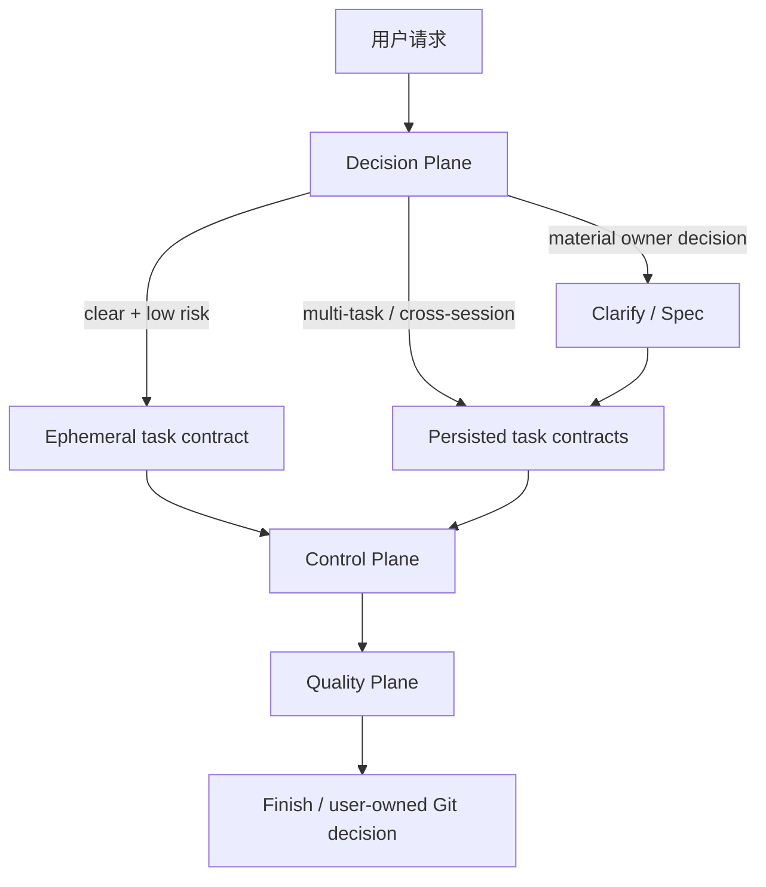

# 把 loopx 演进为薄提示、硬运行时、风险自适应的并行执行系统

Author(s): zhangyukun, Codex
Last updated: 2026-07-16
Status: Accepted
Discussion: 当前对话中关于 Superpowers 5.x -> 6.x、loopx 当前架构与 `parallel-subagent-exec` 的分析
Source requirements: `docs/loopx/design/2026-07-16-model-native-adaptive-execution/需求合同.md`
Support lenses: architecture-designer, cli-developer, ddia:failure-review

## Abstract / 摘要

我们提议将 loopx 从主要依靠 skill prose 约束模型的工作流，演进为“薄提示 +
硬运行时 + 风险自适应质量 Gate”的执行系统。模型负责理解、判断、实现和处理例外；
runtime 负责身份、状态、并发、Git、证据和恢复；review 与新鲜验证负责质量结论。

本提案减少的是实现微操、重复投影、无法验证的模型自报指标和历史模型补丁；
不删除 controller-only、leaf-only、write ownership、CAS、provenance、review-before-integration、
Critical/Important 闭环和 final-review。

`exec`、`subagent-exec` 和 `parallel-subagent-exec` 的新 run 最终共用一个 execution kernel：
三种 mode 共用 run identity、state、evidence、review、completion 和 writer authorization，
但分别固定 workspace/Git strategy、quality policy、adapter 与 effective concurrency。首轮并行
优化保持 task review 强度不变，速度先来自 exact task delta 和流式调度；关键路径、early
integration、测试分层与 review-turn reduction 分别评估。

本文中 `current-contract generation` 指现有 0.5.x/v2 skill 与 state 合同；`unified-run generation`
指本提案批准后的新 run 合同。这两个名称是架构代际，不是 npm 版本号。

## Decision Request / 本次需要批准什么

提案评审者现在只需决定架构方向和显式 supersession scope。下述已有契约修复不是
新的产品决策；具体 schema、文件名、调度公式和性能阈值也不在本次被冻结。

### Approve now / 架构批准项

| ID | Decision | Consequence |
|---|---|---|
| `A-001` | 采用 Decision Plane / Control Plane / Quality Plane 逻辑所有权 | 每个约束只有一个 accountable owner；模型做判断，runtime 管确定性不变量，review 管质量结论 |
| `A-002` | 新 run 逐步统一 inline、delegated serial 和 parallel kernel | 共用 run/state/evidence/review/completion；mode 仍显式区分 workspace/Git、quality、adapter 和 concurrency |
| `A-003` | plan 收敛为 task contract，worker prompt 由 compiler 按需注入 | 默认删除完整代码转录、2-5 分钟微步骤和重复 schema prose |
| `A-004` | workflow/review Gate 使用可观测 risk signals，并根据真实 diff 单调再分类 | changed-surface High-risk hard guard 始终生效；其上的 classifier 先 shadow；所有 adaptive writer 使用 owned worktree 与可强制 write-root boundary，未批准 High-risk 结果进入 `decision_required` |
| `A-005` | 首轮 parallel 保留 per-task review-before-integration | 先通过排队与去重提速，不同时改变质量层 |
| `A-006` | 第一个 unified-run generation 对同一 Git common dir 只允许一个 participating active writer run | append-only epoch claim + cooperative lease/fencing 防跨 run Git/state 争用；mutex、finish 或 unfenced legacy owner 未 terminal 时禁止 takeover；跨 repo 只保证每 run 有界并接受 provider backpressure；竞争者返回 `busy` |
| `A-007` | `prepare -> execute -> finish` 先作内部 resolver/policy facade | 保留现有 skill 为 expert aliases，第一版不新增 public skill 或 CLI command |

### Existing contract correction / 已有契约修复（非批准项）

`skills/shared/review-contract.md` 已经规定 Minor 为 non-blocking，只有 Critical/Important 阻塞。
当前 `loopx.review-result.v1` 无法表达 `Approved + Minor` 是 Phase 0 contract bug，不重新打开
severity 产品决策。

### Clause-level supersession / 按条款替代当前 parallel 的部分设计

当前 `parallel-subagent-exec` 的安全不变量保留，但 unified-run generation 会替代
`docs/loopx/design/2026-07-14-parallel-subagent-exec/需求设计文档.md` 中以下合同：

| Existing anchor clause | Disposition | Successor | Carried forward |
|---|---|---|---|
| `D-001.separate-lane` | replaced | parallel 成为 unified kernel mode；direct skill 作为 expert alias 与 legacy entry | 现有 invocation 与用户可见 scope |
| `D-002.inline-json-fences` | replaced | compiler 从 task contract 生成 versioned sidecar manifest | shared validator、不可推导 dependency/exclusive 必须明示、invalid input fail closed |
| `D-003.unified-missing-metadata-handoff` | replaced | unified prepare 编译 manifest，无法证明 parallel safety 时在 dispatch 前用 concurrency=1或拒绝 | Git/runtime/baseline/state preflight 继续在 dispatch 前 zero-mutation fail-fast |
| `D-003.legacy-missing-metadata-handoff` | unchanged | recognized current direct skill保留旧 handoff | exact same-path handoff与legacy validator |
| `D-004.plan-worker-budget` | replaced | `max_parallel` 由 versioned runtime policy、explicit alias override 与 observed capacity共同限制 | bounded capacity、backpressure、fix/review priority、全部 leaf role 计数 |
| `D-008.fixed-task-integration-order` | deferred | rung 4b graduation后，review通过且可交换的task可按完成事件early integrate；operation/reservation可replay | rung 4a仍保留旧integration barrier；snapshot/restore/reconciliation/re-review安全语义不变 |
| `D-010.parallel-only-namespace` | replaced | 新 run 使用统一 versioned state；current state 不就地迁移 | atomic CAS、persist-before-dependent-action、strict identity、idempotent completion、unknown schema fail closed |
| `D-013.first-generation-manual` | unchanged | shadow/迁移期仍manual | bundled、discoverable、installer/plugin governance |
| `D-013.permanent-manual-only` | deferred | 只有live eval graduation后resolver才可自动选择parallel | explicit alias继续可用 |
| `D-015.always-plan-metadata` | replaced | machine manifest 在 prepare/execute 按需编译；人类 plan 只保存 task contract | 未 graduation 前 execution recommendation 不自动选择 parallel |

完整 clause disposition 与旧 `AC-*`/`TC-*` successor 位于 `需求设计文档.md`。新
`需求合同.md` 同时替代 `.loopx/intake/2026-07-14-parallel-subagent-exec/requirements.md`
中与独立 lane、always-on metadata、固定 task integration order、永久 manual-only 和 source-tree
zero-change 相关的条款，并收窄 2026-07-13 v2 reset 的 no-compatibility 选择：pre-v2 仍不支持，
recognized current-contract state 允许由 frozen legacy engine 精确恢复。

保留 `D-005`-`D-007`、`D-009`、`D-011`、`D-012`、`D-014`、`D-016`、`D-017` 中的 worktree
isolation、leaf pipeline、review-before-integration、controller-owned Git、有界 reconciliation、package
review、observed capacity、startup/final-review/finish、internal JSON helper、cleanup 与 dirty-worktree safety
语义。所有 unified writer mode 都使用 runtime-owned worktree 与 adapter/runtime 强制的 write-root boundary；
只有独立 cwd、Git repo 或事后 diff Gate 不构成该边界。current-contract in-place `exec`
只作为 legacy resume，不属于 adaptive mode。

### Experimental defaults / 不在本次冻结的初始值

| Parameter | Candidate default | Approval meaning |
|---|---|---|
| Parallel eligibility | 至少 2 个独立 ready task，预测节省至少 20% 或 60 秒 | 只授权进入 eval，不是产品永久阈值 |
| Graduation latency | eligible DAG p50 相对 serial 改善至少 25%，p95 回归不超过 10% | 需与 retry amplification、total token 和 provider degradation 一起评估 |
| Prompt efficiency | main-chain uncached input token p50 降低 30%，全 run total token p50 回归不超过 10% | 仅在 absolute quality Gate 通过时有效 |
| Low-risk final gate | 仅精简 prompt/schema 投影，完整保留 current final-review 六阶段职责 | 不减少 coverage、support lens、runtime、regression、test-trust 或独立 reviewer 责任 |

### Deferred to detailed design / 留给详细设计

- unified state 的精确目录、schema 和 status transition。
- writer lease 的文件布局与显式恢复命令；Git-common-dir scope、structured busy、fencing 和
  不使用 elapsed-time 自动抢占是固定约束。
- prompt compiler 的输入格式、role templates 和 platform overlay。
- scheduler 的 critical-path 估算、slot reservation 和稳定 tie-break。
- exact task delta 的 tree/blob 格式与 review result 新 schema。
- public CLI 是否在后续版本增加显式 mode/risk/explain 表面。

## Background / 背景与动机

### 强模型让错误指令更值得清理，没有让系统不变量消失

OpenAI 的 Codex prompting guidance 将近期模型描述为更节省 reasoning token、具备更长时间的
自主执行能力，同时建议在特定 rollout 中删除会导致提前停止的前置计划、preamble
和状态更新指令。GPT-5.1/5.2 guidance 也建议用 eval 小步清理冲突、重复指令。

模型越能遵循指令，错误和过时指令的伤害可能越大。但状态竞争、写冲突、陈旧证据、
Git 污染和 provider 模型替换仍是系统问题，不是推理能力问题。

参考：

- [OpenAI Codex Prompting Guide](https://github.com/openai/openai-cookbook/blob/main/examples/gpt-5/codex_prompting_guide.ipynb)
- [OpenAI GPT-5.1 Prompting Guide](https://github.com/openai/openai-cookbook/blob/main/examples/gpt-5/gpt-5-1_prompting_guide.ipynb)
- [OpenAI GPT-5.2 Prompting Guide](https://github.com/openai/openai-cookbook/blob/main/examples/gpt-5/gpt-5-2_prompting_guide.ipynb)
- [Anthropic: Building Effective Agents](https://www.anthropic.com/engineering/building-effective-agents)

### Superpowers 6.x 压缩了轮次与上下文，保留了质量责任

Superpowers 6.x 将两个 per-task reviewer 合并为一个、用文件交接 task/report/diff、分开
task-scoped review 和最终 whole-branch review，并明确 model 和 reviewer 独立性。v6.1 继续
删减每次 session 都付费的 bootstrap 和 harness boilerplate，但保留经验证有效的
behavior-shaping content。

可转移的决策是：让模型做值得模型做的判断，将重复机械工作变廉价，将安全和证据
收口硬化。Superpowers 的 eval 结果不是 loopx 的本地性能证明。

- [Superpowers v6.0.0 release notes](https://github.com/obra/superpowers/blob/v6.0.0/RELEASE-NOTES.md)
- [Superpowers v6.1.0 release notes](https://github.com/obra/superpowers/blob/v6.1.0/RELEASE-NOTES.md)

### loopx 的问题是契约混层，不是缺少更多契约

loopx 0.5.x 已有 controller-only/leaf-only、agent budget、合并 task reviewer、文件交接、
AC/TC -> D -> T -> evidence -> review -> finish 可追踪链、trace-first eval，以及 parallel 中的
DAG/CAS/worktree/review-before-integration 基础。下一阶段应收敛提示面与控制面，不应重写
这些已有不变量。

| Repo evidence | Current fact | Consequence |
|---|---|---|
| `skills/plan-to-exec/SKILL.md` | 416 行；同时要求 task contract、2-5 分钟微步骤和完整代码 | plan 和 implementation 双写，过早冻结局部方案 |
| `docs/loopx/plans/` | Markdown 合计超过 24,000 行，多个单计划超过 1,000 行 | 上下文和 drift 成本已经可观测 |
| `README.md` / `src/workflow.mjs` | 公开 Golden path 完整，持久 stage 主要是 `clarify/done` | 后续 lifecycle 仍靠 skill prose 和 controller memory |
| `exec` / `subagent-exec` / `parallel-subagent-exec` | 不同 progress/state/recovery 路径 | 无法安全自适应切换 executor |
| shared contracts 与 role prompts | evidence、leaf、commit、severity 在多处重复 | 已产生 Minor/schema、progress path 等冲突 |
| new plans / manual parallel | 所有新 plan 携带 parallel JSON，默认路径不消费 | 支付了元数据成本，大多数 run 没有调度收益 |
| `parallel-exec.mjs` | 主要暴露 primitives，完整管线仍由 skill/controller 编排 | batch barrier、非 critical-path priority 与手工 orchestration 限制提速 |
| `subagent-exec/scripts/review-package` | 默认 `git diff` 不包含 untracked file 内容，也不是严格 task delta | review-before-integration 的证据不完整 |

### 当前 eval 只支持“先收敛 planning/implementer”

| Evidence | Result | Decision implication |
|---|---|---|
| `.loopx/evals/gpt-5.6/aggregate-implementer/report.md` | 5/5 candidate 质量通过，token 中位数下降 10.9%-32.3%，latency 下降 11.1%-41.3% | 收敛 implementer/planning prompt 有本地证据 |
| `.loopx/evals/gpt-5.6/aggregate-reviewer/report.md` | 2/2 质量通过，但只有 1 个资源改善，无缺陷场景 token +3.6% | 不应根据当前样本减少 reviewer turn |
| `evals/gpt-5.6/README.md` | live prompt runner 是 read-only，且 default peak active agent = 1 | 不能作为真实 coding/parallel graduation 证据 |
| `.loopx/final-review/2026-07-14-parallel-subagent-exec.md` | live native multi-agent stress 明确 deferred | parallel 安全 primitives 已有基础，性能/质量声明仍待证明 |

## Goals And Non-Goals / 目标与非目标

### Goals / 目标

- 让 worker prompt 主要描述 outcome、boundary、evidence 和 stop conditions，不预写局部实现。
- 每个硬约束只有一个 owner，prompt 只投影当前 role 必要的部分。
- 新 run 共用 identity/state/evidence/review/completion，并且可严格 resume。
- 使用可观测风险信号决定 clarify/spec/plan/review 强度。
- 对值得并行的宽 DAG 缩短 wall time，小 task 和紧耦合 task 保持 inline/serial。
- 让 prompt、model policy、reasoning effort 和 Gate 策略可版本化、可回滚、可通过 eval 独立演进。

### Non-Goals / 非目标

- 不删除已有 safety、review、provenance 和 finish 不变量。
- 不立即让 parallel 成为默认，不在首轮取消 delegated/parallel task review。
- 不批量回写历史 design/plan/review artifact。
- 不在本提案中决定精确 schema、函数、CLI 字段或 implementation tasks。
- 不增加第三方 runtime 依赖，不硬编码当前 model ID。

## Proposal / 设计方案

### Decision 1: 约束只有一个 owner，prompt 只是按需投影

详细设计应建立 constraint registry。每条约束记录稳定 ID、类别、owner、真实 failure mode、
enforcement layer、eval case 和 sunset condition。

| Category | Examples | Accountable owner | Enforcement / consumers | Change rule |
|---|---|---|---|---|
| Hard invariant | leaf-only、write ownership、CAS、lease、resume identity、destructive Git boundary | Execution kernel maintainer | Runtime、schema、validator | 只能通过设计变更，不因模型变强而删除 |
| Quality contract | outcome、AC/D/TC、evidence、review verdict | Quality contract maintainer | Schema、quality pipeline、reviewers | 保留语义，可改为结构化输出/tool grammar |
| Risk gate | 是否需要 spec、plan review、task review、full final review | Risk policy maintainer | Versioned policy、runtime、quality pipeline | 由可观测信号和 eval 调参 |
| Heuristic/workaround | 5+ files、每 3 task、2-5 分钟步骤、固定 rounds | Risk policy maintainer | Policy defaults、prompt projections | 必须有 failure evidence、eval case 与 sunset condition |

Plan 改为 task contract，默认只保留：

- 稳定 task identity、outcome 与可观察成功条件。
- source requirements / AC、design / D、test scenarios / TC。
- 预期 create/modify/test surfaces、allowed writes、consumes/produces interfaces。
- semantic dependencies、exclusive resources、verification、expected evidence、review focus 和 residual risk。

默认不再携带完整 production/test code、固定微步骤或重复 evidence schema。只有当精确
内容本身是已批准 contract 时保留完整 payload，例如 migration SQL、wire format 或安全规则。

Prompt compiler 为 implementer/reviewer/fixer/final reviewer 生成最小 role prompt。平台差异只存在于
adapter/platform reference；一般 Git、evidence 和 review 契约不在 Codex/Claude/Cursor 中分别复制。

### Decision 2: 用三个 plane 和风险政策决定流程强度



- Decision Plane：仓库探索、material ambiguity、task contract、semantic dependency 候选与例外判断。
- Control Plane：run/worker identity、lease、manifest、DAG、capacity、state、Git、provenance、resume 和 cleanup。
- Quality Plane：focused verification、task review、fan-in checks、whole-feature review 和 finding 闭环。

Risk policy 只使用可从需求、repo 和真实 diff 证明的信号：public API/schema/CLI、permission/security、
migration/compatibility、删除或不可逆行为、fan-out/fan-in、shared utility、write overlap 和覆盖证据。

| Risk | Default preparation | Default quality gate |
|---|---|---|
| Low | 可使用 ephemeral task contract | focused verification + compact semantic final gate |
| Standard | 多 task/cross-session/delegation 时持久 task contracts | delegated task review + whole-feature final review |
| High | clarify + spec + persisted contracts + plan review | per-task review + runtime validation + full final review |

`compact final gate` 只表示更短的 prompt 和结构化输出，不删除 current `final-review` 的六阶段语义、
whole-feature scope 或独立 reviewer。任何减少阶段或责任的方案都需要另行显式 supersession 批准。

authoritative changed-surface guard 与实验 classifier 分属不同 owner。hard guard 始终检查真实 diff；
如果出现未批准的 High-risk surface，run 进入 `decision_required`，停止新 dispatch/integration/finish。
classifier 在 shadow 阶段只记录 observed risk 与 recommended gates，不改变 hard guard 之外的实际
executor/tree/baseline Gate。observed risk 单调升级；classifier enforcement graduation 后 actual gates
也只能增加。批准后的 source requirement/design revision 创建 successor run，不原地改写旧 run identity。

`prepare -> execute -> finish` 是普通用户的内部决策路径，不是第一版公开 CLI 推断。
现有显式 skill invocation 保留，自动化通过稳定 JSON 获得 selected mode、risk signals、required/skipped
gates 和原因，不依赖人类文案。

### Decision 3: 新 run 共用一个 execution kernel 和 fenced writer lease

unified-run generation 共用一个 versioned run namespace。下列只是详细设计的内容边界，不在本提案
冻结文件名：

```text
.loopx/runs/<run-id>/
  manifest + state + events + policy
  tasks/<task-id>/{brief,report,evidence,review-package,review-result}
  conflicts + reviews + completion
```

run identity 需要绑定 source/plan/manifest hashes、repo/baseline/worktree、engine/policy/prompt/adapter version、
requested/observed model 和 native worker identity。`run-id` 全局命名 plan-local `T-*`，避免跨 plan 冲突。

| Mode | Actor / adapter | Workspace / Git strategy | Required write boundary | Quality profile | Effective leaf-writer concurrency |
|---|---|---|---|---|---:|
| Inline | current controller/session | runtime-owned root integration worktree | controller tool/runtime write root；不可用则profile disabled | risk-driven checkpoint + final review | 0 |
| Delegated serial | native/CLI worker | one owned task worktree at a time | worker filesystem root + source Git read-only | per-task review-before-integration + final review | 1 |
| Parallel strict | native/CLI workers | isolated owned task worktrees | per-worker filesystem root + source Git read-only | per-task review-before-integration + wait-any | >1 |
| Parallel relaxed | native/CLI workers | adapter-proven relaxed isolation | task-scoped enforced output root；无法证明则profile disabled | per-task review + batch sibling audit + barrier；no wait-any/early integration | >=1 |

Current-contract in-place `exec` 不是 unified mode，只在 recognized legacy state resume 时使用。

第一个 unified-run generation 以 realpath-normalized Git common dir 为 key 使用 cooperative
single-writer lease。只读 run 可并行；第二个 participating writer 返回结构化 `busy`，第一代不建立
持久 queue。lease recovery 不能只依据 elapsed time；append-only epoch claim 是权威记录，`current.json` 只能是
可重建缓存，所有 state、Git、integration、completion 和 cleanup mutation 必须校验 `lease_id + epoch`。
持有lease/state mutex、正在执行finish placement或未实现epoch fencing的legacy owner，都不能仅靠new workspace
epoch安全隔离，所以在adapter/process evidence证明其terminal前拒绝recovery/takeover。repo lease 不治理跨
repo/provider agent capacity；第一代只保证每个 run 的本地 cap，
provider capacity/rate-limit 作为 bounded backpressure，不承诺跨 repo 总 leaf 的原子上限。细粒度
target-ref/resource lease 只在有需求与 fault eval 后再开放。

Runtime 必须提供 deterministic prepare/next/reserve/transition/finish/complete 语义。prepare由caller预先提供
stable run/operation identity与request digest，避免lease后崩溃留下不可定位run；`next`返回与revision/policy/
selection绑定的opaque token，`reserve`在state mutex内验证token并重新确认ready集合。如果 harness只允许模型调用
native agent tool，runtime输出精确`next_actions`与reservation identity，薄controller shim只执行指定
create/wait/cancel/capture动作，不自行计算DAG或维护对话内状态。

native spawn 成功但 identity 未持久化时，reservation 进入 `uncertain`。runtime 先使用 adapter trace/
inspect/cancel 对账；只有证明原 worker terminal 后才允许默认最多一次 replacement。无法证明 terminal
时 run 阻塞，迟到或无 reservation binding 的结果永不被接受。该边界保留 shared agent-topology 的
“running worker 不 replacement”规则，不宣称 spawn exactly-once。

Model policy 按 task class/risk/platform 记录 minimum capability、reasoning profile、可接受 substitute、实测
成功率、review fidelity、token、latency 和 retry 成本。runtime 记录 observed model；High-risk/final-review
的 substitute 不满足 policy 时必须阻塞或升级。

Current-contract run 不就地迁移。现有 state 没有未来的 engine/policy version，因此迁移期必须保留
legacy executor 代码，并按现有 path/schema 显式路由。如果安装版本不再包含对应 legacy engine，则
由当前 facade fail closed。使用原版本恢复前必须确认没有 active unified run，并完成人工 preflight；
不声称原版本能够识别新 namespace、参与新 lease 或凭空按“启动时版本”恢复。

### Decision 4: Parallel 用流式调度提速，用 exact task delta 守住质量

首轮并行优化不改变 review 数量。以下候选按独立 rung 激活，不作为一次发布：

- rung 4a 中 strict adapter 使用 `wait-any` / `as-completed`，task 完成后立即 scope-check -> review ->
  fix/re-review，但继续等待既有 integration barrier。
- scheduler 保留 reconciliation/fix/review 优先，同级内根据剩余 critical path、可解锁 downstream
  和历史耗时排序，并防止 implementation/review 任一方饥饿。
- rung 4b 独立通过后，review clean、actual changed paths 不相交、无 semantic dependency 且可交换的
  task 才可提前集成以释放 downstream；正式 child/package commit 边界仍保持批准语义。
- 只有无法证明 per-worker cwd/worktree isolation 的 relaxed adapter 保留必要 batch barrier。
- 同一外部事件只写一次有恢复价值的原子 state checkpoint。
- capability probe 只在 runtime/version/model/workspace/auth capability identity 一致且未过期时复用。
- worker 跑 focused tests，fan-in/wave/child 跑 contract/integration checks，root 最后跑一次 full suite/runtime
  validation。

Parallel preflight 只能使用 declared dependency/write scope 与预测收益。actual changed-path overlap 在 worker
完成后才能验证，它是 integration Gate，不是 dispatch precondition。临时候选准入线为：

```text
independent_ready_tasks >= 2
AND declared_write_overlap == 0
AND interfaces_fixed == true
AND predicted_saving >= max(20%, 60 seconds)
```

该公式只是 eval hypothesis。不满足时，准入阶段选择 concurrency=1，不在已启动 parallel run 中
静默换 executor。

task review package 必须绑定 task base/candidate tree、tracked/staged/unstaged changes、untracked created-file
content/blob、delete/rename/mode/symlink changes、actual-vs-declared paths，以及 report/verification hashes。它只表示
当前 task delta，不携带之前 task 的累计 diff。

Anthropic 的多 agent research 系统显示，multi-agent 对独立展开的 breadth-first 工作价值最高，
但 token 成本也可以显著增加。对 coding 的转移性推论是：优先并行宽 DAG、写集分离且
上下文可分割的工作，不只因为平台能创建更多 agent 就并行。

- [Anthropic: How we built our multi-agent research system](https://www.anthropic.com/engineering/multi-agent-research-system)

### Decision 5: 资源改善必须同时通过 absolute correctness 和 baseline regression Gate

任何 prompt、policy、model 或 scheduler candidate 必须：

1. baseline/candidate 使用同一 fixture、model、reasoning effort、tool set 和 timeout。
2. 一次只改一组变量。
3. 使用 baseline-first/candidate-first crossover 与中位数。
4. 每个 fixture 先通过 absolute expected outcome/seeded defect/tree/test Gate，再比较 baseline。
5. 所有 replicate 通过 quality/safety/reliability/provenance，不用平均值遮蔽一次严重回归。
6. 先检查 failure trace，再改下一组指令。

Parallel graduation 增加 sequential/P=2/P=4 live coding crossover，覆盖宽 DAG、长尾 worker、diamond
dependency、package fan-in、cross-task defect、out-of-scope write、untracked file、conflict/reconciliation、
provider/model substitution、interrupt/resume 和 dirty worktree。

| Priority | Attribute | Candidate target | Required measurement |
|---|---|---|---|
| P0 | Absolute quality | 每个 fixture 的 expected outcome、seeded Critical/Important recall、final tree 和 tests 全部正确 | native coding eval + exact tree/test evidence |
| P0 | Safety | nested agent = 0；out-of-scope integration = 0；stale artifact = 0；unrelated user mutation = 0 | trace + hashes + dirty-worktree fixtures |
| P0 | Reliability | accepted result/review/integration/completion/cleanup 不重复；uncertain native spawn 可检测，未证明 terminal 时不 replacement；stale fence mutation 为 0 | kill-at-transition、spawn-persist gap 与 stale-controller fault injection |
| P0 | Provenance | requested/observed model、thread、attempt 和 task artifact hashes 可验证 | artifact verifier + native trace |
| P1 | Parallel latency | eligible DAG p50 改善 >= 25%；p95 回归 <= 10% | crossover + queue/critical-path metrics；每 workload 至少 20 个平衡 paired samples |
| P1 | Provider degradation | rate limit/capacity 下不产生无界 retry 或重复工作 | constrained-capacity fixtures |
| P1 | Prompt efficiency | main-chain uncached input token p50 改善 >= 30%；全 run total token p50 回归 <= 10% | native usage aggregation |
| P2 | Maintainability | 每个不变量一个 owner，governance 检查 behavior 而不是可替换 prose | owner matrix + behavioral tests |

任何资源改善只在所有 P0 条件通过时成立。

## Support Lens Checks / 专项设计检查

| Support lens | Trigger | Design checks applied | Result |
|---|---|---|---|
| architecture-designer | workflow ownership、state machine、scheduler、Git isolation、恢复和长期 model policy | 系统边界、NFR 优先级、失败影响面、可逆迁移、观测和 owner | 采用三平面、repo writer lease、版本化 run 和 eval-gated parallel |
| cli-developer | resolver 决策、expert aliases、未来 mode/risk/explain 输出与错误行为 | 公开签名、人类/JSON、stdout/stderr、non-TTY、exit behavior 与跨平台路径 | 第一版不增 CLI；保留显式 override；自动化只消费稳定 JSON；任何公开变更另行批准 |
| ddia:failure-review | lease、timeout、process pause、旧 controller 恢复和 native spawn 不确定性 | fencing、stale holder、exactly-once 边界、idempotency 与 recovery ownership | lease 不自动按 TTL 抢占；unified mutation epoch-fenced；legacy/uncertain worker 无 terminal evidence 时不 takeover/replacement；不宣称 spawn exactly-once |

## Boundary Scenarios / 边界场景

| Boundary | Treatment |
|---|---|
| 清晰、小型、可逆变更 | 可直接生成 ephemeral task contract，不强制 clarify/spec/persisted plan |
| 存在 material owner/product decision | 返回 clarify/spec；不用 risk score 或 review 替代决策 |
| 多个独立 clarification questions | 按 decision cluster 询问少量问题并给推荐答案，不固定一轮一问 |
| 无法证明 semantic dependency 或 declared overlap | 使用 concurrency=1 或返回 Decision Plane，不 aggressive parallel |
| 历史 plan/state/artifact | 不回写；current-contract run 使用 legacy executor 或 fail closed；新 engine 不猜测迁移 |
| 同 Git common dir 已有 participating active writer | 后续 writer 返回 structured `busy` 且零 mutation；只读 run 不受影响 |
| unfenced legacy owner paused 或状态未知 | 不恢复 lease、不启动第二 writer；只有 terminal evidence 后才允许 takeover |
| 两个 repo 共享 provider quota | repo lease 互不阻塞，各 run 本地有界；provider 拒绝形成 backpressure，不宣称跨 repo 原子总 cap |
| platform 不能证明 cwd/worktree/identity | 该 adapter 保持 serial、relaxed barrier 或 explicit-only，不伪造 strict isolation |
| 现有显式 skill/CLI caller | 保留 direct aliases；第一版不改 public CLI signature、human/JSON 或 exit codes |
| 外部权限、多租户、数据库 migration | 本提案不新增该产品面；具体开发任务出现该风险时仍属 High risk |

## Failure Modes / 失败模式

本表是失败处理的权威 proposal 视图；Boundary 和 Compatibility 不再重复这些细节。

| Trigger | Impact | Detection | Recovery / Mitigation | Owner |
|---|---|---|---|---|
| 初始 risk 低估 | 跳过事前 design Gate | changed-surface 再分类 | 隔离结果，返回 clarify/spec，批准前不集成 | Risk policy + controller |
| prompt 收敛删除了有效 guidance | 早停、越界或证据缺失 | paired behavior eval | 一次改一组，回滚 prompt variant | Prompt owner |
| 两个 writer run 争用同一 Git common dir | state/Git divergence | writer lease | 单 writer + structured busy；不自动抢占 | Execution kernel maintainer |
| unified 旧 controller 在 lease recovery 后恢复 | stale state/Git mutation | lease epoch mismatch + epoch-owned workspace/ref | 每次 correctness mutation拒绝旧 epoch，从 current state恢复 | Execution kernel maintainer |
| unfenced legacy controller paused | 新旧 writer 无法按epoch隔离 | lease owner/adapter/process terminal evidence | 无 terminal evidence 时禁止 recovery/takeover | Execution kernel maintainer |
| native spawn 成功但 identity 未持久化 | orphan worker、重复成本 | reservation/native trace reconciliation | 标记 uncertain；不接受未绑定结果；terminal 后才有界 replacement，否则 block | Platform adapter maintainer |
| controller shim 越过 `next_actions` | duplicate worker 或 state drift | reservation/native trace mismatch | 拒绝未绑定结果，从 persisted state 恢复 | Control Plane |
| worker 实际写出 declared scope | 污染 task/integration | actual changed-path check | 保留 evidence，拒绝 integration，不扩大权限 | Evidence/Git owner |
| review package 累计或遗漏 created file | reviewer 未审查完整 task | tree/blob/package verifier | 拒绝 artifact，重建 exact task delta | Evidence owner |
| provider 替换为不满足 policy 的 model | 实现/review 质量不可信 | observed model identity | 阻塞、升级或使用已验证 adapter | Model policy + adapter |
| batch barrier/priority 造成 head-of-line blocking | parallel 慢于必要值 | queue/slot/critical-path metrics | strict adapter 使用 wait-any；收益不足返回 serial | Scheduler |
| integration conflict 重试失败 | affected DAG 无法前进 | conflict evidence + attempt counter | 恢复 owned snapshot，有界 reconciliation，超限阻塞 | Git owner |
| cleanup 命中非 owned resource | 用户工作丢失 | root/path/ref provenance | 只清理 manifest 显式拥有且 identity 匹配的 resource | Cleanup owner |
| low-risk wave review 漏缺陷 | 节省 turn 但降低质量 | absolute seeded-defect Gate | 保持 experimental，任一 replicate 回归即恢复 per-task review | Quality policy |

## Rationale / 理由与取舍

| Alternative | Why Not |
|---|---|
| 删除大部分 workflow/review 约束，依赖强模型自律 | 无法解决并发写入、陈旧证据、恢复幂等、provider 替换和 Git ownership |
| 只压缩 skill prompt，不统一 runtime | token 可下降，但 state 分裂与手工 orchestration 仍在 |
| 继续把 parallel 作为独立第四 lane | 继续复制 state、evidence、resume、review 和 finish 合同 |
| 从 prose 猜 DAG 后直接并行 | 模型可提案 dependency，但 validator/lease/scope 才能授予执行权 |
| 所有多 task 默认 P=4 | 小 task 的 dispatch/review/worktree 成本可高于节省 |
| 第一阶段就合并 per-task review | 同时改变 scheduler 和质量层，无法归因，当前 reviewer 证据不足 |
| 立即做第二次 breaking reset | current-contract 不变量与 parallel primitives 有价值；新 run 分代迁移风险更低 |

### NFR trade-off: 质量优先于延迟

P0 是 absolute quality、safety、reliability 和 provenance。首轮通过流式调度、去重和精确 evidence
改善延迟，不通过减少 review。low-risk wave review 是后续独立 eval rung，不与 scheduler 同时发布。

### NFR trade-off: 模型自主性与可预测性

模型拥有实现方法和例外判断；runtime 拥有允许写入、lease、state transition、integration 和 cleanup。
某些 harness 仍需薄 controller shim，但 shim 只执行结构化 next actions。

## Compatibility / 兼容性

本提案对 unified-run generation 是 internal plan/state/routing breaking change，但不批量迁移历史 artifact，
不立即修改 public CLI。

- Current direct skills 和 public CLI signatures 保留。
- Current parallel strict JSON、manual-only 和 state path 在 legacy executor 存续期内保留；新 run 使用新合同。
- Current-contract state 按 path/schema 路由到保留的 legacy engine；无可用 engine 时 fail closed。
- 新 run 持久 engine/policy/prompt/adapter version，不在运行中切换 generation。
- 历史 plan/design/review 不回写；历史 review artifact 不被新 run 作为当前 Gate。
- 迁移先启用 changed-surface hard guard，再跑 shadow classifier；shadow 只比较 risk/mode/gates/predicted
  saving，不改 hard guard 之外的实际 executor/tree/baseline Gate。
- Rollback 优先使用当前版本保留的 legacy executor。代码降级或原版本恢复只允许在零 active
  unified run 且 operator preflight 确认无 active lease、owned worktree、pending integration 后进行；
  active unified run 必须先由兼容 engine 完成、取消或隔离。
- `concurrency=1` 只是调度降级，不是 unified engine 故障的 rollback。
- 新 facade 对 unknown unified schema fail closed，不静默 normalize；旧 loopx 可能忽略新 namespace，
  因此不把旧 binary 本身当作兼容性防线。

如果未来增加 public mode/risk/explain 表面，需单独批准 command/flag、human/JSON、stdout/stderr、
exit code、non-TTY 与跨平台合同。

## Operational And Security Impact / 运行与安全影响

- 统一 engine 增加 runtime/schema/adapter 的初期实现成本，但减少多套 executor 长期 drift。
- 并行增加短时 agent/worktree/token/provider quota 压力；第一代 effective limit 受 per-run budget 和
  observed provider capacity 限制，跨 repo 原子 capacity coordinator 明确后置。
- trace 需新增 queue delay、slot utilization、stage duration、critical-path lower bound 与 probe/worktree/
  review/integration overhead。
- blocked/interrupted run 保留可恢复证据，success 只清理 manifest 拥有的 resource。
- brief/diff/report/native IDs 可含仓库敏感信息；run workspace 必须 owner-only 且 Git ignored。
- trace 不保存 API key、raw environment dump、无关源码或超出 task 的内容。
- unified profile只有在adapter/runtime能强制write-root时可用；worker对source Git只读，不能借tracked symlink、
  absolute path或显式`--git-dir`修改central state、其他worktree、invoking checkout、refs或completion artifact。
- 现有standalone worktree不自动提供该权限边界；phase 2a必须逐adapter做negative capability probe。无法证明的
  profile保持disabled，这可能推迟inline或某个平台cutover，是本方案明确接受的安全成本。
- 不新增网络传输、凭证存储或第三方依赖。

Ownership：Decision Plane 归 decision-policy maintainer；Control Plane 归 execution-kernel maintainer；
Quality Plane 归 quality-contract maintainer；platform adapter maintainer 只拥有 native identity/capability
mapping。每条 constraint 的 registry entry 只列一个 accountable owner。

## Implementation And Transition / 实现与过渡

以下是 rollout outcome，不是 implementation backlog。

| Phase | Outcome | Graduation gate | Rollback |
|---|---|---|---|
| 0a-0d. Contract baseline | Minor/schema、progress namespace、exact delta、shared-contract drift 分别修复并记录 baseline | 每项 focused contract tests + current baseline + plugin installer release gate全绿 | 单项回滚，不引入 unified state |
| 1. Prompt/task-contract slimming | 删除实现转录与重复 prose，保留现有 Gate | paired prompt eval 的 absolute + regression Gate 全过 | 回滚 prompt/policy variant |
| 2a. Safety-complete unified serial parity | 在simulation/temp repo完成owned serial、enforced write root、lease/fence、High hard guard、state/evidence与fenced finish handoff；不切fresh route | 与current delegated serial的final tree/test/evidence/resume等价，symlink/source-Git/pause/finish fault tests全过 | 无production unified run；current route不变 |
| 2b. Facade + legacy authorization hardening | current aliases、legacy resume经同一writer authorization；仍不切unified fresh route | same-repo race、crash、recovery、stale epoch、unfenced legacy no-takeover tests全过 | 关闭facade route，current behavior保持 |
| 2c. Delegated serial cutover | fresh `subagent-exec` 创建unified serial run | production parity、checkout零写、rollback全过 | 停建fresh unified serial；active run兼容收尾/隔离 |
| 2d. Owned inline cutover | controller在owned root worktree执行；High hard guard已从2a存在 | small-task parity、post-diff quarantine和finish placement全过 | 保留delegated serial；不选择unified inline |
| 3. Shadow risk/mode policy | authoritative High guard 继续生效；classifier只记录 classification/mode/gates/predicted saving | labeled fixtures稳定，非 High baseline tree/Gate不变 | 关闭 shadow classifier，保留 hard guard |
| 4a. Wait-any | 只把 batch wait 改为 as-completed，priority/order/test policy 不变 | P=2 long-tail crossover 全部 P0 通过 | 恢复 batch barrier |
| 4b. Early task integration | 只允许通过 exact-delta Gate 的可交换 task 提前集成 | final-tree replay、overlap、conflict fault tests全过 | 恢复 integration barrier |
| 4c. Critical-path priority | 只改变 ready-stage ranking | latency 改善且无 implementation/review starvation | 恢复 stable priority/topological order |
| 4d. Test layering | 只改变重复测试调度，不改变最终 full-suite责任 | seeded cross-task defect零漏检且 evidence freshness 全过 | 恢复原测试频率 |
| 5a. Parallel graduation P=2 | 对 eligible fresh run 允许 resolver 自动 parallel | classifier + live coding 全部 P0，p50/p95 达门槛 | 禁自动 parallel；fresh run concurrency=1/manual alias |
| 5b. Parallel graduation P=4 | 提高已 graduation workload 的 cap | sequential/P2/P4 crossover 与 provider degradation 全过 | cap退回 P2/P1 |
| 6. Review-turn experiment | 单独比较 low-risk delegated per-task 与 wave review | 任一缺陷漏检、tree/test 或 context-safety 回归即失败 | 恢复 per-task review |

## Open Questions / 待决问题

### Blocking proposal acceptance

无。维护者已批准 `A-001`-`A-007` 的修订后方向、clause-level supersession 和先进入 `spec`。

### Non-blocking experimental calibration

- Parallel eligibility、p50/p95、prompt token 与 compact final gate 初始值可在详细设计与 eval 中调整，
  不需要为提案 `Accepted` 冻结数值。

## Detailed Design Handoff / 详细设计交接

评审 owner 是 loopx maintainer/zhangyukun。进入详细设计的条件已经满足：

1. 修订后的 `A-001`-`A-007` 与 clause-level supersession 已批准。
2. `需求合同.md` 已持久化可测 `AC-*`/`TC-*`，并作为唯一 implementation-ready requirements source。
3. 同目录 `需求设计文档.md` 负责冻结 schema、状态、接口、迁移、验证与 `D-*` anchors。

Design anchors: not applicable. 本文档只请求方向决策，不是 implementation contract。

## Appendix / 附录

### 仓库证据

- `README.md` 与 `skills/RESOLVER.md`：当前 Golden path、executor 选择与 manual parallel surface。
- `skills/plan-to-exec/SKILL.md`：当前完整代码、微步骤、task contract 和 parallel metadata。
- `skills/clarify/SKILL.md` 与 `src/workflow.mjs`：当前 clarification 与持久 state。
- `skills/exec/SKILL.md`、`skills/subagent-exec/SKILL.md` 和 `skills/parallel-subagent-exec/`：三条 execution
  lane。
- `skills/shared/agent-topology.md`、`evidence-contract.md`、`review-contract.md` 和
  `parallel-plan-contract.md`：保留不变量。
- `src/agent-eval.mjs`、`evals/gpt-5.6/` 和 `.loopx/evals/gpt-5.6/`：当前 eval discipline 与证据。
- `.loopx/final-review/2026-07-14-parallel-subagent-exec.md`：parallel primitives 已验证、live stress deferred。
- `docs/loopx/analysis/2026-07-14-claude-platform-validation-findings.md`：requested/observed model 差异。

### 与现有设计及已落地合同的关系

| Artifact | Current status | Relationship |
|---|---|---|
| `docs/loopx/design/2026-07-13-skill-suite-v2-reset/` | 提案 `Accepted`，详细设计已落地 | 保留 controller-only、leaf-only、shared contract owner 和 current-contract 原则 |
| `docs/loopx/design/2026-07-14-parallel-subagent-exec/` | 提案 `Draft`，实现与 final-review 已存在 | 保留安全不变量，显式申请替代部分 lane/metadata/state/routing 合同 |
| `docs/loopx/design/2026-06-30-main-chain-workflow-completion/` | 提案 `Draft`，相关合同已在当前 skills 中落地 | 保留 AC/TC -> D -> T -> evidence -> review -> finish 可追踪链 |
| `docs/loopx/specs/installation.md` | 长期 repo spec | 保留 skill-first public CLI、installer ownership 和 bundled surface；公开变更需单独批准 |

### 证据边界

- focused parallel primitive tests 证明 validator/state/scheduler/Git/CLI/simulation 基础稳定，不证明真实
  multi-agent 速度或质量。
- 现有 GPT-5.6 eval 证明 prompt 收敛有潜力，不证明 review 可删减或 parallel 可 graduation。
- Superpowers 只提供可转移的设计证据，不是 loopx 本地性能证明。
