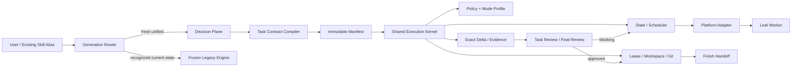
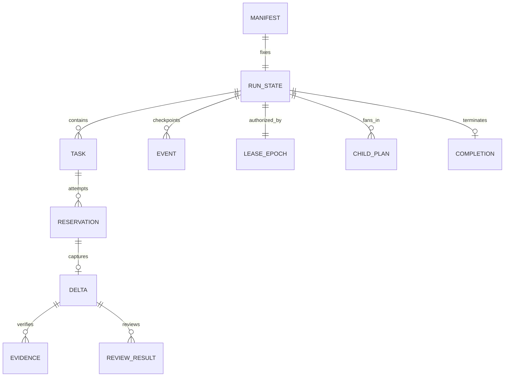

# Model-Native Adaptive Execution 设计文档

## 一、修订历史

| 版本号 | 修订内容 | 修订时间 | 修订人 |
|---|---|---|---|
| V1.0.0 | 冻结 unified execution kernel、task contract、state、lease、exact delta、review v2、迁移与验证合同 | 2026-07-16 | zhangyukun / Codex |
| V1.0.1 | 闭合write-root、append-only epoch、fenced finish、facade binding、legacy detection与plugin release Gate | 2026-07-16 | Codex |

## 二、需求信息

### 2.1 需求背景

- 背景：loopx 0.5.x 已具备 controller-only、leaf-only、AC/TC -> D -> evidence -> review、
  final-review、finish、parallel worktree/CAS 等基础，但 execution ownership 仍分散在
  `exec`、`subagent-exec`、`parallel-subagent-exec` 三份 skill prose 和三套状态路径中。
- 直接代码证据：
  - `skills/exec/SKILL.md` 使用 `.loopx/exec/<slug>/progress.md` 并在 invoking checkout 原地执行。
  - `skills/subagent-exec/scripts/subagent-workspace` 固定使用 repo 级
    `.loopx/subagent-exec/progress.md`，没有 run identity、schema 或 CAS。
  - `skills/parallel-subagent-exec/scripts/state-lib.mjs` 已有 strict schema、revision CAS、
    task/child transition 和 resume identity，可作为统一内核的 brownfield 基础。
  - `skills/parallel-subagent-exec/scripts/parallel-exec.mjs` 目前主要暴露 primitives；完整生产
    controller loop 仍由 skill prose 编排，模拟路径使用 batch `Promise.all` barrier。
  - `skills/subagent-exec/scripts/review-package` 只采集普通 `git diff`，遗漏 staged diff、
    untracked content，并会把当前 worktree 的累计变化当作单 task evidence。
  - `src/install-discovery.mjs` 对整个 `skills/shared/` 做单一 hash 比较；正常旧安装遇到新增
    shared runtime 时也会被判为 `foreign_or_modified_shared_contracts`。
- 需求目的：把模型擅长的理解、判断和实现与 runtime 必须确定执行的 identity、state、Git、
  concurrency、evidence、resume、cleanup 分开，同时在不削弱 review/final-review 的条件下降低
  prompt 成本和 eligible DAG wall time。
- 目标用户/使用方：loopx maintainer、通过 Codex/Claude/Cursor 使用 loopx skills 的工程师、
  platform adapter 与 quality contract 维护者。
- 需求链接：
  `docs/loopx/design/2026-07-16-model-native-adaptive-execution/需求合同.md`。
- 关联原始材料：
  - Accepted proposal：
    `docs/loopx/design/2026-07-16-model-native-adaptive-execution/设计提案.md`。
  - 现有 parallel 设计：
    `docs/loopx/design/2026-07-14-parallel-subagent-exec/需求设计文档.md`。
  - v2 reset：
    `docs/loopx/design/2026-07-13-skill-suite-v2-reset/`。
  - 长期安装规范：`docs/loopx/specs/installation.md`。
- Canonical requirement contract：同目录 `需求合同.md`，包含 `AC-001`-`AC-026` 与
  `TC-001`-`TC-020`。本设计不以 proposal prose 替代这些验收条款。

### 2.2 需求范围

- 本期范围：
  - 建立安装在 `skills/shared/execution/` 的 shared execution kernel 与 internal JSON facade。
  - 定义一次性编译的 task contract、immutable manifest、role prompt projection。
  - 定义 unified run/task/reservation state、event checkpoint、strict resume 与 completion。
  - 定义 inline-owned、delegated-serial、parallel-strict、parallel-relaxed 四个 mode profile。
  - 定义 Git-common-dir writer lease、fencing epoch、legacy no-takeover rule。
  - 定义 epoch-owned worktree/ref、tree/blob exact task delta、evidence/review v2。
  - 定义 authoritative High-risk guard、shadow classifier、successor run。
  - 定义 wait-any、early integration、critical-path、test layering、review-turn 的独立 graduation。
  - 定义 current-contract legacy routing、installer ownership migration、finish/cleanup handoff。
- 非目标：继承 `需求合同.md` 第 2 节；尤其不新增 public CLI/skill，不自动启用 parallel，
  不做 adaptive in-place，不减少首代 task review/final-review，不承诺 native spawn exactly-once，
  不实现跨 repo 原子 capacity coordinator、持久 writer queue、外部 Git writer 强制互斥。
- 决策边界：
  - 本设计冻结 internal schema、状态与迁移语义；implementation file split、纯函数命名、测试文件拆分
    可由 `plan-to-exec` 决定。
  - P1 性能数值是 versioned candidate graduation threshold，不是永久 SLA。
  - future public mode/risk/explain、legacy 删除日期、固定 model ID 必须另行 `spec`。
- 依赖方：`plan-to-exec`、`plan-reviewer`、三个 executor aliases、`review`、`final-review`、
  `finish`、installer/plugin installer、Codex/Claude/Cursor adapters。
- 约束条件：Node.js ESM、stdlib-first、无新 runtime dependency；owner-only local files；
  package/plugin 继续从 canonical root `skills/` 安装；现有 public CLI 合同不变。
- 触发的辅助 skills：`architecture-designer`、`cli-developer`、`ddia:failure-review`。

### 2.3 可行性分析

- 业务可行性：有益，但前提是按阶段收敛。prompt slimming 已有本地 eval 正向证据；parallel
  primitives 已有 schema/CAS/worktree 测试基础。当前证据不支持直接减少 review 或自动 P=4。
- 技术可行性：中高但受adapter能力Gate约束。现有 `parallel-plan-contract.mjs`、`state-lib.mjs`、`scheduler-lib.mjs`、
  `git-lib.mjs` 和 review provenance helper 可迁移到 shared kernel，主要工作是统一 owner、补 lease/
  fencing、exact delta、production facade 与 compatibility routing；现有standalone worktree不提供权限隔离，至少一个
  目标adapter必须在phase 2a证明enforced write root。证明失败只会使对应profile unavailable，不能降级为prompt约束。
- 团队接受能力：中等。内部状态是 breaking generation，但 public alias/CLI 保持兼容；通过
  fresh-run 分代和 frozen legacy resume 避免一次性 reset。
- 时间成本：高于只压缩 prompt，低于长期维护三套 executor。成本集中在 installer ownership、
  fault injection、Git exact delta 与 adapter reconciliation，而不是业务代码。
- 资源成本：parallel 增加短时 token、agent、worktree 和 provider quota；通过 per-run cap、
  local backpressure 与 graduation Gate 控制。第一代不为跨 repo quota 引入协调服务。
- 替代方案：
  - 只改 prompts：无法解决 state/Git/recovery drift，拒绝。
  - 保留三套 runtime：短期便宜，长期继续复制 correctness contract，拒绝。
  - 一次性删除 legacy：会破坏 current-contract resume，拒绝。
  - 首轮同时 wait-any、early integration、critical-path、review reduction：无法归因质量/性能，拒绝。
- 关键风险：shared installer 无升级 ownership、legacy in-place 无 workspace fencing、native spawn
  persist gap、Git delta 漏项、stale evidence、过早 parallel graduation。后文分别给出 hard Gate。

## 三、概要设计

### 3.1 方案总述

- 设计目标：一个共享确定性内核，多个显式执行 profile；模型决定实现，runtime 决定允许的动作，
  quality plane 决定是否可集成/完成。
- 总体思路：task contract 只写一次，compiler 产生 immutable manifest 和最小 role prompt；所有
  unified writer 在 owned worktree 中执行；facade 以 persisted state 返回 next actions；exact delta
  与 fresh review 作为 integration Gate；risk observation、scheduler optimization 分别版本化。
- 核心模块：contract/compiler、policy、lease/fence、state/event、scheduler、workspace/Git、
  delta/evidence、review Gate、adapter facade、legacy router、finish handoff。
- 主要难点：跨 linked worktree 单 writer、stale controller、spawn-success/persist-fail、单 task
  exact delta、current state 分代、shared install drift、不同 adapter isolation capability。
- 技术指标：全部 P0 correctness/safety/reliability/provenance/compatibility Gate 为绝对条件；P1
  candidate thresholds 由 `需求合同.md` 第 6 节约束。

### 3.2 整体架构设计



- 业务模式：skill-first。用户继续显式调用既有 aliases；第一代没有 `loopx execute` 或 mode flag。
- 系统边界：
  - Decision Plane 拥有 task contract、material ambiguity 与 semantic dependency 声明。
  - Control Plane 拥有 manifest、lease、state、reservation、adapter、Git、resume、cleanup。
  - Quality Plane 拥有 verification schema、review result、finding closure、final-review。
  - platform adapter 只拥有 native capability/identity 映射，不拥有 DAG 或 quality verdict。
- 上下游系统：上游是 approved requirements/design/plan；下游是 existing review/final-review/finish。
- 应用架构：canonical kernel 位于 `skills/shared/execution/`，三个 installed skill aliases 通过 sibling
  shared path 调用；legacy engine 保持在原 skill owner 下，只由 generation router 进入。
- 技术架构：Node.js ESM + Git CLI + owner-only JSON/NDJSON/file artifacts；不引入数据库、服务或 MQ。
- 数据流转：source/task contract -> manifest -> run state/reservation -> worker result -> exact delta ->
  evidence/review v2 -> integration tree -> final-review -> finish result。

**Workflow/Install Contract `D-001`（Source `AC-001`, `AC-004`, `AC-021`, `AC-024`）：**

- Decision：`skills/shared/execution/` 是 unified generation 的唯一 kernel owner；aliases、planner、reviewer
  只消费其 validators/facade，不复制 state/Git/review rules。constraint registry 为每条 hard invariant、
  quality contract、risk gate、heuristic 指定唯一 accountable owner、failure mode、enforcement/eval owner；
  heuristic 必须有 sunset condition。
- Boundary：不把 legacy executor 就地迁入 unified schema，不新增 public CLI，不接管外部/手工 Git writer。
- Downstream：`plan-to-exec` 必须以 shared task schema 生成合同；implementation 必须先解决 managed shared
  ownership，review 必须检查 alias/installer/plugin behavior parity。

### 3.3 核心流程设计

| 流程 | 触发条件 | 参与模块 | 主流程 | 异常/补偿 | 输出 |
|---|---|---|---|---|---|
| Fresh unified prepare | migrated alias + fresh input | router/compiler/policy/lease | read-only preflight -> compile -> acquire lease -> persist manifest/state | invalid reject；lease busy zero run mutation | prepared run |
| Task execution | ready task | scheduler/facade/adapter | next -> reserve -> create/wait/capture -> exact delta | uncertain dispatch reconcile；unknown terminal blocks | result/delta |
| Quality Gate | valid delta | evidence/review | fresh verification -> task review -> finding closure | stale/incomplete/Important reject and re-review | approved task |
| Integration | approved task/child | Git/state | validate fence/tree/scope -> apply -> persist tree | conflict restore -> bounded reconciliation | integrated tree |
| Risk escalation | actual diff adds surface | hard guard/policy/state | monotonic observe -> High decision_required | preserve work; successor run after revised source | blocked predecessor + successor link |
| Resume/recovery | interruption/crash | lease/state/adapter/Git | verify identity/fence -> reconcile intent/effect -> continue | mismatch fail closed；legacy unknown owner no takeover | resumed or blocked |
| Completion | all gates clean | final-review/finish/kernel | final review -> ready_for_finish -> finish -> cleanup | blocked review retains evidence/worktree | terminal record |

### 3.4 功能模块

| 模块 | 职责 | 关键功能 | 依赖 | 备注 |
|---|---|---|---|---|
| contracts/compiler | 单一 task/run schema owner | validate、compile、hash、role projection | plan/design | 不猜 semantic dependency |
| policy | mode/risk/model/quality 版本 | shadow reasons、hard guard、graduation | manifest/diff/eval | 单变量发布 |
| lease/fence | repo writer authorization | busy、epoch、recovery、legacy no-takeover | Git common dir | cooperative |
| state/event | durable lifecycle | CAS、operation id、resume、terminal record | lease | epoch-scoped |
| scheduler | next/reservation | DAG、priority、capacity、barrier | state/policy | pure decision + persisted reserve |
| workspace/Git | owned write/integration | worktree/ref/tree/snapshot/reconcile/cleanup | lease/state | controller-only |
| delta/evidence | exact reviewed unit | tree/blob package、scope、fresh hashes | Git/task artifacts | excludes prior delta |
| review Gate | quality decision | v2 result、Minor、re-review、final review | evidence/model policy | legacy v1 read-only |
| adapter facade | deterministic machine interface | JSON commands、next_actions、identity capture | platform runtime | no public CLI |
| generation router | compatibility | fresh/current/unknown routing、rollback | aliases/state paths | no in-place migration |

### 3.5 新增/调整功能说明

- `plan-to-exec`：从“完整代码 + 微步骤 + parallel fences”收敛为 canonical task contract；精确
  wire/SQL/security payload 只有 source D anchor 明确要求时保留。
- `exec`：recognized current progress 继续 legacy resume；迁移 phase 后 fresh invocation 进入
  inline-owned profile，不再作为 adaptive in-place executor。
- `subagent-exec`：fresh migrated run 进入 delegated-serial profile，保留每 task review。
- `parallel-subagent-exec`：public invocation/flag 保持；新 generation 进入 strict/relaxed profile，
  current state 继续 legacy engine。
- `review`/`final-review`：责任不减少；task result 升为 v2 并支持 `Approved + Minor`。
- installer：shared 从 whole-directory hash 改为 managed path/subtree provenance，未知用户文件不删除。

### 3.6 专项设计检查

| 辅助 skill | 触发原因 | 检查内容 | 设计结论 |
|---|---|---|---|
| architecture-designer | system boundary、state、NFR、rollout | owner、failure mode、operability、rollback | 一个 kernel + 显式 profiles；P0 质量优先；分代迁移 |
| cli-developer | aliases、internal JSON、install/CI | signature、stdout/stderr、exit、non-TTY、paths | 第一代无新 public CLI；internal facade 单 JSON；existing snapshots 保持 |
| ddia:failure-review | lease、pause、timeout、orphan、ordering | system model、fence、retry、stale holder | 不以 TTL 证明死亡；unified epoch-owned resource；legacy/worker 无 terminal evidence 不 takeover/replacement |

本系统采用 asynchronous + crash/omission failure model：native action 可延迟、重复、丢失或乱序；
controller 可 pause/crash；wall clock 只用于观测，不用于 correctness。参与方不是 Byzantine；手工 Git、
旧 binary 和绕过 facade 的进程不在强制互斥保证内。

## 四、详细设计

### 4.1 Shared Kernel、Constraint Registry 与安装所有权

#### 4.1.1 需求内容

- 入口：canonical `skills/shared/`、normal/plugin install、三个 aliases。
- 调用方：planner、executor aliases、review/final-review、installer/governance tests。
- 前置条件：shared runtime 在 package surface 可达，installed ownership 可升级。
- 输出结果：唯一 kernel/facade 与可验证 constraint registry。

#### 4.1.2 方案设计

`D-001` 的 canonical ownership 结构：

```text
skills/shared/execution/
  contracts.mjs
  compiler-lib.mjs
  policy-lib.mjs
  lease-lib.mjs
  state-lib.mjs
  scheduler-lib.mjs
  workspace-lib.mjs
  delta-lib.mjs
  evidence-lib.mjs
  review-lib.mjs
  runtime.mjs
  constraint-registry.json
  policies/
  prompts/
```

文件拆分可在 implementation plan 中微调，但 owner 边界不可合并回各 alias。`contracts.mjs` 是 schema
和 validator 的 executable source of truth；Markdown 只解释，不复制可分叉的字段规则。

`constraint-registry.json` 每项 exact fields：

| 字段 | 含义 |
|---|---|
| `id` | stable `C-*` |
| `category` | `hard_invariant/quality_contract/risk_gate/heuristic` |
| `accountable_owner` | 唯一 owner id |
| `failure_mode` | 被违反时的真实影响 |
| `enforcement_owners` | 可多项，但不能改语义 |
| `eval_cases` | 至少一个 fixture/test id |
| `sunset_condition` | heuristic 必填；其他类别为 `null` |

Installer lock 升到支持 `shared_items` 的新版本。key 是 normalized `skills/shared/` managed item path；item
可为单file或atomic subtree。`execution/` 必须是一个atomic subtree，不能逐module产生mixed-version kernel；
现有contract Markdown可按单file管理，shared `scripts/` 可按owning subtree管理。row记录installation identity、
distribution channel、source/installed path、item kind、previous registry hash、installed hash、install method、
updated time。迁移算法逐managed item执行：

1. target 缺失：安装完整item并建立row。
2. target 与current source item hash相同但无旧row：认领为bootstrap exact match。
3. 有旧row且target item hash等于last installed hash：先复制到owner-only sibling staging path、验证完整
   source hash，再以rename/safe replacement整体升级item。
4. target item hash与last installed hash不同：完整保留该item，只报告scoped conflict；其他managed item继续。
5. unknown target item永不删除；已移除managed item仅在target仍等于last installed hash时删除。

因此新增 `skills/shared/execution/` 不再因其他shared文档drift阻塞；execution要么完整升级、要么完整保留，
用户修改也不会被whole-tree copy覆盖。normal install、Claude target、Codex target、plugin install使用同一算法。

#### 4.1.3 边界条件与不变行为

| 场景 | 处理 | 调用方感知 | 验证 |
|---|---|---|---|
| shared 单文件 user-modified | 保留并报 scoped conflict | install `ok:false`/actionable path | installer fixture |
| 新 runtime subtree 不存在 | 独立安装并登记 | upgrade succeeds | old-install upgrade fixture |
| unknown shared user file | 不读取为 contract、不删除 | unchanged | negative fixture |
| plugin install | 复用 canonical installer | no payload mirror | plugin/package test |

保持 `LOOPX_BUNDLED_SKILLS`、package `files`、skill frontmatter discovery、现有 uninstall/public docs规则；
只有内容或行为合同变化的 skill 才 bump `metadata.version`。由于 `package.json` 的 `test/*.test.mjs` glob
不会执行 `plugins/loopx/scripts/plugin-install.test.mjs`，phase 0a 必须把该 suite 纳入默认 `npm test` release
gate（可由package script显式追加），不能只在设计矩阵中声称 plugin coverage。

### 4.2 Task Contract、Immutable Manifest 与 Prompt Compiler

**Data/Workflow Contract `D-002`（Source `AC-002`, `AC-003`, `AC-024`）：**

- Decision：每个新 plan task 只包含一个 canonical `loopx-task-contract` v1 block；compiler strict
  validate 后生成 immutable run manifest 和 role-specific prompts。dependency、write boundary、exclusive
  resource 必须显式；缺失/歧义时 concurrency=1 或 reject，不能从 prose 猜测。
- Boundary：不要求历史 plan 回写；不默认携带完整实现代码/微步骤；exact payload 只在 source anchor授权。
- Downstream：`plan-to-exec`/`plan-reviewer` 共用 validator；review 以 compiled task hash而非 prose转录为准。

#### 4.2.1 Canonical task contract

每个 `T-*` 下只有一份机器可读且人可评审的合同：

```json
{
  "schema": "loopx.task-contract.v1",
  "task_anchor": "T-001",
  "outcome": "可观察的结果",
  "source_ac": ["AC-001"],
  "design_anchors": ["D-001"],
  "test_scenarios": ["TC-001"],
  "surfaces": {
    "create": ["path"],
    "modify": ["path"],
    "test": ["path"]
  },
  "allowed_writes": [
    {"path": "path", "kind": "file", "operations": ["create", "modify"]}
  ],
  "interfaces": {"consumes": [], "produces": []},
  "semantic_dependencies": [],
  "exclusive_resources": [],
  "verification": [],
  "expected_evidence": [],
  "review_focus": [],
  "residual_risk": [],
  "exact_payloads": []
}
```

- 所有 top-level fields 必须存在，unknown field fail closed。
- path 为 normalized repo-relative path；`kind` 仅 `file/subtree`；subtree 必须显式，不能由目录名猜。
- `operations` 仅 `create/modify/delete/rename/mode`；rename 的 old/new path 都需授权。
- `interfaces` item 包含 stable name、owner、contract reference；prose 相似性不形成 dependency。
- `semantic_dependencies` 使用 qualified task id + reason；空数组表示 planner 显式证明无已知 dependency。
- `exclusive_resources` 用 `{kind,key,reason}` 表达无法靠 path 检测的生成器、schema、ref 等互斥面。
- `verification` 包含 stable id、command、scope、expected outcome；不嵌入 secret/raw env。
- `exact_payloads` 默认空。非空项必须给 source D anchor、kind、content/hash；validator 拒绝无授权 payload。

#### 4.2.2 Manifest 与 compiler

Manifest schema 为 `loopx.execution-manifest.v1`，写入后 immutable：

| Domain | Required identity |
|---|---|
| run | `generation`, `run_id`, `created_at`, predecessor/successor relation |
| source | kind/path/content sha256、requirements/design/plan hashes |
| repo | real Git common dir hash、primary/invoking root、baseline commit、invoking snapshot hash |
| versions | engine/compiler/contract/policy/prompt/model-policy/adapter versions + hashes |
| profile | mode id、workspace/Git/quality/adapter/concurrency policy |
| risk | approved surfaces、hard guard version、shadow policy version、initial observation |
| tasks | qualified id、canonical contract、contract sha256、DAG、write/interface/resource boundaries |
| package | child DAG、declared stable boundary order、review scope |

`run_id = <source-slug>-<baseline12>-<source-hash8>-<random8>`；随机 suffix 使重复执行和 successor
不碰撞，完整 identity 由 manifest hashes而不是可读 id 证明。task id 为
`<run-id>::<plan-relative-path>#<T-*>`。

Compiler 输出：`manifest.json`、`manifest.sha256`、role prompt bundle。每个 prompt 只投影 task outcome、
relevant AC/D/TC、allowed writes/interfaces、verification/evidence、role stop conditions、shared leaf clause；
不复制其他 role 或完整 registry。prompt artifact 记录 template/version/hash，resume 不重编译替换。

#### 4.2.3 边界条件与不变行为

| 场景 | 处理 | 感知 | 验证 |
|---|---|---|---|
| dependency 缺失/循环 | reject before lease/run mutation | contract error | DAG fixtures |
| safety 无法证明但合同有效 | profile concurrency=1 | reason code | TC-002 |
| normal task 含完整实现转录 | plan review defect | actionable anchor | prompt eval |
| approved wire/SQL payload | exact保留并 hash | reviewer可追踪 source D | exact payload fixture |
| historical parallel fences | legacy parser only | no rewrite | TC-015 |

现有 `T-*`、AC/D/TC traceability、Files/Interfaces 语义与 plan-reviewer source coverage 保持；改变的是
表示和 owner，不是删除可追踪性。

### 4.3 Run、Task、Reservation State 与 Durable Events

**State/Operational Contract `D-003`（Source `AC-004`, `AC-006`, `AC-008`, `AC-010`, `AC-012`,
`AC-013`, `AC-014`, `AC-022`）：**

- Decision：manifest immutable；mutable state/event/artifact 按 fencing epoch 分区。每个 transition 需要
  `operation_id + expected_revision + lease_id + epoch`，同 operation idempotent，unknown schema/event拒绝。
- Boundary：不把 current parallel v1/state Markdown 就地升级；wall clock/heartbeat 不证明 owner死亡。
- Downstream：scheduler/adapters/Git/review/cleanup 只能通过 facade transition，不直接写 central state。

Run layout：

```text
.loopx/runs/<run-id>/
  .gitignore
  manifest.json
  manifest.sha256
  source/<content-addressed approved requirement/design/plan snapshots>
  epochs/e000001/
    state.json
    state.mutex
    events/00000001-<operation-id>.json
    tasks/<qualified-task-id>/attempts/a0001/
    conflicts/
    reviews/
    completion.json
```

`.loopx/runs/<run-id>/.gitignore` 内容为 `*`；目录和文件 mode 默认 `0700/0600`。epoch rotation 时旧 epoch
只读保留，新 owner 从最后 verified checkpoint 派生新 epoch state/workspace；stale process 最多写旧
epoch-owned resource，不能成为 active state。

run root固定在real primary root的`.loopx/runs/`；prepare必须先用`git check-ignore`证明`.loopx/runs`和
`.worktrees/loopx-execution`已被repository policy忽略，不能为了启动run去修改用户checkout的`.gitignore`。
compiler将本次approved requirement/design/plan内容复制为content-addressed owner-only source snapshots；后续
prompt/review/resume读取snapshot与hash，不重新信任可能变化的invoking checkout source文件。

State top-level required fields：`schema=loopx.execution-state.v1`、`revision`、`run_id`、`epoch`、
`lease`、`status`、`manifest_sha256`、`repo`、`profile`、`risk`、`tasks`、`reservations`、`children`、
`integration`、`review`、`finish`、`updated_at`、`last_error`。

Run state graph：

```text
prepared -> running -> final_reviewing -> ready_for_finish -> finish_in_flight -> completed
    |          |  \          |                 \-> rolled_back       |-> blocked|interrupted|rolled_back
    |          |   -> decision_required -> superseded|rolled_back
    |          -> blocked -> running|interrupted|rolled_back
    |          -> interrupted -> running|blocked|rolled_back
    |          -> rolled_back
    -> blocked|interrupted|rolled_back
```

- `completed/superseded/rolled_back` terminal；重复 terminal command 返回同一 record。
- `decision_required` 不能在原 run 接受新 source hash或恢复 dispatch；只可 terminal 为
  `superseded/rolled_back`。
- `final_reviewing` 可在fix后回到`running`，或进入`blocked/interrupted/ready_for_finish/rolled_back`；
  `ready_for_finish` 只能由`finish_begin`进入`finish_in_flight`，或进入`blocked/interrupted/rolled_back`；
  `finish_in_flight` 只有matching `finish_capture`/reconciliation可进入`completed`，也可在保留intent后进入
  `blocked/interrupted/rolled_back`，但owner terminal未知时不得恢复lease或重放placement。
- ordinary environment `blocked/interrupted` 可在 identity完全匹配后回到 `running`；operator主动终止任一
  non-terminal run使用`rolled_back`。release route/policy rollback只影响fresh selection，不改变active run status。

Task state graph：

```text
pending -> ready -> implementing -> result_received -> delta_ready
  -> reviewing -> needs_fix -> implementing
  -> approved -> integration_queued -> integrating -> integrated
  -> reconciling -> delta_ready
  -> blocked|canceled
```

Reservation 独立于 task status并保留历史：

```text
reserved -> dispatching -> dispatched -> result_captured -> accepted -> released
                    \-> uncertain -> orphaned|canceled|blocked
                    \-> failed
```

acceptance按`<stage-id,attempt>`记录immutable `accepted_reservation_id/result_hash`，同一stage attempt一旦接受
不可替换；task另有CAS保护的`current_candidate={attempt,tree,delta,accepted_reservation_id}`。implement、fix、
reconciliation各自产生新stage attempt，只有expected prior candidate/review status匹配时才能推进current candidate；
旧/迟到result永不覆盖。reservation release不删除record，active index只是派生视图；task/stage同时最多一个
active reservation。

每个transition先取得epoch-local `state.mutex`（`O_EXCL`，record绑定run/epoch/lease/operation），在临界区内重新
读取current lease/epoch与state、验证expected revision，再计算next snapshot；同一epoch任何event/state writer都必须
经过该mutex，不能只依赖“单controller”假设。crash留下的mutex不按TTL删除，current lease owner只可在对账该
operation event/snapshot后恢复；stale epoch mutex不影响new epoch。

Event schema 为 `loopx.execution-event.v1`，包含sequence、operation id、previous/next revision、event type、canonical
operation、完整canonical `next_state`、before/after state hash、lease/epoch、timestamp。先fsync/atomic rename immutable
event，再fsync/atomic rename state snapshot，最后release mutex；完整next snapshot避免recovery依赖未来reducer或重新
生成timestamp。恢复时仅安装`previous_revision == state.revision`、before hash匹配且next_state hash等于after hash的
唯一adjacent event；state已等于after则视为已完成。任何gap/fork/hash mismatch fail closed。

### 4.4 Mode Capability Profiles

**Behavior/Workflow Contract `D-004`（Source `AC-004`, `AC-005`, `AC-007`, `AC-011`, `AC-017`,
`AC-021`, `AC-025`, `AC-026`）：**

- Decision：统一的是 kernel contract，不是 workspace/Git/review pipeline。manifest 固定 profile id、
  workspace/Git strategy、quality policy、adapter capability requirement、configured concurrency policy；运行中
  不切 generation/profile。state 记录每次调度的 observed capacity/effective limit。
- Boundary：current in-place exec 是 legacy resume，不是 profile；`concurrency=1` 是调度降级，不是 engine rollback。
- Downstream：planner/router 必须显式选择 profile；review 按 profile quality policy验证但所有 writer仍 final-review。

| Profile | Actor | Workspace/Git | Quality policy | Adapter minimum | Enforced write boundary | Leaf concurrency |
|---|---|---|---|---|---|---:|
| `inline-owned-v1` | current controller | one epoch-owned root; controller writes | checkpoint policy + full scope final-review | controller tool/runtime cwd identity | tool/runtime只允许owned root写；source common dir只读 | 0 |
| `delegated-serial-v1` | leaf worker | fresh task worktree -> reviewed delta -> root | every task/fix review + final-review | create + observe/wait + cwd/native identity | worker filesystem root限定task root；source common dir只读 | 1 |
| `parallel-strict-v1` | isolated leaves | one worktree per active task | every task/fix review + final-review；wait policy另版本化 | strict cwd/worktree/native identity | per-worker filesystem root；source common dir只读 | `2..configured` |
| `parallel-relaxed-v1` | adapter-isolated leaves | adapter-proven relaxed roots; batch fan-in | every task review + sibling audit + barrier + final-review | capability artifact proving task output boundary | task-scoped enforced output roots；无法证明则profile unavailable | `1..configured` |

- Relaxed 必须仍能把每个result归因到独立task candidate tree；若连task-scoped output attribution都无法证明，
  profile不可用，不能只把concurrency降为1后继续给leaf广域写权限。它不启用 wait-any/early integration，
  除非adapter后续通过strict isolation capability graduation。
- `cwd`、standalone Git repo、prompt中的allowed paths和事后delta检查都不是write boundary。adapter capability
  artifact必须证明OS/tool/runtime层会拒绝root外write与source Git write；inline平台无法动态收紧当前controller
  tool权限时，`inline-owned-v1`不可选，只能路由另一个已证明安全的profile或fail closed。
- Inline 不创建 leaf implementer，因此 leaf count 0；controller/lease/state/Git action不占 leaf slot。
- Delegated/parallel implementer、reviewer、fixer、reconciliation、plan/spec reviewer均计 leaf slot。
- `effective_limit = min(configured_limit, local_runtime_limit, observed_provider_limit, ready_leaf_stages)`；
  provider unknown/deny 产生 backpressure，不改变 profile或增加 task attempt。
- 第一代 classifier shadow 只产生推荐 profile；actual profile 由 alias routing/pinned policy选择。

### 4.5 Owned Workspace、Git Strategy 与 Invoking Checkout Isolation

**Git/Safety Contract `D-005`（Source `AC-005`, `AC-006`, `AC-009`, `AC-010`, `AC-012`,
`AC-014`, `AC-022`）：**

- Decision：所有 unified writer resource 同时绑定 real common dir、run id、lease id、epoch、kind、qualified id。
  root/task/retry worktree 和 refs 均 epoch-owned；只有 controller facade可创建 ref、commit、apply、restore、cleanup。
  每个writer在assignment/dispatch前必须安装enforced write-root policy，source common dir只读。
- Boundary：finish 前 invoking checkout 的 files/index/HEAD/existing untracked bytes保持不变；不保证外部 writer互斥。
- Downstream：任何 Git mutation 先验证 current lease/epoch与 resource descriptor，review只能消费 exact trees。

Canonical names：

```text
<primary-root>/.worktrees/loopx-execution/<run-id>/e000001/root
<primary-root>/.worktrees/loopx-execution/<run-id>/e000001/tasks/<task-id>-a0001  # standalone attempt repo/worktree
refs/heads/loopx/execution/<run-id>/e000001/root
refs/loopx/execution/<run-id>/e000001/delta/<task-id>/a0001                 # controller-created after approval
refs/loopx/execution/<run-id>/e000001/checkpoint/r000042                   # persisted integration tree pin
```

root/child integration workspace可使用linked Git worktree并由controller独占；leaf task/fix/reconciliation attempt使用
standalone temporary Git repository/worktree：自己的index、refs、object directory，通过read-only alternates读取source
repo baseline objects。standalone Git只隔离普通stage/commit，不是权限边界；adapter还必须在OS/tool/runtime层把task root
设为唯一可写root，并把source common dir、invoking checkout、其他worktree与central state挂为只读/不可达，显式
`--git-dir=<source-common>`也必须失败。review clean后controller按exact OID提升objects并创建epoch-owned delta ref；
relaxed adapter必须提供等价write/object/ref隔离，否则profile unavailable。

Preflight 记录 invoking `HEAD`、index tree、tracked status、所有dirty tracked path的mode/content sha256，以及所有
existing untracked item与placement可能覆盖的ignored item的relative path、kind、mode、size/content sha256。unified run
可在 invoking checkout dirty 时启动，因为root从committed baseline创建且不读其index/worktree；finish placement前必须
逐项重验snapshot，变化时返回user-owned Git decision，不自动覆盖。

approved source可能是dirty/untracked文档；它只通过`D-003` content-addressed snapshot进入manifest/prompt，
不得被复制进implementation root后伪装成baseline code change。`.loopx`/`.worktrees` ignore preflight失败时
zero-dispatch/zero-worktree fail closed。

每个 descriptor required fields：common dir hash、primary root realpath、path realpath、branch/ref、HEAD/tree、
run/lease/epoch、resource kind/id、created operation id。path/ref 不在 owned namespace、symlink ancestor escape、
identity mismatch一律拒绝。cleanup 不用 broad glob，不执行 destructive fallback。

Dispatch/assignment preflight对每个declared write path逐component执行`lstat`与nearest-existing-ancestor realpath检查：
现存symlink、root外解析、absolute/`..` escape、Git metadata alias均在副作用前拒绝。该检查只缩小声明面，不能替代
write-root enforcement，因为worker仍可能尝试未声明path。adapter capability probe必须实际运行root外普通文件、tracked
symlink target、invoking checkout与explicit source `--git-dir`写入negative fixture；任一成功则对应profile unavailable。
执行后再比较invoking snapshot与source ref/object sentinel作为defense-in-depth detection；检测到变化立即block并保留证据，
但不能把这种事后检测算作AC-005的主要保证。

每个persisted integration tree先由controller创建synthetic checkpoint commit并以epoch/revision ref pin住，再把该
commit/tree写入state event；下一checkpoint durable后才可删除更早且不再被resume/review引用的pin。new epoch只从
verified pinned checkpoint重建，不能依赖unreachable index tree恰好尚未被Git GC。

Unified recovery 创建新 epoch namespace。新 root从 last persisted verified integration tree/commit重建；旧 epoch
worktrees/refs quarantine，迟到 controller只可能修改旧 namespace。未实现epoch fencing的legacy owner没有该
隔离能力，因此lease takeover必须等待terminal evidence。

### 4.6 Tree/Blob Exact Task Delta

**Data/Quality Contract `D-006`（Source `AC-003`, `AC-015`, `AC-016`, `AC-018`, `AC-025`）：**

- Decision：review unit 是 immutable `base_tree -> candidate_tree`，不是 worktree当前累计 `git diff`。
  candidate tree从 temporary index构建，覆盖 tracked/staged/unstaged/untracked/delete/rename/mode/symlink；
  review-package index绑定 declared/actual path、brief/report/evidence/verification hashes。
- Boundary：ignored files、Git metadata、其他 task/前序 integrated delta不属于 package；越界不扩大权限。
- Downstream：scope/risk/review/integration全部消费同一个 delta id/hash，stale package不能集成。

Capture algorithm：

1. reservation持久化 task `base_tree` 与 base commit/tree descriptor。
2. 在写任何new Git object/artifact前，使用tracked status、untracked inventory和task-start ignored fingerprint
   得到candidate path/operation集合；先做normalized path、realpath/symlink、allowed writes、secret/sensitive path
   与size policy Gate。越界项只记录最小path/operation evidence，不读取/复制其content，不进入object store。
   allowed candidate content以streaming scanner检查secret；命中则decision/block并quarantine worktree，不落blob。
3. 为通过pre-object Gate的attempt创建run/epoch-owned isolated Git object directory，以repo objects作为read-only
   alternate；在controller-owned temporary `GIT_INDEX_FILE` 中 `read-tree <base_tree>`。ignored new/changed output
   永不stage，只有inside-owned-worktree的path/kind fingerprint，作为cleanup/verification limitation。
4. 记录worker `HEAD`与原index tree，生成`base_tree -> worker_index_tree` staged sub-delta；再从task worktree对
   approved candidate path执行`git add -A`到temporary index，不修改worker index，`write-tree`得到最终
   `candidate_tree`，并生成`worker_index_tree -> candidate_tree` unstaged/untracked sub-delta。new blob/tree只写
   isolated object directory，不污染repo common object store。
5. 使用 full-index/binary tree diff枚举完整`base_tree -> candidate_tree`的old/new path、status、mode、blob
   oid/type/size；rename同时计old/new path。两份sub-delta用于证明staged/unstaged均未遗漏，但integration/review
   verdict仍绑定完整final delta。
6. 为所有new/changed blobs写owner-only可验证oid reference；review通过isolated object directory读取精确content，
   large/binary不以
   text patch 代替。
7. 再验证actual paths/operations、concurrent task overlap、report hash与pre-delta command receipts完整性；写
   `delta.json`、`delta.patch`和object descriptor。canonical evidence随后引用delta-core，review-package index再
   引用evidence/verification hash并把package sha256写入独立sidecar；只有完整package进入review。
8. review approval与current fence均通过后，controller才把candidate tree所需的exact reachable objects从isolated
   directory提升到repo common object store并逐OID验证；然后构造internal synthetic delta进行integration。

Hash/provenance必须形成有向无环图，禁止artifact自引用：

```text
task contract -> brief -> report
task contract/brief/report + base/candidate trees -> delta-core
delta-core + command receipts -> evidence
delta-core + evidence + report + object index -> review-package-index
review-package-index + reviewer raw result -> review-result
```

`loopx.task-delta.v1` required identity：run/task/reservation/attempt/epoch、base/worker-index/candidate trees、declared
writes、actual entries、out-of-scope entries、brief/report hashes、capture tool/version、created time。它不包含evidence/
review/package hash。`delta.sha256`、`evidence.sha256`、`review-package.sha256`作为sidecar或parent index field保存；
被hash的JSON本体绝不包含自己的hash。

Integration 使用由 base/candidate tree创建的 internal synthetic commit/delta；不会要求 worker修改 ref或创建
formal task commit。attempt repo先创建local synthetic commit/ref pin住candidate tree与全部new blobs；review clean后
提升到source common object store时先创建epoch-owned delta ref，再apply，直到integration checkpoint持久化后才可
释放ref，避免GC使resume丢object。rejected/out-of-scope/secret candidate objects不提升，attempt object directory按
retention policy quarantine/cleanup。

Authorization/commutativity的actual path集合固定使用tree diff `--no-renames`，rename按delete old + create new处理，
因此不受Git rename similarity heuristic/version影响；可选rename detection只用于review展示且必须记录tool/options，
不能改变scope verdict。actual集合包含mode-only path。两个 task可交换的必要条件是 actual path
集合、exclusive resources均不相交，manifest无任一方向 semantic dependency，且二者review package都绑定
各自原始 base/candidate；条件不满足时保持 barrier/reconciliation。

### 4.7 Evidence v2 与 Review Result v2

**Quality/Workflow Contract `D-007`（Source `AC-015`, `AC-016`, `AC-019`, `AC-022`, `AC-025`）：**

- Decision：unified task evidence/review使用显式 v2。review result绑定 run/task/reservation、base/candidate tree、
  delta/brief/report/verification hashes与 requested/observed reviewer identity；`Approved + Minor` 合法。
- Boundary：legacy v1只由 legacy engine读取，不静默转换；task review不替代 plan/spec final-review。
- Downstream：integration只接受 current candidate tree对应的 clean v2 artifact；fix后必须 fresh delta/evidence/review。

Evidence schema `loopx.execution-evidence.v2`：

| Domain | Required fields |
|---|---|
| identity | run/task/reservation/attempt/epoch、manifest/task/delta-core hashes |
| command | redacted command、cwd、timestamp、exit、scope、result、output summary |
| freshness | candidate tree at execution、tool/runtime version |
| limitations | skipped checks、environment constraints、remaining risk |
| provenance | implementer requested/observed model、platform/thread/native id |

不保存 raw environment、API key、token或无关源码；secret-bearing args必须在采集前按 declared secret field redaction，
不能安全净化则 evidence标记 blocked而不是落盘原值。

Evidence本体引用delta-core hash但不被delta-core反向引用；review-package index引用evidence hash，package hash存放在
独立sidecar。Review schema `loopx.review-result.v2` required fields：schema、run/task/reservation/review attempt、
`spec_status`、`task_quality`、findings、cannot_verify、reviewer provenance、input hashes、created_at。

- `SPEC_COMPLIANT + Approved + [Minor...]` 合法。
- 任一 Critical/Important -> `ISSUES_FOUND + Needs fixes`，阻塞 integration。
- non-empty `cannot_verify` -> `NEEDS_CONTEXT + Needs fixes`。
- `Approved` 禁止包含 Critical/Important，但允许 Minor。
- raw reviewer message/rollout hash与 canonical parsed artifact同时保留；controller不得从 prose重建 verdict。

Delegated serial、parallel strict/relaxed 的每个 implement/fix attempt必须走 exact delta task review；inline按
checkpoint policy，但所有 profiles在 finish前执行现有 scope对应的完整 plan/spec final-review六阶段责任。

### 4.8 Authoritative Risk Guard、Shadow Policy 与 Successor Run

**Behavior/Policy Contract `D-008`（Source `AC-006`, `AC-007`, `AC-008`, `AC-023`, `AC-026`）：**

- Decision：hard guard与classifier分离。hard guard version固定并始终阻塞真实 diff中的未批准 High surface；
  classifier version固定、首代 shadow，只输出 observation/recommendation。observed risk单调；actual Gate不低于
  pinned baseline，enforcement graduation后也只增不减。
- Boundary：risk score不替代 material owner decision；shadow不自动改 executor；High predecessor不原地换 source。
- Downstream：policy/eval必须分别发布 hard guard、classifier、enforcement；plan/review保留 reasons/evidence。

Authoritative High signals：未在 approved source surfaces 中声明的 public API/CLI/schema/serialized format、
permission/security boundary、migration/backfill、destructive delete/data loss、installer ownership、compatibility
removal、secret handling。Standard/Low recommendation signals可包括 shared utility、fan-out/fan-in、write overlap、
coverage gap、task count和预测收益，但不能降低 hard guard。

State同时记录 `observed_risk`、`baseline_quality_floor`、`recommended_gates`、`enforced_gates`、signals/evidence。
Low -> Standard时 observation/recommendation只追加；shadow下 enforced保持baseline或更高。未批准 High触发：

1. 持久化 `decision_required` 与 exact delta/risk evidence。
2. 停止 new reservation、integration、final-review/finish；允许已运行 worker cancel/capture到隔离区。
3. 保留 owned worktree/artifacts，invoking checkout不变。
4. requirements/design修订后创建新 run，manifest记录 `predecessor_run_id` 与 predecessor candidate tree。
5. predecessor terminal为 `superseded`；successor可显式重新采集 predecessor delta，但旧 review/evidence不作为新 Gate。

Classifier graduation、Gate enforcement graduation、automatic mode routing分别独立；任一回滚不关闭 hard guard。

### 4.9 Internal JSON Runtime Facade

**Interface/Workflow Contract `D-009`（Source `AC-003`, `AC-012`, `AC-013`, `AC-014`,
`AC-021`）：**

- Decision：`skills/shared/execution/runtime.mjs` 提供 internal `prepare/next/reserve/transition/finish_begin/
  finish_capture/complete` 与 recovery helper。request从 owner-only JSON file读取；stdout恰好一个 complete JSON，diagnostic/progress到
  stderr。controller shim不计算 DAG/state，只执行 response指定的 native actions。
- Boundary：不是 `src/cli.mjs` public command；不支持 shell-encoded JSON、interactive prompt或 human prose parsing。
- Downstream：aliases必须消费 stable response fields/error codes；adapter result必须带 reservation binding。

Request envelope `loopx.execution-request.v1`：

| 字段 | 规则 |
|---|---|
| `operation` | `prepare/next/reserve/transition/finish_begin/finish_capture/complete/lease_recover` |
| `operation_id` | caller生成的全局唯一 id；retry复用同 id |
| `request_sha256` | canonical `{operation,run_id,expected_revision,lease,payload}` digest；同operation id只能绑定一个digest |
| `run_id` | caller在prepare前生成并校验；所有operation必填，retry保持不变 |
| `expected_revision` | mutation必填；read-only next也返回 observed revision |
| `lease` | writer mutation必填 `{lease_id,epoch}` |
| `payload` | operation-specific exact object；unknown field拒绝 |

Response envelope `loopx.execution-response.v1`：`ok`、`operation`、`operation_id`、`run_id`、
`revision`、`status`、`result`、`next_actions`、`error`。`status`仅
`ok/idle/busy/backpressure/decision_required/blocked/error`，调用方不能根据 message prose分支。

| Operation | Exact payload | State effect | Result / next action |
|---|---|---|---|
| `prepare` | source path/hash、repo/common-dir descriptor、baseline、profile/policy/compiler/prompt/adapter versions | validate/compile后取得lease claim，再创建manifest/e1 state | prepared identity；busy时repo/run零mutation |
| `next` | wait policy/version、adapter capability hash | 无mutation；按observed revision计算候选 | ready/wait set、reasons与opaque `selection_token` |
| `reserve` | `selection_token`、selected stage ids、adapter/capacity observation | state mutex内重读epoch/revision并重算ready集合，CAS持久化reservation/attempt | reservation-bound `create_worker`或inline assignment |
| `transition` | reservation id、transition kind、effect identity/hash、observed result | CAS持久化dispatch/wait/cancel/capture/review/Git result | next state + optional actions |
| `finish_begin` | final tree/review/handoff hashes、invoking snapshot、target disposition | CAS写finish intent与`finish_in_flight`，重验authoritative claim/snapshot | epoch-bound `finish_token`与expected Git identities |
| `finish_capture` | `finish_token`、before/after Git identities、raw/canonical result hashes | 对账placement effect并CAS写finish result | reconciled disposition或blocked |
| `complete` | all Gate hashes、finish result identity、requested outcome | 验证无active/pending/blocking Gate，幂等写terminal | immutable completion summary |
| `lease_recover` | previous claim、terminal evidence、recovery authorization/reason | terminal proven后分配append-only next epoch claim | new epoch descriptor或拒绝原因 |

`selection_token` canonical绑定run/epoch/observed revision、manifest/policy/scheduler versions、selected stage ids、
ready/wait set与capability hash。`reserve`不信任controller回传的stage；它在epoch-local state mutex内验证token、
expected revision和request digest，并用同版scheduler重算。任一差异返回revision/identity error且零reservation。
mutation operation首次落盘时记录`operation_id -> request_sha256`；retry digest不同视为冲突，不做best-effort merge。

`next_actions` 只允许 `create_worker/wait_worker/cancel_worker/capture_result`；每项包含 reservation id、
role、qualified task、attempt、cwd、prompt artifact/hash和adapter parameters。inline assignment放在 `result.assignment`
中由当前 controller直接完成，不伪装为 native action。worker prompt固定包含 leaf-only clause，worker无权调用
facade mutation、修改central state/ref/其他 worktree或写completion。

Internal exit codes：`0` valid response（含 idle/backpressure）、`2` usage/schema、`3` revision/identity/fence、
`4` Git/workspace/evidence integrity、`5` hard capability unavailable、`6` busy、`7` decision/policy blocked、
`130` interrupted。它们不改变现有 public CLI exit behavior。

### 4.10 Repo Writer Lease、Fencing 与 Busy

**Operational/Safety Contract `D-010`（Source `AC-005`, `AC-009`, `AC-010`, `AC-011`,
`AC-022`, `AC-026`）：**

- Decision：authorization key为 `realpath(git rev-parse --git-common-dir)`；每个 participating writer必须
  先取得 cooperative lease。unified epoch恢复后所有active resources/state按epoch分区；legacy in-place owner
  只有terminal evidence后才可takeover。busy不产生persistent repo/run mutation。
- Boundary：read-only run不取writer lease；不治理跨 repo quota、手工 Git、旧 binary或绕过facade的进程。
- Downstream：每个 correctness mutation验证 current lease/epoch；capacity policy不得复用lease实现semaphore。

Lease metadata位于 Git metadata 而不是任一 linked checkout：

```text
<real-git-common-dir>/loopx/execution-writer/
  claims/e000001/acquire-<lease-id>.json
  claims/e000001/release-<operation-id>.json
  current.json  # derived cache only
  mutex
  history/e000001-<lease-id>.json
  heartbeats/e000001-<lease-id>.json
  quarantined-mutex/
```

append-only acquire claim schema `loopx.repo-writer-lease-claim.v1` required fields：common-dir sha256、lease id、epoch、
run id、generation、workspace strategy、owner host/process/session/native identity、prepare operation/request digest、
predecessor claim hash、claimed timestamp、heartbeat artifact path、recoverable。release claim绑定acquire claim hash、
lease/epoch、release operation/digest、terminal reason/time。files mode `0600`，directory `0700`。
authoritative lease/epoch是所有valid acquire claim中的最大epoch；active/released由同epoch valid release claim派生，
任何claim只用`O_EXCL`创建且不可改写。`current.json`只是从claims重建的cache，读取方必须验证其digest/epoch等于
authoritative claim；旧owner重写或删除cache不能降低epoch或把released epoch重新激活。
heartbeat只原子更新epoch-specific heartbeat artifact，绝不重写claim或决定owner存活。

Acquisition/release/recovery通过 short `O_EXCL` mutex 串行；mutex record包含 owner/operation/request digest/lease/epoch。
如果 authoritative claim active，竞争者直接返回 `busy`，不创建 `.loopx/runs`、worktree、ref或修改cache。mutex/lease
staleness不能仅由elapsed time判断：

- heartbeat只用于diagnosis/alert，不自动释放。
- unified owner有terminal evidence时可recover并创建next append-only epoch claim；无terminal evidence时，即使operator
  请求也不得takeover。operator可以先通过adapter/process control终止owner并取得可验证terminal evidence，再重试。
- 任一未实现unified epoch fencing的legacy engine都标记`recoverable:false`；即使operator请求也必须先有
  adapter/process terminal evidence才可takeover。in-place legacy会直接写checkout，current parallel legacy也会
  写non-epoch state/ref，二者都不能靠new epoch安全隔离。
- stale short mutex只有其owner terminal时才能原子移入`quarantined-mutex/`；同一recovery operation id重复调用幂等。
- `finish_in_flight`、state mutex或lease mutex任一owner terminal未知时，lease recovery一律拒绝；epoch不能作为抢占
  仍可能执行shared side effect的理由。每个correctness mutation从claims重算authoritative epoch，不信任cache。

Repo lease与agent capacity严格分离。每个run按profile/policy本地计算cap；不同repo可同时持有writer lease。
provider quota拒绝转换为bounded backpressure/retry evidence，不声明所有process合计不超某个global值。

### 4.11 Crash Recovery 与 Idempotency Boundaries

**Operational Contract `D-011`（Source `AC-010`, `AC-012`, `AC-013`, `AC-014`, `AC-016`,
`AC-018`, `AC-022`, `AC-024`）：**

- Decision：每个外部side effect使用 persisted intent -> effect -> captured result；operation/reservation identity
  去重。resume验证manifest/repo/baseline/epoch/workspace/engine/policy/prompt/adapter/model/result hashes；mismatch
  fail closed。accepted result/review/integration/completion/cleanup至多一次。
- Boundary：不承诺spawn exactly-once，不猜测无法观测的worker terminal/completion，不用conversation memory恢复。
- Downstream：adapter必须支持reservation token对账；Git/review/cleanup提供effect reconciliation。

| Side effect | Persist before | Resume reconciliation | At-most-once boundary |
|---|---|---|---|
| prepare after lease | caller先持有stable run/operation/request digest；claim原子记录三者 | same request completes missing manifest/state；other caller busy；terminal后recover | one immutable manifest per run id |
| native spawn | reservation + prompt/cwd/hash | trace/inspect reservation token；unknown -> uncertain | only one accepted reservation |
| wait/cancel | action id + native id | inspect terminal/current status | repeated action same result |
| result capture | raw result hash/native id | verify binding then accept | stage/attempt accepted id immutable；candidate CAS |
| review dispatch | review reservation + input hashes | verify raw/canonical artifact | one accepted review per candidate tree |
| Git apply | expected root tree + delta id + snapshot | observed tree==before retry；==after且checkpoint ref存在则补result；other restore/block | one integration event per delta |
| finish placement | finish intent/token + expected checkout/ref/index identities + epoch claim | owner running则等待；terminal后观察before/after并补result或block | one accepted placement result；unknown owner no takeover |
| cleanup | exact owned descriptors + disposition | missing=already cleaned；identity mismatch reject | one cleanup disposition |
| completion | all gate hashes + finish identity | existing matching record returned | terminal record immutable |

Spawn-success/persist-fail：prompt/operation artifact预先包含reservation token。adapter能定位并证明worker仍running时
继续等待；能cancel/inspect并证明terminal后才允许默认最多一次replacement；无法证明terminal时run blocked。
orphan/late result永不绑定到replacement reservation，即使内容正确。

Prepare crash：caller在调用前生成stable `run_id + operation_id + request_sha256`，因此lease前不需要repo mutation也能
定位retry。lease claim原子保存三者；同digest重试可补写immutable source snapshots/manifest/e1 state，digest不同拒绝；
不同caller看到active lease返回busy且零repo/run mutation。owner terminal后recovery进入new epoch
并只在source/manifest hashes可重建一致时继续，否则release/quarantine并fail closed。

Finish crash：`finish_begin`先持久化intent并把run置为`finish_in_flight`。现有`finish`必须在unified cutover前增加
epoch-aware internal entry：实际checkout/ref/index mutation前重验authoritative claim、finish token与完整invoking snapshot，
mutation后立即capture before/after identity。finish owner未证明terminal时禁止lease takeover；证明terminal后若observed
Git identity等于expected before可重放同token，等于expected after可只补capture，其他状态block并交给用户决策。

Git integration crash：state先记录expected before/after identities与operation id，apply只发生在current epoch root。
resume观察root tree：等于before则可重放同operation；等于expected after则只补result transition；其他值先按
persisted snapshot恢复，无法精确恢复则block并保留workspace。reconciliation使用latest verified root创建fresh
attempt worktree，完整verification + task review，最多2次；超限block task/dependents，independent branch可继续。

State event fork、missing manifest version、source hash变化、workspace/ref owner mismatch、observed model不满足policy、
unbound native result均不是retryable normalization，直接blocked/decision_required。

### 4.12 Streaming Scheduler 与独立 Graduation Rungs

**Scheduler/Operational Contract `D-012`（Source `AC-003`, `AC-011`, `AC-017`, `AC-018`,
`AC-021`, `AC-023`, `AC-024`, `AC-026`）：**

- Decision：scheduler是manifest/state/policy的pure decision owner；`reserve`负责CAS。baseline保留bounded cap、
  reconciliation/fix > review > implementation、stable topo/path/anchor order。每个optimization独立version/
  graduation/rollback，不在同一candidate混合变量。
- Boundary：第一代无跨repo allocator；wait-any不隐含early integration；P=2/P=4分别graduation。
- Downstream：eval必须固定其他policy版本，记录queue/slot/stage/critical-path/retry/token/tree/test evidence。

| Rung | 唯一变化 | 必须保持 | Activation Gate | Rollback |
|---|---|---|---|---|
| baseline | current stable batch/order | per-task review、full final review、test cadence | parity/fault suite | legacy/frozen stable profile |
| 4a wait-any | completed worker立即scope/review | integration barrier、priority、tests | long-tail P=2 P0 + latency | batch wait |
| 4b early integration | reviewed commutative task提前apply/unlock | ranking、tests、child order | tree replay/overlap/conflict P0 | integration barrier |
| 4c critical path | same-priority ready ranking | wait/integration/test policy | no role starvation + latency | stable topo/path/anchor |
| 4d test layering | focused/fan-in/full scheduling | final full suite/test trust | seeded cross-task defect zero miss | original test frequency |
| 5a auto P=2 | resolver may select parallel eligible run | all quality policies | classifier/live crossover P0/P1 | disable auto parallel |
| 5b P=4 | configured cap for graduated workload | same profile/Gates | P2/P4/provider degradation | cap P2/P1 |
| 6 review-turn | low-risk review grouping only | independent final review | zero seeded regression | per-task review |

Baseline `effective_limit = min(configured, local runtime, observed provider, ready leaf stages)`；capacity shortage
写backpressure但不增加attempt。所有leaf roles计slot，controller/state/lease/Git不计。same-priority tie-break在4c前
固定topological level、plan path、task anchor；fix/reconciliation/review不会被new implementation饿死。

4b commutativity Gate使用`D-006` actual path + exclusive resource + semantic DAG证明，不根据task completion prose。
package child boundary仍按manifest声明stable order提交。无法证明adapter isolation时profile保持relaxed barrier。

Graduation eval对宽DAG、长尾、diamond、package fan-in各至少20个balanced paired samples；每replicate先过全部
P0 absolute gates。candidate更快但任一严重回归即失败，不用平均值掩盖。

### 4.13 Package Fan-In 与 Review Ownership

**Workflow Contract `D-013`（Source `AC-015`, `AC-016`, `AC-018`, `AC-022`, `AC-024`,
`AC-025`）：**

- Decision：single plan在root产生一个formal plan boundary；multi-plan每child保留一个reviewed boundary commit，
  全package只有一个spec-level final review。task early integration只改变child内部tree timing，不改变declared
  child boundary order或review ownership。
- Boundary：plan-level reviewer只写matching child row；task review不替代child/spec review；blocked sibling不污染。
- Downstream：package state、boundary commit、review artifact都绑定run/epoch/manifest/tree hashes。

Flow：root integration从baseline创建；child只有全部predecessor boundary integrated后ready，同frontier且声明可并行
才并行。每个child task走exact delta/task review；child tree完成后在child snapshot运行plan-level final-review，
controller验证其他rows byte-equivalent和matching row passed，再创建boundary commit。boundary commits按manifest
stable order进入package root。全部child clean后在package root运行唯一spec-level final-review，再handoff finish。

Child boundary conflict：从latest package verified tree重建child，按declared stable task replay；受影响task走fresh
reconciliation/delta/review，随后完整plan-level re-review并产生replacement boundary commit。最多2次；失败block
child/dependents，independent siblings可继续。single plan直接在root形成一个plan commit与spec-level review。

保持现有 multi-plan schema v2 field semantics、plan-level不写canonical spec report、spec-level唯一canonical report、
one-child-one-commit和finish Gate。

### 4.14 Generation Router、Legacy Resume 与 Sunset

**Compatibility/Workflow Contract `D-014`（Source `AC-004`, `AC-020`, `AC-021`, `AC-024`,
`AC-026`）：**

- Decision：route先看 persisted path/schema/generation，再看release route table。recognized current-contract state
  精确进入frozen legacy engine且不迁移；fresh alias按当前phase创建指定generation/profile；unknown/pre-v2/engine
  missing fail closed。active run永不换generation/profile。
- Boundary：public invocation/help/flags/human/JSON/stdout/stderr/exit/non-TTY/install surface不变；rollback不是
  concurrency=1，也不把active unified改写legacy。
- Downstream：每个cutover/rollback更新internal route policy和compatibility fixtures，不靠old binary识别new state。

| Phase | Fresh `exec` | Fresh `subagent-exec` | Fresh explicit parallel | Recognized current state |
|---|---|---|---|---|
| pre-2a | current fresh behavior | current fresh behavior | current manual behavior | matching legacy engine |
| 2a safety-complete parity（no cutover） | current fresh behavior | current fresh behavior | current manual behavior | matching legacy engine |
| 2b facade/lease（no unified cutover） | current behavior经facade authorization | current behavior经facade authorization | current manual经facade authorization | legacy engine经facade lease；unfenced no takeover |
| 2c delegated cutover | current behavior经facade | unified delegated serial | current manual经facade | matching legacy resume only for subagent |
| 2d inline cutover | unified inline-owned | unified serial | current manual经facade | matching legacy resume only |
| 4a+ manual parallel | unified inline-owned | unified serial | unified parallel profile | matching legacy resume only |
| 5a graduated | resolver可对eligible fresh选择unified P=2 | same | explicit override保持 | matching legacy resume only |

Cutover后 `R-005` 生效：current-contract in-place exec只resume，不再创建fresh current state。某phase rollback只停止
该phase的fresh unified selection并回到route table中最近的graduated profile；只有route table仍显式授权时才可创建
fresh current state。active unified由compatible engine完成、cancel或quarantine；不转换为legacy。整个unified engine
不可用且无authorized fresh legacy route时，fresh invocation fail closed而不是原地写用户checkout。

Legacy detection按alias冻结，不用“目录存在”推断active state：

| Alias | Qualified recognized state | Empty/fresh | Ambiguous/reject |
|---|---|---|---|
| `exec` | slug-specific progress/checkpoint与execution-start identity唯一绑定invocation source path/hash | ledger/checkpoint均空且无active execution identity | slug/source/hash冲突或多个active identity |
| `subagent-exec` | repo-global progress非空，且所有task brief的`Source plan`、review/result provenance与invocation source归一化后唯一一致；matching execution-start identity存在 | progress为空且无task/review/result artifact | 无source provenance、混合多个source、orphan artifact或无法证明active worker terminal |
| `parallel-subagent-exec` | run-qualified exact v1 state通过schema/source/repo/adapter/worktree identity | 无matching run id | unknown schema、identity mismatch或缺frozen engine |

Qualified current state只交给matching frozen engine，不bootstrap/adopt为unified，也不重写ledger。ambiguous repo-global
`subagent-exec` state返回structured `legacy_state_ambiguous`并完整保留；用户/doctor只能在证明无active worker后显式
archive/cleanup，router不得猜source或把它当fresh。pre-v2继续不支持。TC-015必须包含empty、single-source、mixed-source、
orphan artifact和missing-engine fixtures。

首个包含unified fresh route的release必须同步修订`docs/loopx/specs/installation.md`中“installed skills only expose
v2 current contract”的旧表述：新长期规则是“fresh migrated aliases可创建unified generation，recognized v2/current
state由adjacent frozen engine resume，pre-v2仍不支持”。其余public CLI、installer dry-run/JSON/ownership与published
skill surface条款保持不变。

Legacy engine删除没有日历日期，必须同时满足：

1. 单独compatibility `spec` 批准删除并定义用户可见error/handoff。
2. installer/doctor可在目标安装中扫描recognized resumable state并在engine缺失前阻止不安全升级。
3. current resume、unknown/pre-v2、public alias/CLI/install fixtures有明确replacement expectation。
4. 至少一个完整release candidate证明所有fresh routes不依赖legacy code，active unified rollback已验证。
5. docs/release notes明确支持边界；不得仅因repo内未发现local state就推断所有用户已迁移。

### 4.15 Completion、Cleanup 与 Finish Handoff

**Operational/Workflow Contract `D-015`（Source `AC-005`, `AC-006`, `AC-010`, `AC-012`, `AC-016`,
`AC-022`, `AC-025`, `AC-026`）：**

- Decision：runtime在full final-review clean后写`ready_for_finish` handoff，绑定final tree/commit、manifest、review、
  invoking snapshot、lease/authoritative epoch。`finish_begin`持久化epoch-bound placement intent/token并重验完整
  invoking snapshot；epoch-aware finish在owned root执行用户Git placement。finish前不触碰invoking checkout。
  terminal cleanup只命中manifest-owned且identity/fence匹配的resources。
- Boundary：blocked/decision/interrupted保留恢复证据；finish是否merge/commit/PR/keep由现有finish contract拥有，
  但现有未校验run/epoch的finish入口不能消费unified handoff。
- Downstream：finish实际checkout/ref/index mutation前必须校验authoritative claim、finish token、expected HEAD/index/
  worktree snapshot并在effect后回传before/after result identity；kernel才能写completed/rolled_back并清理。

`finish_in_flight` 是shared external side effect，不靠epoch namespace隔离。其owner terminal未知时拒绝lease recovery；
terminal已证明后，runtime按D-011对账：observed identity等于expected before才可用同token重放，等于expected after只补
`finish_capture`，其他状态进入blocked user Git decision。phase 2c首次unified production cutover前，finish runtime、
`execution-start/finish-start` identity bridge与stale-finish pause fault tests必须同时就绪。

`loopx.execution-completion.v1`包含run/generation/manifest/epoch、source/baseline/final tree/commit、all task/child
Gate hashes、canonical final-review、invoking preflight/revalidation、finish handoff/result、resource disposition、
created/completed times。重复complete返回同一matching record。

| Run outcome | Artifacts | Workspace/ref cleanup |
|---|---|---|
| ready_for_finish | 全量保留 | root交给finish；task/retry仅在Gate证据可重建时清理 |
| finish_in_flight | 全量intent/token/before identity保留 | owner terminal未知不清理、不takeover；terminal后按effect对账 |
| completed | compact completion + required audit evidence | 按finish disposition清理exact owned resources |
| blocked/interrupted | 全量保留 | 不自动清理；输出resume identity |
| decision_required/superseded | risk/delta/source link保留 | predecessor resources quarantine，successor不隐式拥有 |
| rolled_back | reason/evidence保留 | 仅清理current fence owned且operator选择的resources |

cleanup遇到missing resource视为已完成；identity mismatch/stale fence拒绝，绝不force remove unowned worktree/ref。
invoking checkout在执行期间发生用户变化不阻塞run内部完成，但finish placement重新决策，不覆盖用户changes。

### 4.16 Model 与 Adapter Capability Provenance

**Data/Operational Contract `D-016`（Source `AC-003`, `AC-012`, `AC-013`, `AC-014`, `AC-019`,
`AC-023`）：**

- Decision：每次reservation/review记录requested与observed model、reasoning profile、platform/adapter/runtime version、
  native identity和capability artifact hash。model policy定义task class/risk/review role的minimum capability和可接受
  substitute；不满足时block/upgrade，不把substitute记为requested model成功。
- Boundary：不硬编码永久model id，不把provider label当observed proof，不因optional capability缺失伪造strict mode。
- Downstream：resume/review/eval绑定observed provenance；capability cache只能在完整identity key相同且policy TTL内复用。

Capability artifact `loopx.adapter-capability.v1`记录platform、adapter/version/hash、auth/workspace identity hash、
requested/observed model、create/wait/inspect/cancel/capture、cwd/worktree isolation等级、enforced writable roots、
source Git read-only enforcement、negative probe evidence/time/expiry。
expiry只决定是否重跑probe，不授予lease recovery或worker terminal判断。

Policy至少区分implementer、task reviewer、reconciliation、plan/spec final-review与High-risk任务。provider substitution
时adapter先持久化observed identity；若低于policy，reservation不得accepted。model/prompt/policy candidate进入
graduation时同一实验只改一个变量，所有P0 replicate通过后才比较token/latency。

### 4.17 Clause-Level Supersession

本节中 `old AC/TC` 专指 `.loopx/intake/2026-07-14-parallel-subagent-exec/requirements.md`；
`old D-*` 专指 2026-07-14 parallel 详细设计，避免与本设计同号混淆。

| Old anchor clause | Disposition | Successor D | Old upstream -> new AC/TC |
|---|---|---|---|
| D-001 parallel独立additive lane | replaced | D-001/D-004 | old AC-001/TC-001 lane部分 -> AC-004/AC-021, TC-003/TC-015；sequential behavior另行unchanged |
| D-001 `subagent-exec` sequential/default behavior | unchanged | D-001/D-014 | old AC-001/TC-001 -> AC-020/AC-021, TC-015 |
| D-001 `skills/subagent-exec/` content/hash永不改变 | replaced | D-001 | old AC-034/TC-029 -> AC-021, TC-015 behavior/install parity |
| D-001 bundled/discoverable/package/plugin governance | unchanged | D-001 | old AC-007/TC-005 -> AC-021, TC-015 + qualified install fixture |
| D-001 first-generation explicit manual parallel | unchanged | D-001/D-008 | old AC-024/TC-020 -> AC-007/AC-021, TC-005/TC-015 |
| D-001 permanent resolver never parallel | deferred | D-008/D-012 | old AC-024/TC-020 -> AC-023, TC-017；仅rung 5a后激活 |
| D-001 public parallel invocation/flag | unchanged | D-001/D-004 | old AC-029/TC-024 -> AC-021, TC-015 |
| D-002 plan/task/package inline JSON fences | replaced | D-002 | old AC-010/TC-008 -> AC-002/AC-003, TC-002 |
| D-002 old v1 fields含`parallel_safe/max_parallel` | replaced | D-002/D-004 | old AC-010/TC-008 -> AC-002/AC-003/AC-004, TC-002/TC-003 |
| D-002 dependency/write/exclusive结构化且不猜prose | carried_forward | D-002 | old AC-011/TC-009 -> AC-003, TC-002 |
| D-002 cycle/missing/path traversal/overlap/unknown strict reject | carried_forward | D-002 | old AC-012/TC-010 -> AC-003/AC-024, TC-002/TC-018 |
| D-002 shared validator唯一owner | carried_forward | D-001/D-002 | old AC-010/AC-011/AC-012, TC-008/TC-009/TC-010 -> AC-001/AC-003, TC-001/TC-002 |
| D-002 unified missing metadata exact subagent fallback | replaced | D-002 | old AC-012/TC-010 unified部分 -> compile/concurrency=1/reject；new AC-003, TC-002 + qualified old TC-010 |
| D-002 recognized legacy missing metadata handoff | unchanged | D-014 | old AC-012/TC-010 legacy部分 -> AC-020/AC-021, TC-015 + qualified old TC-010 |
| D-002 package frontier no unordered declared overlap | carried_forward | D-002/D-012/D-013 | old AC-011/AC-012, TC-009/TC-010 -> AC-003/AC-017/AC-018, TC-002/TC-013/TC-019 |
| D-003 metadata/Git/runtime/baseline/state preflight before dispatch | carried_forward | D-002/D-004/D-005/D-010/D-011/D-016 | old AC-012/AC-032, TC-010/TC-027 -> AC-003/AC-005/AC-009/AC-012/AC-019, TC-002/TC-003/TC-006/TC-009/TC-014 |
| D-003 invalid existing flags | unchanged | D-001/D-004/D-012 | old AC-029/TC-024 -> AC-021, TC-015 |
| D-003 missing runtime/capability fail fast | carried_forward | D-004/D-016 | old AC-032/TC-027 -> AC-012/AC-019, TC-009/TC-014 |
| D-003 tracked dirty invoking checkout blocks unified run | replaced | D-005/D-015 | old AC-032/TC-027 unified部分 -> AC-005/AC-022, TC-003/TC-016；owned root允许dirty checkout且保持zero-write |
| D-003 tracked dirty invoking checkout blocks legacy run | unchanged | D-014 | old AC-032/TC-027 legacy部分 -> AC-020/AC-022, TC-015/TC-016 |
| D-003 worktree root/ownership/state mismatch fail fast | carried_forward | D-005/D-011 | old AC-032/TC-027 -> AC-005/AC-012/AC-022, TC-003/TC-009/TC-016 |
| D-003 no fallback after start | unchanged | D-004/D-014 | old AC-012/TC-010 -> AC-004/AC-020/AC-026, TC-003/TC-015 |
| D-004 plan `max_parallel ?? 4`是budget owner | replaced | D-004/D-012 | old AC-013/TC-011 -> AC-004/AC-011/AC-021, TC-003/TC-008/TC-015 |
| D-004 min(configured,runtime,ready) bounded cap | carried_forward | D-012 | old AC-013/TC-011 -> AC-011/AC-024, TC-008/TC-018 + old TC-011 fixture |
| D-004 all leaf roles count；controller action no slot | unchanged | D-009/D-012 | old AC-013/TC-011 -> AC-011/AC-014, TC-008/TC-009 |
| D-004 capacity shortage是backpressure非failure | unchanged | D-012/D-016 | old AC-014/TC-012 -> AC-011/AC-013/AC-019/AC-024, TC-008/TC-010/TC-014/TC-018 |
| D-004 reconciliation/fix > review > implementation | carried_forward | D-012 | old AC-017/TC-014 -> AC-017/AC-024, TC-013/TC-018 + old TC-014 fixture |
| D-004 baseline stable topo/path/anchor tie-break | unchanged | D-012 | old AC-017/TC-014 -> AC-017/AC-024, TC-013/TC-018 + qualified old TC-014 |
| D-004 critical-path replacement ranking | deferred | D-012 | old AC-017/TC-014 future部分 -> AC-023, TC-017；仅4c后激活 |
| D-004 explicit manual P>1 outcome | unchanged | D-012 | old AC-002/TC-002 -> AC-017/AC-021, TC-013/TC-015 |
| D-004 automatic parallel selection | deferred | D-008/D-012 | old AC-002/TC-002 future部分 -> AC-023, TC-017 |
| D-008 fixed task total integration order through rung 4a | unchanged | D-012 | old AC-020/TC-016 -> AC-017/AC-024, TC-013/TC-018 |
| D-008 completion-order early task integration | deferred | D-012 | old AC-020/TC-016 -> AC-018/AC-023, TC-017/TC-019；仅4b后激活 |
| D-008 persist pre-apply HEAD/tree/index/task identity | carried_forward | D-003/D-009/D-011 | old AC-005/TC-006 -> AC-012/AC-013/AC-014, TC-009/TC-010 |
| D-008 apply failure restores exact saved tree | unchanged | D-011/D-015 | old AC-005/TC-006 -> AC-012/AC-022/AC-024, TC-009/TC-016/TC-018 |
| D-008 latest tree retry worktree + conflict evidence | unchanged | D-011/D-013 | old AC-021/TC-017 -> AC-012/AC-015/AC-022/AC-024, TC-009/TC-011/TC-016/TC-018 |
| D-008 reconciliation full verification/review/replacement | unchanged | D-006/D-007/D-011/D-013 | old AC-021/TC-017 -> AC-015/AC-016/AC-025, TC-011/TC-012/TC-020 |
| D-008 reconciliation最多2次 | unchanged | D-011 | old AC-022/TC-018 -> AC-013/AC-022/AC-024 + NFR, TC-010/TC-016/TC-018 |
| D-008 block descendants而independent branch继续 | unchanged | D-003/D-011/D-012 | old AC-022/TC-018 -> AC-022/AC-024, TC-016/TC-018 |
| D-008 child boundary conflict rebuild/re-review | unchanged | D-011/D-013 | old AC-027/TC-022 -> AC-012/AC-016/AC-018/AC-022/AC-024, TC-009/TC-012/TC-019/TC-016/TC-018 + old TC-022 fixture |
| D-010 deterministic old run-id | replaced | D-003 | old AC-030/TC-025 -> AC-004/AC-012, TC-003/TC-009 |
| D-010 parallel-only state namespace | replaced | D-003/D-014 | old AC-030/TC-025 -> AC-004/AC-020, TC-003/TC-015 |
| D-010 exact v1 fields/status graph | replaced | D-003 | old AC-030/TC-025 -> AC-004/AC-012/AC-013, TC-003/TC-009/TC-010 |
| D-010 revision CAS + 0600 atomic rename | carried_forward | D-003/D-009/D-011 | old AC-030/TC-025 -> AC-012/AC-013/AC-014, TC-009/TC-010 |
| D-010 persist before dispatch/dependent/cleanup | unchanged | D-003/D-009/D-011 | old AC-030/TC-025 -> AC-012/AC-013/AC-014, TC-009/TC-010 |
| D-010 unknown schema no normalize | unchanged | D-014 | old AC-032/TC-027 -> AC-020, TC-015 |
| D-010 strict resume identity/active worker behavior | carried_forward | D-011/D-016 | old AC-031/AC-032, TC-026/TC-027 -> AC-012/AC-013/AC-019, TC-009/TC-010/TC-014；successor增加versions/model/reservation/fence |
| D-010 idempotent completion + outcome cleanup | unchanged | D-011/D-015 | old AC-033/TC-028 -> AC-013/AC-022, TC-010/TC-016 |
| D-010 `.loopx` gitignored local state、无tracked progress | carried_forward | D-003/D-005 | old AC-030/AC-033, TC-025/TC-028 -> AC-005/AC-022, TC-003/TC-016 + qualified old TC-025 |
| D-013 bundled/plugin/matrix/docs | unchanged | D-001 | old AC-007/TC-005 -> AC-021, TC-015 + old TC-005 fixture |
| D-013 canonical root plugin/no mirror | unchanged | D-001 | old AC-007/TC-005 -> AC-021, TC-015 |
| D-013 first-generation Manual/Experimental | unchanged | D-001/D-008 | old AC-024/TC-020 -> AC-007/AC-021, TC-005/TC-015 |
| D-013 permanent manual-only | deferred | D-008/D-012 | old AC-024/TC-020 -> AC-023, TC-017 |
| D-013 all plans always carry parallel metadata | replaced | D-002 | old AC-023/TC-019 metadata部分 -> AC-002/AC-003, TC-002 |
| D-013 first-generation recommendation remains old executors | unchanged | D-008/D-012 | old AC-023/TC-019 route部分 -> AC-007, TC-005 |
| D-013 future resolver may select parallel | deferred | D-008/D-012 | old AC-023/TC-019 future部分 -> AC-023, TC-017 |
| D-013 changed skill content/behavior bumps metadata.version | carried_forward | D-001 | old AC-007/AC-034, TC-005/TC-029 -> AC-001/AC-021/AC-024, TC-001/TC-015/TC-018 |
| D-013 unchanged `subagent-exec` never bumps | replaced | D-001 | old AC-034/TC-029 -> facade/behavior change requires own bump；AC-021/AC-024, TC-015/TC-018 |
| D-015 every plan always emits parallel blocks | replaced | D-002 | old AC-010/TC-008 -> AC-002/AC-003, TC-002 |
| D-015 human task trace/files/interfaces/evidence | carried_forward | D-002 | old AC-010/TC-008 -> AC-002, TC-002 |
| D-015 plan-reviewer validates metadata/surfaces | carried_forward | D-002/D-006 | old AC-010/AC-011, TC-008/TC-009 -> AC-002/AC-003/AC-015, TC-002/TC-011 |
| D-015 first-generation recommendation only exec/subagent | unchanged | D-008/D-012 | old AC-023/AC-024, TC-019/TC-020 -> AC-007, TC-005 |
| D-015 recommendation never parallel | deferred | D-008/D-012 | old AC-023/AC-024, TC-019/TC-020 future部分 -> AC-023, TC-017 |

未列为目标替代的 safety anchors 默认迁移owner但保持语义：

| Old anchor | Disposition | Successor | 保留内容 |
|---|---|---|---|
| D-005 | carried_forward | D-005/D-010 | hierarchical owned worktree、common-dir identity、no shared writable root |
| D-006 | carried_forward | D-007/D-013 | leaf pipeline、review-before-integration、blocking finding closure |
| D-007 | carried_forward | D-006/D-013 | controller-only Git、internal task delta、formal boundary policy |
| D-009 | unchanged | D-013 | old AC-006/AC-008/AC-009/AC-025-028、TC-007/TC-021-023：package two-level fan-in、declared child boundary order、child/spec review ownership；successor AC-018/AC-024/AC-025、TC-018/TC-019/TC-020 |
| D-011 | carried_forward | D-011/D-012/D-016 | adapter capacity/recovery、leaf-only、observed identity |
| D-012 | unchanged | D-013/D-015 | execution-start、final-review、finish ownership |
| D-014 | unchanged internally | D-009/D-014 | JSON helper streams/errors；no new public CLI |
| D-016 | unchanged | D-015 | success cleanup、blocked preservation、root handed to finish |
| D-017 | carried_forward | D-005/D-010/D-015 | invoking checkout/unowned refs/destructive fallback safety |

`TC-018` 必须审计本矩阵。任何缺失 upstream disposition、误把 `deferred` 当已激活、或删除默认
carried-forward clause 都阻塞 `plan-to-exec`。

### 4.18 Boundary Scenario Coverage

| Category | Scenario | Required behavior | Evidence/owner |
|---|---|---|---|
| normal | fresh clear serial task | prepare -> owned execution -> review -> finish | TC-003/TC-020 |
| invalid input | unknown schema/field、cycle、path escape、ambiguous dependency | pre-dispatch fail closed；no run/worktree when prepare invalid/busy | TC-002/TC-006 |
| permission failure | run/common-dir/worktree不可写或mode无法收紧 | no partial authorization；structured blocked/error | D-001/D-010 fault fixture |
| duplicate/retry | same operation/result/review/complete/cleanup repeated | same result or reject duplicate；never repeat accepted effect | TC-009/TC-010/TC-016 |
| concurrency race | linked worktrees start writers；CAS contenders | one lease winner；one busy；CAS loser reloads | TC-006 + old TC-025 |
| timeout/process pause | heartbeat old、worker wait empty、controller resumes late | timeout alone no death；same worker wait；stale fence reject | TC-007/TC-009/TC-010 |
| partial failure | event written/state missing、Git apply crash、spawn persist gap | deterministic replay/reconcile/block | TC-009/TC-010 + old TC-006 |
| legacy data | current/pre-v2/unknown/engine missing | exact legacy route or fail closed；no migration | TC-015 |
| migration overlap | current legacy and unified caller target same repo | same lease；legacy no-terminal takeover | TC-006/TC-007/TC-015 |
| rollback | candidate policy/route regresses | only current variable rolled back；active generation pinned | TC-017/TC-015 |
| unchanged behavior | public aliases/CLI/install/final-review/finish | snapshots and ownership remain | TC-015/TC-020 |
| privacy | secret/raw env/unrelated source appears in candidate | 在content/object artifact前stream reject；raw owned worktree quarantine；never upload | TC-016 |
| empty/capacity | no ready node or provider capacity zero | idle/backpressure，不增加attempt或unbounded poll | TC-008 + old TC-012 |

### 4.19 Module Input、Flow、Output 与不变行为

各module的方案与boundary由对应inline contract和4.18拥有；本表补齐统一模板要求，避免在16节重复同一流程。

| D/module | 入口/调用方 | 前置条件 | 核心步骤与输出 | 必须保持不变 |
|---|---|---|---|---|
| D-001 kernel/install | package source；installer/aliases | managed item provenance valid | atomic install -> registry validate -> shared imports | public/install ownership与plugin canonical source |
| D-002 compiler | approved source；planner/router | canonical task blocks readable | strict validate -> hash -> manifest/prompt | T/AC/D/TC traceability |
| D-003 state | manifest/lease；kernel | current epoch/fence | event+state transaction -> snapshot | unknown schema fail closed、local gitignored state |
| D-004 profiles | alias/route/policy | adapter capability proven | pin profile -> record effective limit | run中不切profile；quality floor |
| D-005 workspace | repo topology/lease；Git owner | ignore/common-dir/descriptor valid | create owned root/task workspace -> verify | invoking checkout与unowned refs不写 |
| D-006 delta | task attempt/base tree；controller | result captured、pre-object Gate clean | inventory -> isolated objects -> exact package | no cumulative prior delta/no scope expansion |
| D-007 review | exact package/evidence；reviewer | hashes/model identity valid | parse v2 -> severity Gate -> persist | Critical/Important block、final-review责任 |
| D-008 risk | approved surfaces/actual delta；policy | hard guard version pinned | observe -> monotonic classify -> decision/successor | shadow不改baseline；hard guard常开 |
| D-009 facade | owner-only request；shim | schema/revision/fence valid | command -> one JSON/action set | public CLI、stdout/stderr discipline |
| D-010 lease | real common dir；participating writer | repo metadata writable | acquire/busy/recover/release | read-only不阻塞、unfenced legacy no takeover |
| D-011 recovery | persisted intent/observed effect；kernel | identity hashes可验证 | reconcile -> retry/complete/restore/block | no guessed completion、bounded replacement/reconcile |
| D-012 scheduler | manifest/state/capacity；kernel | DAG/state valid | compute next -> reserve CAS -> wait policy | role priority/cap；rungs独立 |
| D-013 package | child DAG/reviews；controller | predecessors/Gates clean | child fan-in -> stable boundary -> spec review | one-child-one-commit/review ownership |
| D-014 router | alias/state/route version；controller | exact generation detection | fresh/current/unknown route | no state migration/implicit fallback/public drift |
| D-015 finish | clean final tree/review；finish | ready_for_finish identity valid | revalidate invoking -> placement -> terminal cleanup | finish owns user Git decision |
| D-016 provenance | reservation/provider observation；adapter | capability artifact current | bind requested/observed -> policy Gate | no fixed model/label substitution trust |

## 五、存储类设计

### 5.1 库表设计

不涉及数据库。所有数据是本地 owner-only filesystem/Git object artifacts；Git tree/blob 是 task delta
内容事实源，JSON state/review 是 workflow事实源。

#### 5.1.1 数据模型图



#### 5.1.2 文件结构

| Artifact | 用途 | Identity/key | Mode | Retention |
|---|---|---|---|---|
| `manifest.json` | immutable run contract | run id + sha256 | 0600 | terminal audit |
| `epochs/e*/state.json` | current epoch snapshot | run/epoch/revision | 0600 | full while resumable |
| `events/*.json` | transition audit/replay | sequence + operation id | 0600 | full while resumable |
| task attempt artifacts | prompt/report/delta/evidence/review | task/reservation/attempt/tree hashes | 0600 | outcome policy |
| `completion.json` | idempotent terminal/handoff | run/manifest/final tree | 0600 | compact audit |
| Git lease metadata | repo authorization | common-dir/lease/epoch | 0600 | current + history |
| owned worktrees/refs | isolated writes | run/epoch/kind/id | repo permissions | disposition-specific |

State和manifest使用exact schema ids；unknown fields/version fail closed，除非schema显式声明forward-compatible
extension map。本代不声明extension map。

### 5.2 数据迁移/初始化

- DDL/DML：不涉及。
- 初始化顺序：read-only source/repo preflight -> in-memory compile -> writer lease -> manifest/epoch state -> worktree。
- Shared install migration：按 `D-001` 从whole-tree hash升级到per-path provenance；unknown/user-modified保留。
- Current state：不回填、不改schema、不搬目录；router调用matching frozen engine。
- Review v1：legacy read-only；unified只写v2，不将v1 verdict转成v2 approval。
- Historical plan/design/review：不批量回写；fresh unified compile canonical new task contract。
- 新老读写关系：unified engine只写`.loopx/runs`；legacy只写原namespace；generation router是唯一入口，
  任何engine都不能写对方state。

### 5.3 缓存设计

只有adapter capability probe可缓存：

| 场景 | Key | Value | 数据结构 | 过期 | 失效/刷新 |
|---|---|---|---|---|---|
| capability probe | adapter/runtime/model/workspace/auth identity hash | capability artifact | owner-only JSON | policy TTL | 任一identity/version变化或expiry重跑 |

缓存expiry不参与lease/worker failure detection。scheduler history可作为eval输入，但第一代不以未经验证的历史
duration改变production ranking，直到4c policy graduation。

## 六、其他组件设计

### 6.1 消息设计

不涉及MQ或网络event bus。`next_actions` 是本地request/response artifact，不是at-least-once message broker；
其delivery/retry由reservation/operation idempotency处理。

### 6.2 配置设计

| 配置项 | 环境 | 默认值 | 动态生效 | 说明 | 风险 |
|---|---|---|---|---|---|
| generation route policy | packaged | release-pinned | 否 | fresh/current routing | 错配会破坏resume |
| hard guard policy | packaged | v1 | 否/run | authoritative High surfaces | 不得随shadow rollback关闭 |
| classifier policy | packaged | shadow v1 | 否/run | recommendation only | 误作authorization |
| mode/quality policy | packaged | alias/phase pinned | 否/run | profile/Gates | run中切换禁止 |
| scheduler policy | packaged | stable baseline | 否/run | cap/order/rungs | 多变量无法归因 |
| model policy | packaged | capability class | 否/reservation | minimum/substitute | label不等于observed |
| prompt bundle | packaged | versioned hash | 否/run | role projection | resume drift |
| explicit max parallel | existing alias input | existing precedence | prepare时 | configured local cap | 非global quota |

不新增public env/config key。flag/env/config precedence维持现有public合同；未来public mode/risk flag另行设计。

### 6.3 定时任务/批处理

不涉及production cron。graduation eval是maintainer触发的离线/本地batch，不自动收集用户trace或上传源码。

### 6.4 技术组件

- 分布式锁：无外部lock service；Git-common-dir cooperative lease + epoch-owned resource。不是跨主机consensus。
- 唯一ID：crypto random suffix + stable source/baseline hashes；operation/reservation使用random UUID。
- 加解密/验签：不涉及。artifact靠sha256完整性，不把hash误称为身份签名。
- 文件处理：same-directory temp + atomic rename；immutable event/artifact；owner-only mode。
- 限流/熔断：per-run leaf cap、provider backpressure、bounded retry；无cross-repo semaphore。
- Git：temporary index、tree/blob、synthetic internal delta、expected tree/snapshot、epoch namespace。

## 七、接口设计

### 7.1 接口设计原则

- Public skill aliases/CLI先保持现状；internal facade不是public product API。
- Machine caller只消费schema/status/code/ids，不解析human prose。
- Mutation必须operation idempotency、expected revision、lease/fence；non-query接口说明retry边界。
- stdout只放完整JSON，diagnostics/progress到stderr；non-TTY/CI无prompt/color dependency。
- path通过Node path/realpath API处理，支持spaces，不假设bash；复杂payload只从owner-only file读取。

### 7.2 接口清单

| 接口 | 调用方 | 服务方 | 权限/认证 | 幂等 | 文档地址 | 备注 |
|---|---|---|---|---|---|---|
| existing `$exec` | user/controller | alias/router | local repo | source/run identity | existing skill | signature unchanged |
| existing `$subagent-exec` | user/controller | alias/router | local repo | source/run identity | existing skill | signature unchanged |
| existing `$parallel-subagent-exec ... --max-parallel N` | user/controller | alias/router | local repo | source/run identity | existing skill | flag unchanged |
| internal runtime facade | aliases/controller shim | shared kernel | owner-only request + lease | operation id | D-009 | not public CLI |
| task compiler imports | planner/router | contracts/compiler | repo source | content hash | D-002 | strict schema |
| review result v2 | reviewer adapter/controller | quality owner | reservation/input hashes | review attempt | D-007 | Minor supported |
| finish handoff | kernel | existing finish | root ownership/fence | final tree/run id | D-015 | user Git decision |

### 7.3 接口明细

#### 7.3.1 Internal runtime facade

- 路径/方法：`node skills/shared/execution/runtime.mjs <operation> --request <owner-only-json>`。
- 请求头：不涉及。
- 请求参数：`loopx.execution-request.v1`，见 `D-009`。
- 响应参数：`loopx.execution-response.v1`，stdout单JSON。
- 错误码：`2/3/4/5/6/7/130`；structured `error={code,message,details,retryable}`。
- 业务校验：schema、operation id、revision、manifest、lease/epoch、resource/result identity。
- 数据变更：仅对应operation owner可写的state/event/Git/artifact。
- 日志字段：run/operation/revision/lease/epoch/task/reservation/adapter/model ids；不含secret/raw env。

#### 7.3.2 Review result v2

- 输入：reviewer raw result、exact input artifact paths/hashes、native identity。
- 输出：canonical `loopx.review-result.v2` + raw message/rollout hash。
- 错误：missing/multiple block、unknown schema/field、hash mismatch、invalid severity combination均视为
  `NEEDS_CONTEXT`/artifact invalid，不视为approval。
- 幂等：相同review attempt/input/raw hash返回同artifact；candidate tree变化必须新attempt。

#### 7.3.3 Generation routing

- 输入：alias、source path、detected runtime path/schema、route policy version。
- 输出：`unified:<profile>`、`legacy:<engine-version>`或structured rejection。
- 禁止：unknown normalize、active generation switch、implicit fresh legacy fallback、public output contract变化。

## 八、系统发布

### 8.1 灰度方案

灰度单位是 internal policy/route version，不新增用户flag。每个phase只在前一phase P0 Gate全过后激活：

| Phase | Release outcome | Fresh route impact | Graduation evidence |
|---|---|---|---|
| 0a | shared managed ownership可升级 | 无 | old install + user drift + plugin/package |
| 0b | review v2/run-qualified artifacts | 无；legacy v1不变 | Minor/Important/stale/hash fixtures |
| 0c | tree/blob exact delta primitive | 无 | staged/unstaged/untracked/mode/symlink/tree replay |
| 0d | constraint registry + frozen baseline | 无 | owner/eval/sunset governance + current suite |
| 1 | slim task contract/prompt candidate | execution route不变 | paired prompt absolute/regression Gate |
| 2a | safety-complete unified serial kernel parity：enforced write root、owned workspace、append-only lease/fence、High hard guard、state/evidence、fenced finish齐备 | 无fresh cutover | symlink/source-Git/pause/finish + final tree/test/evidence/resume fault parity |
| 2b | facade + legacy authorization fault hardening | participating current aliases先authorization；仍无unified cutover | linked-worktree race/crash/unfenced legacy no-takeover |
| 2c | unified delegated serial production cutover | fresh subagent切换 | production parity、checkout zero-write、epoch-aware finish pause/reconcile、rollback |
| 2d | unified inline-owned cutover | fresh exec切换 | small-task parity、checkout zero-write、finish placement |
| 3 | shadow classifier | 无额外behavior change | deterministic reasons；non-High baseline parity |
| 4a | wait-any | explicit strict parallel only | long-tail P0 + latency |
| 4b | early integration | qualified strict parallel only | commutativity/tree/conflict P0 |
| 4c | critical-path ranking | qualified scheduler policy only | no starvation + latency |
| 4d | test layering | qualified test policy only | seeded cross-task defect zero miss |
| 5a | automatic eligible P=2 | resolver fresh route可变 | live crossover P0/P1 |
| 5b | P=4 | graduated workload cap | P2/P4/provider degradation |
| 6 | review-turn experiment | isolated low-risk cohort | any defect regression fails |

验证指标：P0 expected outcome、Critical/Important recall、final tree/tests、nested/out-of-scope/stale/unrelated
mutation、duplicate accepted effect、fence reject、provenance、compatibility全部通过；然后才看P1 latency/token/overhead。

### 8.2 降级方案

- classifier异常：关闭shadow classifier，保留High hard guard与actual route/Gates。
- wait-any异常：恢复batch wait，不改变integration/review/test policy。
- early integration异常：恢复stable barrier/order，不关闭wait-any。
- critical-path异常：恢复stable topo/path/anchor ranking。
- test layering异常：恢复原测试频率与最终full suite。
- auto parallel异常：禁fresh automatic P=2；explicit alias与serial profile按各自graduation状态保留。
- provider容量异常：降低local effective limit/backpressure；不切generation，不重复accepted work。
- unified engine异常：停止对应fresh route；active unified由compatible engine完成/cancel/quarantine，禁止转legacy。

### 8.3 关联系统/功能影响

| 系统/功能 | 影响 | 依赖动作 | 负责人 | 验证方式 |
|---|---|---|---|---|
| installer/plugin | shared ownership schema升级 | per-path provenance migration + plugin suite进入default release gate | installer owner | TC-015 + old TC-005 |
| installation long-lived spec | current-only表述变为fresh unified + recognized current resume | clause同步，不改public surface | compatibility owner | TC-015/TC-018 |
| plan-to-exec/plan-reviewer | task contract替代parallel fences/实现转录 | shared validator/compiler | planning owner | TC-002 |
| exec | fresh phase 2d改owned inline | generation router | execution owner | TC-003/TC-015/TC-016 |
| subagent-exec | fresh phase 2c unified serial | v2 evidence/review | execution/quality owners | TC-003/TC-009/TC-020 |
| parallel alias | new generation shared scheduler | strict/relaxed adapter | execution owner | TC-013/TC-019 |
| review/final-review | v2 input/provenance，责任不减 | exact delta/model policy | quality owner | TC-012/TC-014/TC-020 |
| finish | owned root handoff | final tree/invoking revalidation | finish owner | TC-016 |

### 8.4 回滚方案

- 回滚条件：任一P0 regression、unknown/forked state、stale fence mutation、unrelated checkout mutation、
  accepted duplicate、Critical/Important miss、public compatibility regression。
- 回滚步骤：冻结new reservations -> 持久化interrupted/blocked -> 关闭当前单一policy/route version ->
  保留active run compatible engine -> 恢复上一graduated fresh route -> 运行对应fault/compatibility suite。
- 数据回滚：manifest/events不改写；candidate artifacts保留或按identity cleanup。review v2不降写v1。
- 配置回滚：只回滚当前实验变量；hard guard、lease、ownership safety不随性能candidate关闭。
- 代码降级：只有zero active unified lease/run、无pending integration/owned finish handoff并完成人工preflight时
  才允许安装旧版本；旧binary不是new namespace/lease的compatibility防线。
- 风险：legacy resume engine删除前仍有维护成本；这是有意接受的migration成本。

## 九、系统监控与维护

### 9.1 监控与告警

第一代不上传telemetry。metrics/events写入owner-only run artifacts，由human summary与maintainer eval读取。

| Signal | 记录内容 | 触发感知 | Owner |
|---|---|---|---|
| lease | busy、epoch、recovery、fence reject、legacy takeover reject | structured status/stderr | execution kernel |
| state | revision conflict、event gap/fork、resume mismatch | blocked + exact code | state owner |
| adapter | queue、slot、spawn uncertain、terminal/cancel、substitution | run summary/eval | adapter owner |
| scheduler | ready/active/backpressure、stage duration、barrier wait、critical lower bound | eval report | scheduler owner |
| delta | package size、scope violation、overlap、stale hash | integration blocked | evidence owner |
| quality | review attempts、severity、cannot_verify、final Gate | review artifact | quality owner |
| Git | worktree create/apply/conflict/restore/reconcile/cleanup | conflict/block artifact | Git owner |
| risk | signals、observed/recommended/enforced、decision_required | run summary | policy owner |
| finish | invoking snapshot drift、placement、cleanup disposition | finish summary | finish owner |

告警渠道：本地CLI/skill summary与exit/status、persisted `last_error`、eval report；无常驻服务因此无pager。

### 9.2 性能与容量

- TPS/吞吐：不适用在线TPS；衡量eligible run wall time、task stage throughput和provider utilization。
- CPU/内存/IO：tree/blob capture与多worktree增加disk/IO；记录package bytes、object writes、worktree setup。
- 数据容量：blocked/interrupted保留全量，completion压缩；大blob仍由Git object + hash引用，避免重复文本拷贝。
- Agent容量：per-run cap；controller/lease不计leaf；跨repo global cap deferred。
- 性能报告：p50/p95、queue/worktree/review/retry/integration overhead、main-chain与total tokens；每workload
  至少20 balanced pairs后报告p95。
- Small task：候选阈值为startup overhead不超过10%；超过时fresh policy选择已graduated lighter owned profile，
  不回到adaptive in-place。

### 9.3 可靠性与兜底

| Trigger | Impact | Detection | Recovery / mitigation | Owner |
|---|---|---|---|---|
| clock jump/heartbeat timeout | 误判owner死亡 | heartbeat仅observational | 不自动takeover；terminal/explicit recovery | lease owner |
| process pause后unified epoch已换 | stale mutation | lease/epoch/resource mismatch | stale request reject；old namespace quarantine | kernel |
| process pause后legacy仍active | checkout竞争 | legacy owner无terminal evidence | 禁takeover，等待/明确terminate | kernel/operator |
| native spawn result丢失 | orphan/重复成本 | reservation trace/inspect | terminal后至多1 replacement；unknown block | adapter |
| provider partition/rate limit | stage停滞 | wait/capacity error | bounded backpressure，同reservation等待 | adapter/scheduler |
| state write在event/state间crash | snapshot落后 | adjacent event + hashes | deterministic replay；gap/fork block | state owner |
| Git apply中crash | root tree不确定 | before/after/observed tree | retry/complete/restore三分支 | Git owner |
| task越界或symlink escape | integration污染 | actual delta/realpath | reject，不扩大scope | evidence/Git |
| review stale/incomplete |错误approval | all input/tree hashes | rebuild/re-review | quality owner |
| model substitute低于policy |质量不可信 | observed identity | block/upgrade | model policy |
| reconciliation连续失败 | DAG局部阻塞 | attempt counter/conflict | max2；block descendants，siblings继续 | Git/scheduler |
| shared user edit与upgrade冲突 | runtime不可达/覆盖风险 | per-path provenance | preserve scoped conflict | installer |
| finish时invoking checkout变化 | overwrite风险 | pre/post snapshot | return user-owned placement decision | finish |
| cleanup ownership mismatch | 用户资源丢失风险 | descriptor/fence | refuse cleanup，保留evidence | cleanup owner |

- 幂等击穿：operation id、accepted reservation、review candidate hash、integration delta id、completion identity。
- 并发失效：same repo writer lease + state revision；外部 writer明确不保证，finish重验。
- 冷热备：不涉及服务副本；blocked artifacts和Git trees是本地恢复源。
- 关键任务独立性：blocked path只传播到semantic descendants；non-overlap siblings可继续。
- 字段兜底：无best-effort normalize；unknown schema/field fail closed。
- 老新数据兼容：router精确分代；legacy state不迁移。
- 安全/隐私：owner-only、gitignored、no raw env/secret/unrelated source、无新增网络传输。

## 十、排期与规划

### 10.1 实现工作流与相对工作量

本表是release workstream，不是implementation task plan；exact files/tasks/commits由后续`plan-to-exec`拆分。

| Workstream | 范围 | Owner | 相对工作量 | 依赖 | 完成边界 |
|---|---|---|---|---|---|
| Foundation contracts | shared ownership、registry、review v2、exact delta | installer/quality/kernel | L | none | phase 0 P0全绿 |
| Compiler/kernel | task/manifest、state/event、facade | planning/kernel | L | foundation | serial simulation + fault parity |
| Lease/workspace | common-dir lease、epoch Git、recovery | kernel/Git | L | state | linked-worktree/stale tests |
| Safety-complete kernel | enforced write root、owned serial、append-only lease/fence、High guard、state/evidence、fenced finish | kernel/Git/quality/finish | L | foundation | phase 2a parity；no fresh route |
| Serial cutover | delegated serial + aliases/router | execution | M | phase 2a/2b | phase 2c production parity |
| Owned inline | inline profile、finish | execution/finish | M | serial cutover | phase 2d checkout zero-write |
| Adapter/scheduler | strict/relaxed、wait-any | adapter/scheduler | L | serial/lease | phase 4a |
| Independent experiments | 4b-6 policies/evals | policy/quality | per-rung M | prior rung | one-variable graduation |
| Legacy retirement | scanner/docs/compat review | compatibility | deferred | adoption evidence | separate spec |

### 10.2 计划时间

- 不在本设计冻结日历日期或人天承诺。
- 顺序必须遵守 phase 0 -> 2a safety-complete parity -> 2b facade hardening -> 2c delegated cutover ->
  2d inline cutover -> 3 -> independent rungs；不能让fresh unified writer早于lease/fence/High guard。
- 每个route cutover前需要code review、fault suite、compatibility snapshots和rollback rehearsal。

### 10.3 发布计划

1. 发布phase 0 compatibility foundations，不创建unified state。
2. 在temp repo/simulation发布safety-complete unified serial kernel，包含owned workspace、lease/fence和High guard，
   但保持所有fresh aliases current route。
3. 让current aliases先经facade lease并完成legacy no-takeover fault hardening，仍不切unified fresh route。
4. 单独切换fresh subagent到unified delegated serial并验证production parity/rollback。
5. 再切换fresh exec到owned inline；High hard guard从第一个unified writer开始始终已启用。
6. shadow classifier只采集本地eval evidence。
7. wait-any、early integration、critical path、test layering逐项发布/回滚。
8. P=2 automatic/P=4/review-turn分别经P0/P1 Gate。

### 10.4 遗留问题与后续规划

| 问题 | 影响 | 处理计划 | Owner | 状态 |
|---|---|---|---|---|
| cross-repo atomic capacity | 多process可能共同超provider quota | provider/backend需求出现后另行spec | adapter/policy | deferred |
| fine-grained resource lease | single writer限制same repo throughput | fault evidence证明需要后再设计 | kernel | deferred |
| public mode/risk/explain | 用户无法直接script新决策面 | 单独CLI contract | product/CLI | deferred |
| legacy删除日期 | adjacent engine维护成本 | 满足D-014 retirement Gate后另行spec | compatibility | deferred |
| fixed model ids | provider演进会过时 | versioned capability policy/eval校准 | model policy | intentionally open |
| adapter enforced write root | 未必所有Codex/Claude/Cursor surface都能动态收紧writer权限 | phase 2a逐adapter capability probe；失败则该profile不切流 | adapter/execution | cutover Gate |

### 10.5 Planning Handoff

- `plan-to-exec` 可以决定：
  - `skills/shared/execution/` 内纯函数的最终文件拆分、export名称和test file组织。
  - 在不改变schema/owner的前提下复用或移动current parallel primitives的顺序。
  - phase 0-2c 的tracer-bullet task边界、TDD步骤、plan-boundary commits和focused commands。
  - candidate policy文件的内部编码，只要versions/hashes与single-variable Gate可验证。
- 必须返回 `spec` 的事项：
  - 改public CLI/skill signature/JSON/exit/non-TTY/install surface。
  - 改writer lease scope、允许legacy无terminal takeover、允许adaptive in-place。
  - 减少task/final review责任、合并graduation rungs、改变package child boundary order。
  - in-place迁移current state、删除legacy engine、增加第三方runtime/coordinator/network telemetry。
  - 改任一`D-*` schema/state/error/compatibility语义。
- 必须返回 `clarify` 的事项：新的product/owner decision、permission/security/retention用户承诺、
  public behavior或migration支持窗口不明确。
- 推荐下一步：

```text
$plan-to-exec docs/loopx/design/2026-07-16-model-native-adaptive-execution/需求设计文档.md
```

## 十一、QA

### 11.1 评审记录

| 评审时间 | 评审人 | 评审问题 | 处理进展 | 结论 |
|---|---|---|---|---|
| 2026-07-16 | requirements consistency audit | shadow/hard guard、capacity、orphan、rung、legacy fence冲突 | 已修订需求/提案并复核 | ready_for_spec |
| 2026-07-16 | repo evidence audit | shared installer、review delta、prose/runtime drift | 已进入D-001/D-006/D-009 | closed |
| 2026-07-16 | supersession audit | 旧复合anchor会吞掉carried safety | 已完成4.17 clause matrix | closed |
| 2026-07-16 | final architecture/code alignment | write-root、epoch authority、finish、facade、legacy detector、phase/plugin Gate | 已按D-001/D-004/D-005/D-009/D-010/D-011/D-014/D-015修订 | closed |

### 11.2 待确认问题

无 blocking open question。第10.4节均为明确deferred，不阻塞phase 0-2d planning；任何试图提前实现的
deferred项必须重新进入`spec`。

### 11.3 Verification Strategy / TC 覆盖映射

| TC | Source AC | Related D anchors | 设计级验证策略 | 自动化/人工 | Deferred rationale |
|---|---|---|---|---|---|
| TC-001 | AC-001 | D-001 | registry双owner/无enforcement/eval/sunset fixtures fail | automation | 无 |
| TC-002 | AC-002/AC-003 | D-002/D-009 | normal/exact payload compile；missing/malformed/unknown/path/overlap/dependency ambiguity zero-mutation serial/reject | automation | 无 |
| TC-003 | AC-004/AC-005 | D-003/D-004/D-005 | 三mode family/四profile artifacts；write-root unavailable、tracked symlink、absolute path、source --git-dir在副作用前拒绝；checkout bytes/index/HEAD proof | capability/fault integration | 无 |
| TC-004 | AC-006/AC-008 | D-003/D-005/D-008/D-015 | Low->Standard monotonic；High decision；successor provenance | integration | 无 |
| TC-005 | AC-007 | D-004/D-008 | non-High shadow crossover，actual route/tree/Gate parity | eval/integration | 无 |
| TC-006 | AC-005/AC-009/AC-010 | D-005/D-010 | linked worktree writer race、read-only concurrency、paused mutex no-takeover、terminal后claim advance、old cache write无效 | fault integration | 无 |
| TC-007 | AC-010 | D-003/D-005/D-010/D-011/D-015 | stale epoch五类mutation reject；legacy/finish no-terminal takeover reject；finish before/after reconciliation | fault integration | 无 |
| TC-008 | AC-011 | D-004/D-010/D-012 | two repos local caps/provider backpressure；明确不assert global sum | integration | global atomic cap deferred |
| TC-009 | AC-012/AC-014 | D-003/D-005/D-009/D-011/D-016 | kill at prepare claim/manifest/e1与reserve/dispatch/review/integrate；request digest/selection token/identity/nested reject | fault integration | 无 |
| TC-010 | AC-013 | D-003/D-009/D-011 | spawn-persist gap terminal/unknown branches；one accepted result/integration | fault integration | 无 |
| TC-011 | AC-015 | D-006 | staged/unstaged/untracked/create/delete/rename/mode/symlink exact tree | real-Git automation | 无 |
| TC-012 | AC-016 | D-006/D-007 | scope/stale/Minor/Important combinations and re-review | automation/integration | 无 |
| TC-013 | AC-017 | D-004/D-012 | wait-any only；early review但integration/order/test unchanged | live/simulation eval | 仅graduation后production |
| TC-014 | AC-019 | D-007/D-016 | provider substitute provenance + High/final policy block | adapter integration | 无 |
| TC-015 | AC-004/AC-020/AC-021/AC-026 | D-001/D-004/D-009/D-014 | fresh/qualified-or-ambiguous global ledger/current/pre-v2/unknown/rollback routes、public/install snapshots、default plugin installer gate | automation/manual | 无 |
| TC-016 | AC-005/AC-022 | D-005/D-010/D-015 | all outcomes、dirty checkout、stale fence、ownership cleanup/retention | real-Git fault | 无 |
| TC-017 | AC-023 | D-008/D-012/D-016 | balanced crossover candidate faster with one P0 regression fails | eval | candidate thresholds versioned |
| TC-018 | AC-024 | D-001/D-002/D-003/D-004/D-005/D-006/D-007/D-008/D-009/D-010/D-011/D-012/D-013/D-014/D-015/D-016 + 4.17 | machine/manual clause/upstream audit，missing carry blocks | automation/manual | 无 |
| TC-019 | AC-018/AC-023 | D-006/D-012/D-013 | only early integration；order permutations same tree；overlap barrier | real-Git eval | 仅4b graduation后production |
| TC-020 | AC-016/AC-025 | D-004/D-007/D-013/D-015 | serial/strict/relaxed missing task review blocks；all modes full final | integration | review reduction到rung6 |

Qualified legacy fixtures继续作为successor design verification，不由TC-018替代behavior test：

| Legacy fixture | Successor owner | 保留断言 |
|---|---|---|
| old TC-001 | D-001/D-004/D-013/D-014 | existing single/package sequential/default orchestration与completion scope parity |
| old TC-005 | D-001 | normal/package/plugin install governance |
| old TC-006 | D-011/D-015 | task apply conflict、saved-tree restore、无silent fallback |
| old TC-010 | D-002/D-014 | malformed/path/overlap zero-dispatch reject与legacy exact same-path handoff |
| old TC-011 | D-012 | ready-stage effective cap |
| old TC-012 | D-012 | capacity shortage backpressure非failure |
| old TC-014 | D-012 | reconciliation/fix/review优先于new implementation |
| old TC-017 | D-006/D-007/D-011 | latest-base task reconciliation + fresh verification/review |
| old TC-018 | D-003/D-011/D-012/D-015 | 两次reconciliation失败后descendant block、independent branch继续 |
| old TC-022 | D-011/D-013 | child conflict rebuild + affected verify/full plan re-review |
| old TC-025 | D-003/D-009/D-011 | concurrent CAS loser、0600 atomic rename、persist-before-side-effect |

### 11.4 AC -> D -> TC 完整追踪

| AC | Design anchors | Acceptance scenarios |
|---|---|---|
| AC-001 | D-001 | TC-001 |
| AC-002 | D-002 | TC-002 |
| AC-003 | D-002/D-006/D-009/D-012/D-016 | TC-002 |
| AC-004 | D-001/D-003/D-004/D-014 | TC-003/TC-015 |
| AC-005 | D-004/D-005/D-010/D-015 | TC-003/TC-006/TC-016 |
| AC-006 | D-003/D-005/D-008/D-015 | TC-004 |
| AC-007 | D-004/D-008 | TC-005 |
| AC-008 | D-003/D-008 | TC-004 |
| AC-009 | D-005/D-010 | TC-006 |
| AC-010 | D-003/D-005/D-010/D-011/D-015 | TC-006/TC-007 |
| AC-011 | D-004/D-010/D-012 | TC-008 |
| AC-012 | D-003/D-005/D-009/D-011/D-015/D-016 | TC-009 |
| AC-013 | D-003/D-009/D-011/D-016 | TC-010 |
| AC-014 | D-003/D-005/D-009/D-011/D-016 | TC-009 |
| AC-015 | D-006/D-007/D-013 | TC-011 |
| AC-016 | D-006/D-007/D-011/D-013/D-015 | TC-012/TC-020 |
| AC-017 | D-004/D-012 | TC-013 |
| AC-018 | D-006/D-011/D-012/D-013 | TC-019 |
| AC-019 | D-007/D-016 | TC-014 |
| AC-020 | D-014 | TC-015 |
| AC-021 | D-001/D-004/D-009/D-012/D-014 | TC-015 |
| AC-022 | D-003/D-005/D-007/D-010/D-011/D-013/D-015 | TC-016 |
| AC-023 | D-008/D-012/D-016 | TC-017/TC-019 |
| AC-024 | D-001/D-002/D-011/D-012/D-013/D-014 + 4.17 | TC-018 |
| AC-025 | D-004/D-006/D-007/D-013/D-015 | TC-020 |
| AC-026 | D-004/D-008/D-010/D-012/D-014/D-015 | TC-015 |

### 11.5 Design Contract Index / D-* 完整索引

| D anchor | Source AC | Contract type | Decision summary | Boundary / non-goal | Downstream expectation |
|---|---|---|---|---|---|
| D-001 | AC-001/AC-004/AC-021/AC-024 | workflow/install | shared kernel + registry + managed ownership | no public CLI/external Git owner | planner/aliases/installer共用owner |
| D-002 | AC-002/AC-003/AC-024 | data/workflow | one task contract -> immutable manifest/prompts | no prose inference/history rewrite | plan/reviewer共用validator |
| D-003 | AC-004/AC-006/AC-008/AC-010/AC-012/AC-013/AC-014/AC-022 | state/operations | epoch state/events + run/task/reservation/finish graph | no current-state migration/clock correctness | every mutation CAS/idempotent |
| D-004 | AC-004/AC-005/AC-007/AC-011/AC-017/AC-021/AC-025/AC-026 | behavior/workflow | explicit mode capability profiles | legacy in-place not profile | route/quality/concurrency pinned |
| D-005 | AC-005/AC-006/AC-009/AC-010/AC-012/AC-014/AC-022 | Git/safety | epoch-owned worktree/ref + enforced write root；checkout zero-write | no mutual exclusion for manual/external writers | adapter denies root/source-Git escape；Git verifies descriptor/fence |
| D-006 | AC-003/AC-015/AC-016/AC-018/AC-025 | data/quality | exact base/candidate tree/blob delta | no cumulative/ignored/out-of-scope delta | review/integration consume one hash |
| D-007 | AC-015/AC-016/AC-019/AC-022/AC-025 | quality/workflow | evidence/review v2；Approved+Minor | v1 legacy-only；no final-review reduction | fresh inputs and model provenance |
| D-008 | AC-006/AC-007/AC-008/AC-023/AC-026 | behavior/policy | High hard guard + shadow/monotonic policy | shadow no route/Gate change | independent policy graduation |
| D-009 | AC-003/AC-012/AC-013/AC-014/AC-021 | interface/workflow | internal JSON prepare/next/reserve/transition/finish/complete | not public CLI/prose API | shim only executes token-bound actions |
| D-010 | AC-005/AC-009/AC-010/AC-011/AC-022/AC-026 | operations/safety | append-only epoch claim + lease/fencing + no-unknown takeover | no global capacity/external enforcement | all writers authorize against authoritative claim |
| D-011 | AC-010/AC-012/AC-013/AC-014/AC-016/AC-018/AC-022/AC-024 | operations | intent/effect/result recovery and at-most-once acceptance | no spawn exactly-once/guessing | fault injection and bounded reconcile |
| D-012 | AC-003/AC-011/AC-017/AC-018/AC-021/AC-023/AC-024/AC-026 | scheduler/operations | stable baseline + independent rungs | wait-any != early；no global allocator | one-variable eval/rollback |
| D-013 | AC-015/AC-016/AC-018/AC-022/AC-024/AC-025 | workflow | package child boundary/final-review ownership | child order/review not reduced | task/child/spec gates preserved |
| D-014 | AC-004/AC-020/AC-021/AC-024/AC-026 | compatibility/workflow | phase route + frozen legacy resume/sunset Gate | no in-place migration/implicit fallback | public snapshots + exact engine route |
| D-015 | AC-005/AC-006/AC-010/AC-012/AC-016/AC-022/AC-025/AC-026 | operations/workflow | epoch-bound finish intent/effect/result + cleanup | finish owns disposition，not unfenced mutation | terminal identity/fence/snapshot required |
| D-016 | AC-003/AC-012/AC-013/AC-014/AC-019/AC-023 | data/operations | requested/observed model and capability provenance | no fixed model/label trust | policy blocks unverified substitute |
