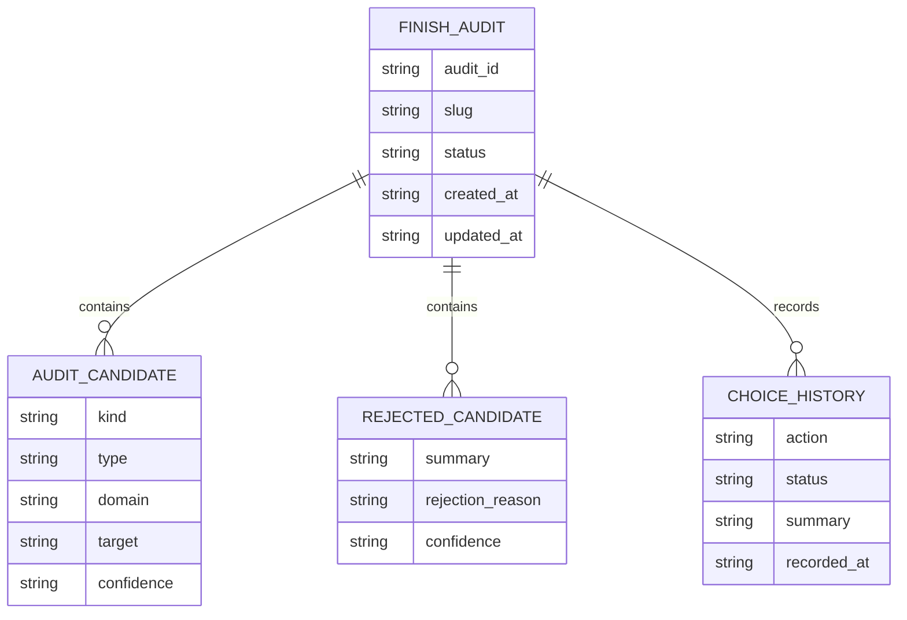

# finish 学习审计设计文档

## 一、修订历史

| 版本号 | 修订内容 | 修订时间 | 修订人 |
|---|---|---|---|
| V1.0.0 | 新建初稿，定义 finish-audit、finish-record、学习候选审计和用户选择持久化方案 | 2026-06-08 | zhangyukun |

## 二、需求信息

### 2.1 需求背景

- 背景：当前 `finish` 技能已经要求在完成前提取 `.loopx/memory/` 和 `docs/loopx/specs/` 候选，但实际输出经常是 `Memory: none`、`Spec candidates: none`。本地检查显示 `finish` 目前主要是技能文档流程，没有对应的 CLI 运行时阶段；`.loopx/memory` 和 `docs/loopx/specs` 当前也没有稳定产物。
- 需求目的：让 `finish` 每次都留下可审计的学习提取记录和用户完成选择记录。即使没有 memory 或 spec candidate，也必须能追踪扫描了哪些输入、拒绝了哪些候选、拒绝原因是什么。
- 目标用户/使用方：Codex/Claude 等使用 loopx 技能的 agent、维护 loopx 工作流的开发者、需要复盘 finish 输出的用户。
- 需求链接：无外部链接，来源为当前会话中的问题分析与方案讨论。
- 关联原始材料：
  - `skills/finish/SKILL.md`
  - `plugins/loopx/skills/finish/SKILL.md`
  - `src/cli.mjs`
  - `src/workflow.mjs`
  - `src/workspace-memory.mjs`
  - `docs/loopx/design/loopx-skill-suite-v1-design.md`

### 2.2 需求范围

- 本期范围：
  - 增加轻量 `finish-audit` 能力，为每次 finish 生成 `.loopx/finish/<timestamp>-<slug>/finish-state.json` 和 `finish-report.md`。
  - 增加轻量 `finish-record` 能力，用于记录用户最终选择：merge、PR、keep、discard，以及执行状态。
  - 定义 memory/spec candidate 的统一 schema、拒绝原因和审计输出格式。
  - 收紧 `finish` 技能文档，要求先运行审计、再呈现选项、最后记录选择。
  - 将 `none` 从无信息输出改为显式审计结果：必须包含 scanned inputs、rejected candidates 或 no-candidate reason。
- 非目标：
  - 不在本期实现完整的 `loopx finish` 自动 merge、PR、discard 状态机。
  - 不强制把 `.loopx/memory` 纳入 git 跟踪。
  - 不自动修改团队长期 spec，除非候选满足明确的稳定规则条件且 agent 已在 repo diff 中写入 `docs/loopx/specs/<domain>.md`。
  - 不用启发式替代 agent 的语义判断；运行时负责证据收集、结构校验和持久化，agent 负责最终语义归类。
- 决策边界：
  - `finish-audit` 是审计与证据收集入口，不执行用户完成选择。
  - `finish-record` 只记录选择与执行结果，不负责推断 memory/spec。
  - 是否将某条学习写入 memory 或 spec，由 `finish` 技能根据证据、候选 schema 和拒绝原因执行。
- 依赖方：
  - CLI 命令分发：`src/cli.mjs`
  - 新增或调整运行时模块：建议新增 `src/finish-runtime.mjs`
  - 技能文档镜像：`skills/finish/SKILL.md` 与 `plugins/loopx/skills/finish/SKILL.md`
  - 测试：`test/trellis-hardening.test.mjs`、`test/skill-governance.test.mjs`
- 约束条件：
  - 保持 v1 skill-first 产品定位，不新增必须全量执行的完成状态机。
  - 所有本地审计状态写入 `.loopx/`，避免污染 repo。
  - repo-tracked spec candidate 必须仍在 `docs/loopx/specs/`，并在 git diff 中可见。
  - 插件镜像必须与根技能保持一致。

### 2.3 可行性分析

- 业务可行性：本需求直接解决 finish 输出不可追踪的问题，能提升 agent 记忆和团队规则沉淀的可信度。
- 技术可行性：仓库已有 `.loopx/` runtime state、workspace journal、CLI command switch、Node test 框架和技能镜像治理，适合增加轻量审计模块。
- 团队接受能力：改动边界清晰，不改变 merge/PR/discard 的危险操作执行方式，接受成本低。
- 时间成本：中等。主要复杂度在 schema 设计、CLI 参数、技能文档收紧和测试覆盖。
- 资源成本：只增加本地小文件和少量 JSON/Markdown 读写，无额外服务依赖。
- 替代方案：
  - 仅增强提示词：实现最简单，但仍无法证明 agent 是否扫描过输入，也不能持久化用户选择。
  - 完整实现 `loopx finish` 状态机：最终一致性更强，但一次性覆盖 git merge、PR、discard 风险较高，超出本期问题核心。
  - 只写 workspace journal：能记录部分完成事实，但缺少候选 schema、拒绝原因和 finish 专用审计结构。
- 关键风险：
  - agent 仍可能不认真填写候选。通过 `finish-record` 校验必填审计字段来降低风险。
  - 审计文件过多。通过每次 finish 一个目录、可后续清理的本地 `.loopx/finish/` 结构控制。
  - spec candidate 过度写入。通过稳定规则条件和拒绝原因控制。

## 三、概要设计

### 3.1 方案总述

- 设计目标：
  - finish 每次都有本地审计记录。
  - 用户选择可持久化。
  - `none` 必须可解释。
  - memory/spec 候选必须有证据、目标和拒绝原因。
- 总体思路：
  - 新增 `finish-audit` 收集证据并创建审计目录。
  - `finish` 技能在审计目录中填充候选判断，再展示 merge/PR/keep/discard 选项。
  - 用户选择后，新增 `finish-record` 写入选择和执行状态。
  - 技能最终回复必须引用审计路径和选择记录。
- 核心模块：
  - `finish-runtime.mjs`：审计目录、状态 JSON、报告 Markdown、schema 校验。
  - `cli.mjs`：新增 `finish-audit`、`finish-record` 命令。
  - `finish` 技能：改为强制审计流程。
  - 测试：覆盖审计产物、选择记录、技能治理。
- 主要难点：
  - 在不做完整语义 AI runtime 的前提下，让 agent 的语义判断不再无痕跳过。
  - 区分本地 memory、repo spec candidate 和拒绝候选。
- 技术指标：
  - 每次审计生成 JSON 与 Markdown 两类产物。
  - `finish-record` 对必填字段做结构校验。
  - 所有新增测试通过 `npm test`。

### 3.2 整体架构设计

- 业务模式：skill-first，CLI 提供审计和记录约束，agent 负责语义判断和危险 git 操作前的人机确认。
- 系统边界：
  - CLI 只创建/更新 `.loopx/finish/` 审计产物。
  - 技能继续负责呈现完成选项和执行用户选择。
  - repo spec candidate 仍由 agent 写入 `docs/loopx/specs/`。
- 上下游系统：
  - 上游：git diff、workflow artifacts、review/final-review 输出、verification output、当前会话用户决策。
  - 下游：`.loopx/memory/`、`docs/loopx/specs/`、最终回复、用户选择执行结果。
- 应用架构：
  - `cli.mjs` 调用 `finishAuditStage` 与 `finishRecordStage`。
  - `finish-runtime.mjs` 复用现有路径工具风格，生成稳定 JSON/Markdown。
  - `skills/finish/SKILL.md` 指导 agent 读取审计报告、填候选、记录选择。
- 技术架构：
  - Node.js ESM。
  - JSON 状态为机器可读合同。
  - Markdown 报告为人类复盘入口。
- 数据流转：
  - `loopx finish-audit <slug>` -> 创建审计目录 -> 采集证据摘要 -> 写 `finish-state.json` 与 `finish-report.md`。
  - agent 根据审计输入填充 accepted/rejected candidates，写 memory/spec candidate。
  - 用户选择完成动作。
  - `loopx finish-record <audit-id> --action <action> --status <status>` -> 更新选择记录。
  - agent 最终回复引用 verification、chosen action、memory changes、spec candidates、audit path。

### 3.3 核心流程设计

| 流程 | 触发条件 | 参与系统/模块 | 主流程 | 异常/补偿 | 输出 |
|---|---|---|---|---|---|
| 创建 finish 审计 | agent 准备执行 finish | `cli.mjs`、`finish-runtime.mjs`、git、`.loopx/workflows` | 解析 slug 或当前 repo，创建 `.loopx/finish/<stamp>-<slug>/`，采集 diff、workflow artifacts、已有 memory/spec 状态，写初始审计 | 找不到 workflow 时仍允许 repo-only 审计，但标记 `workflow_status: missing` | `finish-state.json`、`finish-report.md` |
| 学习候选归类 | 审计创建后、展示完成选项前 | `finish` skill、审计产物、memory/spec 文件 | agent 按 schema 填写 accepted/rejected candidates；必要时写 `.loopx/memory` 或 `docs/loopx/specs` | 无候选时必须写 `no_candidates_reason` 和 scanned inputs | 更新后的审计产物与可能的 memory/spec diff |
| 用户选择记录 | 用户选择 merge/PR/keep/discard 后 | `finish-record`、审计产物 | 记录 action、status、execution summary、PR URL 或保留路径等 | 审计未完成时拒绝记录 `done`，要求补齐 audit result | 更新 `choice` 与 `completion` 字段 |
| 最终响应 | 选择已记录后 | `finish` skill | 输出 verification、chosen action、memory changes、spec candidates、audit path | 若记录失败，最终响应必须说明失败和手动补救命令 | 用户可复盘的完成摘要 |

### 3.4 功能模块

| 模块 | 职责 | 关键功能 | 依赖 | 备注 |
|---|---|---|---|---|
| `src/finish-runtime.mjs` | finish 审计运行时 | 创建审计目录、采集证据、读写状态、校验候选、记录选择 | `node:fs/promises`、git 命令、现有 workspace 路径 | 新增模块，避免继续扩大 `workflow.mjs` |
| `src/cli.mjs` | 命令入口 | 新增 `finish-audit` 与 `finish-record` usage 和 switch 分支 | `finish-runtime.mjs` | 不新增完整 `finish` 命令 |
| `skills/finish/SKILL.md` | agent 操作合同 | 强制先审计、再归类、再展示选项、最后记录选择 | CLI 命令、schema | 根技能与插件镜像同步 |
| `.loopx/finish/` | 本地审计存储 | 保存 `finish-state.json`、`finish-report.md` | `.gitignore` 已忽略 `.loopx/` | 不进入 repo |
| `docs/loopx/specs/` | repo-tracked spec candidate | 保存稳定团队规则 | git diff | 仅高置信候选写入 |
| 测试套件 | 回归保障 | 审计写入、记录校验、技能治理 | `node:test` | 覆盖正常和 none 场景 |

### 3.5 新增/调整功能说明

- CLI：
  - 新增 `loopx finish-audit [slug] [--json]`。
  - 新增 `loopx finish-record <audit-id-or-path> --action <merge|pr|keep|discard> --status <pending|done|failed> [--summary <text>] [--url <url>]`。
- Skill：
  - Step 4 学习提取前必须运行 `finish-audit`。
  - 展示完成选项前必须完成候选审计字段。
  - 用户选择后必须运行 `finish-record`。
  - 最终响应必须包含审计路径。
- Runtime：
  - 审计产物不阻断危险 git 操作的人类确认，但会阻断“声称完成”时缺少选择记录的情况。

## 四、详细设计

### 4.1 finish 审计运行时详细设计

#### 4.1.1 需求内容

- 入口：`loopx finish-audit [slug]`。
- 操作人/调用方：`finish` skill 或手动 CLI 用户。
- 前置条件：实现工作已完成，verification 准备执行或已执行。若存在 loopx workflow，应处于 final-review 后或 done 附近状态。
- 输出结果：本地审计目录和初始审计状态。

#### 4.1.2 方案设计

- 核心逻辑：
  - 解析 slug；若未传 slug，优先从 `.loopx/workflows` 中最近活动 workflow 或 git branch 推断，无法推断时报错要求显式传入。
  - 创建 `.loopx/finish/<YYYYMMDDTHHMMSSZ>-<slug>/`。
  - 采集 git branch、base branch、worktree 类型、dirty diff 摘要、untracked 文件摘要。
  - 读取 workflow state、spec、review/final-review、finish audit 等可用 artifacts。
  - 检查 `.loopx/memory/` 和 `docs/loopx/specs/` 是否存在。
  - 写入 `finish-state.json` 和 `finish-report.md`。
- 状态流转：
  - `created`：审计目录创建。
  - `needs-agent-audit`：已采集证据，等待 agent 填写候选。
  - `audited`：候选字段完整，可展示完成选项。
  - `choice-recorded`：用户选择已记录。
  - `completed`：选择执行结果为 done。
  - `failed`：选择执行失败或审计写入失败。
- 数据变更：
  - 写 `.loopx/finish/<id>/finish-state.json`。
  - 写 `.loopx/finish/<id>/finish-report.md`。
  - 不直接写 `.loopx/memory` 或 `docs/loopx/specs`，但在 report 中列出目标路径。
- 计算公式：
  - `audit_id = <timestamp>-<normalized-slug>`。
  - `base_branch` 使用 `git merge-base HEAD main`、`git merge-base HEAD master` 和当前 upstream 信息推断，不能确定则标记 `unknown`。
- 幂等设计：
  - `finish-audit` 默认每次新建目录，不覆盖历史审计。
  - 可后续扩展 `--reuse-latest`，本期不设计。
- 权限/越权控制：
  - 仅写当前 repo 下 `.loopx/finish/`。
  - 不执行 merge、push、discard。
- 异常处理：
  - git 信息读取失败时不整体失败，字段标记 `unavailable` 并记录 error。
  - workflow artifacts 缺失时记录 missing，不删除或补写旧状态。
- 补偿/重试：
  - 审计失败可重新运行生成新目录。
  - 若只是一部分证据读取失败，允许 agent 继续，但报告必须显示警告。
- 日志与审计：
  - `finish-report.md` 是人类可读审计日志。
  - `finish-state.json` 是机器可读状态。

#### 4.1.3 流程步骤

1. agent 执行 `loopx finish-audit <slug>`。
2. CLI 创建审计目录并采集证据。
3. CLI 输出审计目录路径和下一步提示。
4. agent 读取 `finish-report.md`，按候选 schema 完成学习审计。
5. agent 展示 finish 选项。

#### 4.1.4 边界条件

| 场景 | 处理方式 | 用户/调用方感知 | 监控/告警 |
|---|---|---|---|
| 无 `.loopx/workflows/<slug>` | 允许 repo-only 审计或要求显式 slug，状态中标记 workflow missing | 报告提示缺少 workflow evidence | `warnings` 字段 |
| git 不是 repo | 命令失败，提示 finish-audit 需要 git repo | 用户看到明确错误 | 错误码 `finish_audit_git_required` |
| `.loopx/finish` 不可写 | 命令失败，不进入 finish 选项 | 用户看到写入失败路径 | stderr 与异常 |
| 没有候选 | 允许，但必须写 `no_candidates_reason` | 最终输出不再是裸 `none` | `audit_result.status = no-candidates` |

### 4.2 学习候选 schema 详细设计

#### 4.2.1 需求内容

- 入口：agent 在审计后填写候选判断。
- 操作人/调用方：`finish` skill。
- 前置条件：`finish-audit` 已生成输入清单。
- 输出结果：accepted/rejected candidates 与 no-candidate reason。

#### 4.2.2 方案设计

- 核心逻辑：
  - 每条候选必须说明 kind、type、domain、summary、evidence、future usefulness、target、confidence。
  - 被拒绝的候选也必须记录 rejection reason。
  - 无候选时必须记录扫描范围和总拒绝理由。
- 状态流转：
  - `needs-agent-audit` -> `audited`。
- 数据变更：
  - 更新 `finish-state.json.audit`.
  - 更新 `finish-report.md` 的 Learning Audit 区块。
- 计算公式：不涉及。
- 幂等设计：
  - 重复填写时替换同一审计目录中的 audit 区块，保留 `audit.updated_at`。
- 权限/越权控制：
  - 只允许目标路径为 `.loopx/memory/...` 或 `docs/loopx/specs/...`。
- 异常处理：
  - 缺少 evidence 的 accepted candidate 不允许标记为 accepted。
  - spec candidate 目标不在 `docs/loopx/specs/` 时拒绝。
- 补偿/重试：
  - agent 可补充候选后重新运行记录命令。
- 日志与审计：
  - 所有 rejected candidates 保留在本地 ledger，不进入最终回复的长列表。

候选结构：

```json
{
  "kind": "memory",
  "type": "decision",
  "domain": "workflow",
  "tags": ["finish"],
  "summary": "finish requires a local audit before presenting completion options",
  "evidence": ["skills/finish/SKILL.md", "current conversation"],
  "future_usefulness": "Future agents can verify whether finish extraction was actually run.",
  "target": ".loopx/memory/entries/<id>.md",
  "confidence": "high",
  "status": "accepted"
}
```

拒绝候选结构：

```json
{
  "kind": "reject",
  "summary": "No spec promotion for local-only branch cleanup instructions.",
  "evidence": ["skills/finish/SKILL.md"],
  "rejection_reason": "too_local",
  "confidence": "high"
}
```

拒绝原因枚举：

| 原因 | 含义 |
|---|---|
| `ephemeral` | 只对本次会话有效 |
| `not_proven` | 没有实现或测试证据 |
| `duplicate` | 已有 memory/spec 覆盖 |
| `implementation_detail` | 内部实现细节，不应沉淀为规则 |
| `too_local` | 只适用于当前分支或当前文件 |
| `process_negative` | 只是“没有做某事”的负面流程记录 |
| `low_signal` | 对未来 agent 帮助不足 |

#### 4.2.3 流程步骤

1. agent 读取审计输入清单。
2. agent 列出候选和拒绝项。
3. agent 写入 memory/spec 文件或标记无需写入。
4. agent 更新审计状态为 `audited`。

#### 4.2.4 边界条件

| 场景 | 处理方式 | 用户/调用方感知 | 监控/告警 |
|---|---|---|---|
| accepted candidate 没有 evidence | 不允许通过审计校验 | 提示补证据或降级为 rejected | schema validation error |
| spec candidate 不是稳定规则 | 改为 rejected，reason `not_proven` 或 `too_local` | 最终输出说明 no spec candidates | ledger 保存拒绝项 |
| memory 超过 3 条 | 要求合并或降级 | agent 看到上限错误 | validation warning/error |
| 只有 process negative | 不写 memory，记录 rejected | 最终输出可说明 none with audit | rejected candidates |

### 4.3 用户选择记录详细设计

#### 4.3.1 需求内容

- 入口：`loopx finish-record <audit-id-or-path> --action <action> --status <status>`。
- 操作人/调用方：`finish` skill。
- 前置条件：审计状态至少为 `audited`；若仍为 `needs-agent-audit`，只能记录 `pending`，不能记录 `done`。
- 输出结果：选择和执行结果持久化。

#### 4.3.2 方案设计

- 核心逻辑：
  - 读取审计状态。
  - 校验 action 和 status。
  - 写入 `choice`、`execution`、`completed_at` 等字段。
  - 更新 Markdown 报告。
- 状态流转：
  - `audited` -> `choice-recorded` -> `completed` 或 `failed`。
- 数据变更：
  - 更新 `.loopx/finish/<id>/finish-state.json`。
  - 更新 `.loopx/finish/<id>/finish-report.md`。
- 计算公式：不涉及。
- 幂等设计：
  - 同一 action/status 可重复记录，后一次追加 `updated_at`。
  - action 改变时必须保留 previous choice 到 `choice_history`。
- 权限/越权控制：
  - `discard` 的执行确认仍由技能流程要求用户输入 `discard`，record 只记结果。
- 异常处理：
  - 无效 action/status 报错。
  - `done` 状态缺少 summary 时允许但警告；缺少审计结果时拒绝。
- 补偿/重试：
  - PR URL 后续生成时可再次 `finish-record --action pr --status done --url <url>` 更新。
- 日志与审计：
  - 保存用户选择、执行摘要、失败原因、相关 URL 或路径。

#### 4.3.3 流程步骤

1. 用户选择完成动作。
2. agent 执行动作或保留动作。
3. agent 运行 `finish-record` 写入选择。
4. agent 最终回复引用审计路径和选择状态。

#### 4.3.4 边界条件

| 场景 | 处理方式 | 用户/调用方感知 | 监控/告警 |
|---|---|---|---|
| 用户选择 keep | 记录 action `keep`、status `done`、worktree path | 用户看到保留路径 | report choice |
| PR 创建失败 | 记录 action `pr`、status `failed`、error summary | 用户看到失败原因和后续命令 | report failure |
| merge 成功但测试失败 | 记录 action `merge`、status `failed` | 用户看到 merged verification failed | report failure |
| discard 未确认 | 不记录 done，只可记录 pending 或 aborted | 用户知道未执行删除 | report pending/aborted |

## 五、存储类设计

### 5.1 库表设计

#### 5.1.1 数据库模型图

不涉及数据库。核心实体关系如下：



#### 5.1.2 表结构

不涉及数据库表。文件结构如下：

| 表名 | 用途 | 主键 | 关键索引 | 数据量预估 | 备注 |
|---|---|---|---|---|---|
| `.loopx/finish/<audit-id>/finish-state.json` | 机器可读审计状态 | `audit_id` | `slug`、`status` | 每次 finish 1 个 | 本地 ignore |
| `.loopx/finish/<audit-id>/finish-report.md` | 人类可读报告 | `audit_id` | 无 | 每次 finish 1 个 | 本地 ignore |

字段明细：

| 字段 | 类型 | 是否必填 | 默认值 | 含义 | 来源/取值逻辑 | 备注 |
|---|---|---|---|---|---|---|
| `schema_version` | number | 是 | 1 | finish audit schema 版本 | runtime 写入 | 用于迁移 |
| `audit_id` | string | 是 | 无 | 审计 ID | timestamp + slug | 目录名一致 |
| `slug` | string | 是 | 无 | workflow slug | CLI 入参或推断 | 规范化 kebab-case |
| `status` | string | 是 | `needs-agent-audit` | 审计状态 | runtime/record 更新 | 枚举 |
| `inputs.scanned` | array | 是 | `[]` | 已扫描输入 | runtime 写入 | 包含 path/kind/status |
| `audit.accepted_candidates` | array | 是 | `[]` | 接受候选 | agent 填写 | memory/spec |
| `audit.rejected_candidates` | array | 是 | `[]` | 拒绝候选 | agent 填写 | 必须带 reason |
| `audit.no_candidates_reason` | string/null | 否 | null | 无候选原因 | agent 填写 | accepted 为空时必填 |
| `choice.action` | string/null | 否 | null | 用户选择 | finish-record 写入 | merge/pr/keep/discard |
| `choice.status` | string/null | 否 | null | 执行状态 | finish-record 写入 | pending/done/failed/aborted |
| `choice.summary` | string/null | 否 | null | 执行摘要 | CLI 参数 | 最终回复引用 |

### 5.2 数据迁移/初始化

- DDL：不涉及。
- DML：不涉及。
- 数据回填：不回填历史 finish 输出。历史会话没有可靠审计证据，不能伪造。
- 老数据兼容：若 `.loopx/finish/` 不存在，首次运行时创建。
- 新老系统读写关系：新增审计不影响现有 workflow state、archive state 和 workspace journal。

### 5.3 缓存设计

不涉及缓存。

| 场景 | Key | Value | 数据结构 | 过期时长 | 容量预估 | 失效/刷新策略 |
|---|---|---|---|---|---|---|
| 不涉及 | 不涉及 | 不涉及 | 不涉及 | 不涉及 | 不涉及 | 不涉及 |

## 六、其他组件设计

### 6.1 消息设计

不涉及消息队列。

| 场景 | Group | Topic | 生产者 | 消费者 | 幂等键 | 失败补偿 |
|---|---|---|---|---|---|---|
| 不涉及 | 不涉及 | 不涉及 | 不涉及 | 不涉及 | 不涉及 | 不涉及 |

### 6.2 配置设计

本期不新增持久配置。可后续扩展默认 verification command、默认 base branch、审计保留数量。

| 配置项 | 环境 | 默认值 | 是否动态生效 | 说明 | 风险 |
|---|---|---|---|---|---|
| 不涉及 | 不涉及 | 不涉及 | 不涉及 | 本期无新增配置 | 不涉及 |

### 6.3 定时任务/批处理

不涉及定时任务。

| 任务 | 触发时间 | 处理范围 | 幂等 | 失败重试 | 影响评估 |
|---|---|---|---|---|---|
| 不涉及 | 不涉及 | 不涉及 | 不涉及 | 不涉及 | 不涉及 |

### 6.4 技术组件

- 分布式锁：不涉及。
- 唯一 ID：使用 `YYYYMMDDTHHMMSSZ-<slug>`，同秒冲突时可追加递增后缀。
- 加解密/验签：不涉及。
- 字典转换：action、status、candidate type、rejection reason 使用枚举校验。
- Excel/文件处理：不涉及。
- 用户信息透传：可复用 `resolveDeveloperIdentity` 记录 `developer`，但不阻塞。
- 限流/熔断：不涉及。

## 七、接口设计

### 7.1 接口设计原则

- CLI 输出必须可机器读取。默认输出简洁 JSON 或人类摘要，`--json` 输出完整结构。
- 非纯查询命令必须说明幂等策略。
- 错误码必须稳定，便于测试断言。
- 危险 git 操作不由本期命令执行。

### 7.2 接口清单

| 接口 | 调用方 | 服务方 | 权限/认证 | 幂等 | 文档地址 | 备注 |
|---|---|---|---|---|---|---|
| `loopx finish-audit [slug] [--json]` | agent/user | CLI | 本地文件权限 | 每次新建，不覆盖 | README/skill | 创建审计 |
| `loopx finish-record <audit-id-or-path> --action <action> --status <status> [--summary <text>] [--url <url>]` | agent/user | CLI | 本地文件权限 | 同 action/status 可更新 | README/skill | 记录选择 |

### 7.3 接口明细

#### 7.3.1 `loopx finish-audit`

- 路径/方法：CLI 命令。
- 请求头：不涉及。
- 请求参数：
  - `slug`：可选，workflow slug。
  - `--json`：可选，输出完整 JSON。
- 响应参数：
  - `ok`
  - `command`
  - `audit_id`
  - `audit_path`
  - `state_path`
  - `report_path`
  - `status`
  - `warnings`
- 错误码：
  - `finish_audit_git_required`
  - `finish_audit_slug_required`
  - `finish_audit_write_failed`
- 业务校验：
  - 必须在 git repo 内运行。
  - slug 无法推断时要求显式输入。
- 数据变更：
  - 新建 `.loopx/finish/<audit-id>/`。
- 日志字段：
  - `audit_id`
  - `slug`
  - `created_at`
  - `warnings`

#### 7.3.2 `loopx finish-record`

- 路径/方法：CLI 命令。
- 请求头：不涉及。
- 请求参数：
  - `audit-id-or-path`：必填，审计 ID 或审计目录路径。
  - `--action`：必填，`merge|pr|keep|discard`。
  - `--status`：必填，`pending|done|failed|aborted`。
  - `--summary`：可选，执行摘要。
  - `--url`：可选，PR URL 或相关链接。
- 响应参数：
  - `ok`
  - `command`
  - `audit_id`
  - `status`
  - `choice`
  - `report_path`
- 错误码：
  - `finish_record_audit_not_found`
  - `finish_record_invalid_action`
  - `finish_record_invalid_status`
  - `finish_record_audit_incomplete`
- 业务校验：
  - `done` 要求审计已完成，或 accepted candidates 为空时存在 `no_candidates_reason`。
  - `discard` 的确认动作不在 record 内执行，但 summary 应写明确认来源。
- 数据变更：
  - 更新 `finish-state.json` 与 `finish-report.md`。
- 日志字段：
  - `recorded_at`
  - `action`
  - `status`
  - `summary`
  - `url`

## 八、系统发布

### 8.1 灰度方案

- 灰度范围：先作为新增可选 CLI 命令和技能流程要求发布，不改变现有 `archive`、`review`、`approve` 行为。
- 灰度开关：不需要开关；用户不调用新命令则无影响。
- 验证指标：
  - `npm test` 通过。
  - `finish` 技能文档包含审计强制流程。
  - 新增测试证明 `none` 也有审计原因。
- 放量节奏：随下个 minor/patch 版本发布。

### 8.2 降级方案

- 降级触发条件：新命令写入失败或影响 finish 技能可用性。
- 降级行为：agent 可回退到现有 `finish` 文档流程，但最终回复必须说明审计未写入。
- 用户影响：不能持久化本次 finish 审计和选择，但不影响代码完成动作。
- 恢复方式：修复写入权限或回退变更。

### 8.3 关联系统/功能影响

| 系统/功能 | 影响 | 依赖动作 | 负责人 | 验证方式 |
|---|---|---|---|---|
| `finish` skill | 流程从纯文档变为必须调用审计/记录命令 | 更新根技能和插件镜像 | loopx 维护者 | skill governance test |
| CLI | 增加两个命令 | 更新 usage 和 switch | loopx 维护者 | CLI 测试 |
| `.loopx/` runtime | 新增 `.loopx/finish/` | 无迁移 | loopx 维护者 | 文件存在断言 |
| README | 说明 finish 审计和用户选择记录 | 更新中英文文档 | loopx 维护者 | 文档治理测试 |
| npm package | 新模块随 `src/` 发布 | 无额外 files 配置 | loopx 维护者 | `npm pack --dry-run` |

### 8.4 回滚方案

- 回滚条件：新增命令导致测试失败、安装失败或 finish 技能无法执行。
- 回滚步骤：
  - 移除 CLI 命令入口和 `finish-runtime.mjs`。
  - 还原 `finish` 技能文档审计强制要求。
  - 删除新增测试或改回旧断言。
- 数据回滚：`.loopx/finish/` 是本地 ignore 数据，无需 repo 回滚。
- 配置回滚：不涉及。
- 风险：回滚后恢复到 `none` 不可解释和用户选择不持久化的问题。

## 九、系统监控与维护

### 9.1 监控与告警

- 系统异常：CLI 写入失败、JSON parse 失败、git 信息读取失败。
- 业务异常：审计未完成就记录 `done`、accepted candidate 缺少 evidence、spec target 非法。
- 重试异常：重复 record action 改变时写入 choice history。
- 超时：git diff 过大时限制摘要长度，不读取无限内容。
- 关键接口指标：本地 CLI 无线上指标；通过测试和用户反馈验证。
- 告警渠道：不涉及线上告警。

### 9.2 性能与容量

- TPS/吞吐：本地 CLI 低频操作。
- CPU/内存/磁盘 IO：主要为 git 命令和小文件读写。
- 数据容量：每次 finish 一个目录，报告和 JSON 预计小于数十 KB。
- 缓存容量：不涉及。
- 跑批耗时：不涉及。
- 是否压测：不需要压测，需覆盖大 diff 截断测试。

### 9.3 可靠性与兜底

- 幂等击穿：默认每次 audit 新建目录，record 可重复更新同一目录。
- 并发失效：同秒 audit 目录冲突时追加后缀。
- 冷热备：本地文件，无备份。
- 关键任务独立性：审计不执行危险 git 操作，record 不修改 repo code。
- 字段兜底：缺失字段使用 `null` 或 `unknown`，并在 warnings 记录。
- 老新数据兼容：历史无审计数据不补写。

## 十、排期与规划

### 10.1 任务拆分与工作量评估

| 任务 | 范围 | 负责人 | 工作量 | 依赖 | 备注 |
|---|---|---|---|---|---|
| 运行时设计落地 | `finish-runtime.mjs`、路径与 schema | loopx 维护者 | 中 | 本设计文档 | 计划阶段细分 |
| CLI 命令接入 | `cli.mjs` usage 和 switch | loopx 维护者 | 小 | runtime | 不执行危险 git 操作 |
| 技能文档收紧 | 根技能与插件镜像 | loopx 维护者 | 小 | runtime 命令名稳定 | 必须同步 |
| 测试覆盖 | workflow/trellis/governance tests | loopx 维护者 | 中 | runtime + skill | 覆盖 none 场景 |
| README/release notes | 中英文说明与版本记录 | loopx 维护者 | 小 | 功能稳定 | 发布前完成 |

### 10.2 计划时间

- 数据方案评审：实现计划前完成。
- 开发开始/结束：由 `plan` 阶段决定。
- CR：实现完成后运行 `final-review`。
- 联调完成/提测：本地 CLI 测试通过后完成。
- 测试用例评审：计划阶段定义。
- 测试开始/结束：实现阶段执行。
- 预发布：不涉及服务预发布。
- 上线：随 npm/package 版本发布。
- 线上验证：安装后运行 `loopx finish-audit` 和 `loopx finish-record` smoke test。

### 10.3 发布计划

1. 需求纳入下个 loopx 版本。
2. 完成 runtime、CLI、skill、docs、tests。
3. 运行 `npm test`。
4. 执行 `npm pack --dry-run --json` 检查包内容。
5. 发布 release notes。
6. 安装验证技能镜像和 CLI 命令可用。

### 10.4 遗留问题与后续规划

| 问题 | 影响 | 处理计划 | 负责人 | 截止时间 |
|---|---|---|---|---|
| 是否最终合并成完整 `loopx finish` | 影响自动化程度 | 本期先不做，观察 audit/record 使用效果 | loopx 维护者 | 后续版本 |
| 是否提供 LLM adapter 自动生成候选 | 影响提取质量 | 本期由 skill 语义判断，runtime 负责结构约束 | loopx 维护者 | 后续版本 |
| 是否清理旧 `.loopx/finish` | 影响本地容量 | 后续可加 `loopx doctor` 检查或 prune 命令 | loopx 维护者 | 后续版本 |

### 10.5 Planning Handoff

- `plan` 可以决定：
  - `finish-runtime.mjs` 的函数拆分、内部 helper 名称和测试文件放置。
  - CLI 输出默认是人类摘要还是 JSON，但必须支持结构化输出。
  - Markdown report 的具体排版。
  - 大 diff 摘要截断阈值。
- 必须返回 `spec` 的事项：
  - 将本期范围扩大为完整 `loopx finish`，并由 CLI 执行 merge、PR、discard。
  - 改变 `.loopx/memory` 是否 repo-tracked。
  - 改变 `docs/loopx/specs/` 作为 spec candidate 目标目录。
- 必须返回 `clarify` 的事项：
  - 用户要求对 merge/PR/discard 执行策略作出新的产品决策。
  - 用户要求支持外部 issue tracker、远程存储或跨 repo finish 审计。
  - 用户要求自动语义提取必须达到某个准确率或引入外部模型服务。
- 推荐下一步：

```text
$plan-to-exec docs/loopx/design/finish学习审计需求设计文档.md
```

## 十一、QA

### 11.1 评审记录

| 评审时间 | 评审人 | 评审问题 | 处理进展 | 结论 |
|---|---|---|---|---|
| 2026-06-08 | Codex | 当前 finish 无运行时入口、无选择持久化、`none` 不可解释 | 已在设计中引入 finish-audit、finish-record 和候选审计 schema | 待用户评审 |

### 11.2 待确认问题

| 问题 | 需要谁确认 | 阻塞阶段 | 推荐答案 | 状态 |
|---|---|---|---|---|
| 是否本期只做 `finish-audit` 和 `finish-record`，不做完整 `loopx finish` | 用户/维护者 | plan | 是，先解决审计和选择记录问题，避免一次性扩大危险 git 操作范围 | closed |
| 是否允许无 workflow 的 repo-only finish audit | 用户/维护者 | plan | 允许，但必须标记 `workflow_status: missing`，避免阻塞非 loopx 工作流使用 | closed |
| 是否要求 `finish-record done` 必须审计完整 | 用户/维护者 | plan | 是，否则仍会出现“完成但无学习审计”的旧问题 | closed |
