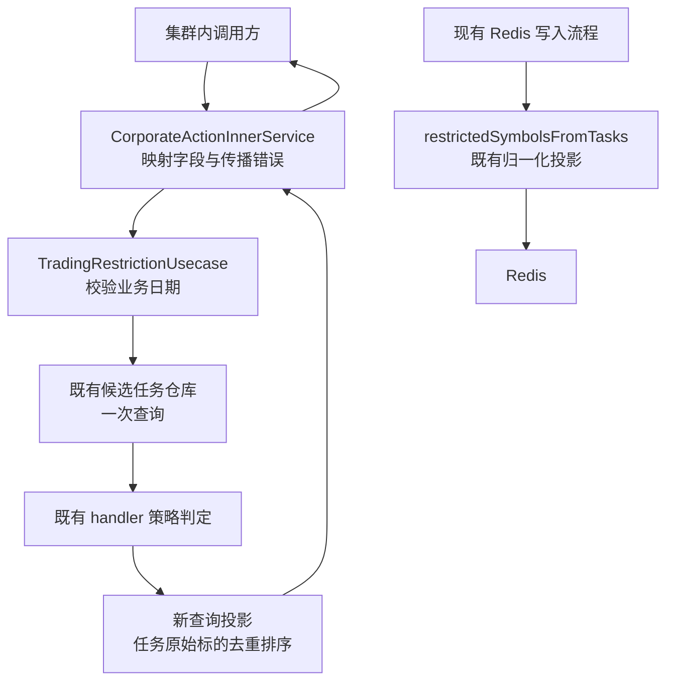

# 交易受限标的查询 · 概要设计（评审版）

| 项 | 内容 |
|---|---|
| 变更等级 | L2：新增集群内部 RPC 契约 |
| 版本 | v1.0 · 待评审 |
| 需求来源 | [演练夹具](source.md)，2026-09-07；其中 Repository facts and accepted choices、AC-001～008、TC-001～007 |
| 文档权威 | 本文拥有架构、核心流程和模块边界；[需求设计文档](需求设计文档.md)拥有字段和处理契约 |
| 实现状态 | 未开工；本次仅文档演练 |
| 决策状态 | 夹具所列技术方向已接受，无需提案；尚未进行设计评审，不具备实施交接条件 |
| 证据边界 | 仅使用夹具陈述的符号和契约，未检查真实 corporate-action 仓库、调用方或实现测试 |

| 版本 | 日期 | 说明 |
|---|---|---|
| v1.0 | 2026-09-07 | 建立评审初稿，区分已接受方向、待核实实现信息与未完成评审 |

## 1. 背景与范围

### 1.1 背景与目标

调用方需要按业务日期查询受公司行动限制交易的标的。现有内部 gRPC 服务可承载这一查询，现有任务候选查询和 handler 策略可决定哪些任务具有限制。新接口返回任务保存的原始标的字符串；现有 Redis 写入使用另一种投影，因此它不能直接充当该接口的数据源。夹具没有提供现有生产缺陷、调用量或收益指标，本文不补造这些背景。

### 1.2 范围

新增一个 `ListTradingRestrictedSymbols` 内部一元 RPC；在 `TradingRestrictionUsecase` 增加一个查询方法，通过 `Service` 和 `InnerUsecases` 接入。补充 inner proto 生成脚本及生成产物，保留已有 admin 工具版本约束。

| 不做 | 理由/归属 |
|---|---|
| HTTP/Gateway 暴露、鉴权边界变化 | 仅扩展已有集群内部调用面 |
| 新 usecase、service、任务数据源 | 既有所有者和扩展点足以承载查询 |
| Redis 读写、释放或 gate 调整 | RPC 返回口径不同，现有 Redis 流程继续独立工作 |
| 新表、迁移、分页、日历校验、后台任务 | 夹具明确排除 |
| 重试、补偿、额外一致性、日志基础设施、出站调用审计 | 夹具未要求；失败沿既有通路返回 |
| 代码、执行计划、真实项目改动 | 本次交付仅为演练设计材料 |

## 2. 总体设计

图中 RPC 主链路无 Redis 连接。图只表达职责及调用关系，不代表实现已验证。

**D-001 · Interface Contract / Operational Contract**

- 来源：AC-008，以及夹具的既有所有者、服务注入和内部暴露约束。
- 决策：沿 `CorporateActionInnerService → 小型 biz 查询接口 → TradingRestrictionUsecase → 既有仓库/handler` 扩展。`Service` 与 `InnerUsecases` 负责接入已有所有者；不另建 usecase、service 或策略副本。
- 边界：服务层仅处理协议映射和错误传播，biz 拥有日期校验及结果选择。仓库拥有候选查询，handler 拥有策略。权限与故障边界沿用已有内部 RPC。RPC 不访问 Redis。
- 下游要求：审查依赖和注入方向，验证旧 RPC 注册、Redis 写入/释放/gate 均保持；具体文件路径尚须真实仓库核实。

**D-002 · Behavior Contract**

- 来源：AC-004、AC-008，以及夹具的并发和只读限制。
- 决策：每次请求读取当次候选数据并计算，不写状态，不增加快照、锁、缓存或一致性承诺。相同候选数据与策略产生相同有序输出；其他工作流修改任务后，下次查询可以变化。
- 边界：不保证跨请求结果固定，也不承诺查询与其他工作流之间的原子快照；仓库和 handler 的既有语义不变。
- 下游要求：TC-007 同时证明确定排序与跨请求变化，测试不得把“确定性”解释为冻结数据。

| 跨模块决策 | 为什么 | 代价 |
|---|---|---|
| 按 D-001 扩展既有所有者和内部链路 | 策略与查询职责已有归属 | service/biz 注入及生成代码需要联合检查 |
| 按 D-002 保持既有读取语义 | 本需求是只读查询，不是交易时点裁决 | 调用方须接受相邻请求结果变化 |
| RPC 与 Redis 使用不同结果投影 | 两者的标的口径和排序语义不同 | 保留两个有明确用途的投影，候选和策略仍复用 |

## 3. 分模块方案

### 3.1 内部 RPC 与接入

**诉求**：提供查询入口，保留现有内部服务契约（AC-002、AC-003、AC-007、AC-008）。

**设计**：在已有服务增加方法，以业务日期调用 biz 查询，成功映射标的列表，失败传播错误且不返回回复对象。字段级契约见详细设计 §7，生成约束见 §4.3。

| 规则 | 为什么 |
|---|---|
| 日期错误继续使用现有 inner 转换（需求已定） | 不能把新增查询变成全局错误治理改造 |
| 零结果成功，执行失败不冒充空结果 | 调用方必须区分没有限制与无法判断 |
| 仅扩展内部 gRPC | 需求没有新增 HTTP 或权限边界 |

### 3.2 限制策略协调与查询投影

**诉求**：按候选任务和既有策略判断限制，返回原始标的集合（AC-001、AC-004～007）。

**设计**：biz 先校验日期，再调用一次候选查询，对每个任务调用既有策略函数。非限制结果跳过；限制结果选取 `task.Symbol`，按精确字符串去重并升序排列。任何候选查询、策略或受限任务空标的错误都终止本次查询。具体边界和错误归属见详细设计 §4.1。

| 规则 | 为什么 |
|---|---|
| AAPL 与 AAPL.US 保持不同（需求已定） | 接口输出存储原值，不输出 Redis key 口径 |
| 不设事件类型白名单 | 策略由 handler 注册与判定路径拥有 |
| 后续任务失败时，已收集标的也不返回（需求已定） | 部分列表会被误读为完整限制集合 |

### 3.3 既有仓库与 handler 边界

**诉求**：排除不符合条件的任务并保护既有规则（AC-001、AC-005、AC-008）。

**设计**：调用现有 `ListTradingRestrictionCandidates(businessDate)` 与 `tradingRestrictionDecisionForTask`，不改其查询或策略契约。record-only RIC 记录不属于任务来源。候选过滤的完整条件由详细设计 D-004 固定。

| 规则 | 为什么 |
|---|---|
| 不另写候选查询 | 避免形成第二套资格筛选口径 |
| 不修改 handler 或 Redis 投影来满足新输出 | 新需求只改变 RPC 的结果选取方式 |

## 4. 改动清单

| 表面 | 拟改动与验证边界 |
|---|---|
| 存储 | 新增 0 张表；不改表结构、状态枚举、初始化或迁移 |
| 接口 | 新增 1 个服务间 RPC；两个既有 RPC 的契约保持 |
| 手写代码 | 既有 service 映射、biz 小查询接口、`TradingRestrictionUsecase` 查询方法及 `Service` / `InnerUsecases` 注入；实际路径待核实 |
| 生成 | inner proto 源文件及新生成脚本，重新生成对应 Go 产物；不手改生成代码，不生成 go-http |
| 核心路径 | 要求既有候选查询、handler 策略、Redis 写入/释放/gate 行为不变；尚未实现，不能声称已达到零改动。以最终 diff 和 TC-006 回归确认 |

## 5. 对外影响与配合事项

| 相关方 | 要配合的事 |
|---|---|
| 服务维护者 | 核实 proto 包、注入位置与错误转换，先发布服务，再允许新调用方上线 |
| 调用方维护者 | 对齐原始标的口径；区分成功空列表和请求失败；将回滚后的 Unimplemented 视为失败 |
| 测试人员 | 按详细设计 TC 映射补足新查询用例和旧行为回归 |
| 设计评审参与者 | 评审材料中的职责、失败和发布边界，实际参与者及日期尚未提供 |

## 6. 风险与待确认

| 编号 | 风险 | 应对 |
|---|---|---|
| R-01 | 尚未发生设计评审 | 材料保持待评审，不标为实施就绪 |
| R-02 | 夹具不包含 proto 包、字段编号及实际注入位置 | 在真实项目落地前核实；不从符号名称臆造路径和线协议编号 |
| R-03 | 受限任务空标的或策略错误导致整次失败 | 遵循完整性规则；错误通过现有链路可见，不跳过坏数据 |
| R-04 | 候选量、响应尺寸及延迟缺少数据 | 在发布前核实适用负载，不编造 SLO 或引入分页/缓存 |
| R-05 | 服务回滚后调用方遇到 Unimplemented | 执行详细设计 D-010 的既定失败边界 |

| 编号 | 待核实议题 | 建议与阻塞范围 |
|---|---|---|
| U-01 | proto package/go_package、消息命名和字段编号、生成路径 | 沿真实 inner proto 约定；阻塞对应接口实现，不阻塞语义初稿 |
| U-02 | 空受限标的的既有错误类型及其 wire 映射 | 查既有错误构造及转换；不新造业务码，阻塞该错误分支的精确实现与测试断言 |
| U-03 | Go 版本、构造器签名、测试和生成命令 | 从真实仓库确认；阻塞可执行交接 |
| U-04 | 实际调用负载、现有超时、调用方和发布负责人 | 由相关维护者提供现有约束；影响发布验证，暂不新增机制 |

这里没有要求重新批准夹具已接受的技术方向。上述事项是证据缺口；本次演练不会访问真实仓库以填补它们。

## 7. 验收要点

所有实现验证均为**待验证**，这里只定义判据。

- biz：TC-001 返回 `["AAPL", "AAPL.US"]`；TC-002 日期无效时仓库调用次数为 0；TC-003 零候选或全非限制时成功空列表。
- 候选边界：TC-004 排除删除、终态、已释放、非 US、record-only RIC；补充 `no_action` 与删除时间两种有效表示。
- 失败完整性：TC-005 后续任务失败时没有部分回复；同时覆盖仓库、注册表和策略失败。
- 兼容性：TC-006 检查旧 RPC 注册/契约及 Redis、仓库、handler 行为；生成输出无新增 HTTP 面。
- 确定性：TC-007 相同数据输出相同排序，任务终态变化后允许后续请求缩减列表。

## 附录 · 技术细节备忘（评审可略过）

详细设计 §11.4 索引全部 D-001～D-010；本文仅拥有 D-001、D-002。日期业务错误与 wire 错误的区别见详细设计 D-008，避免将内部 detail 当成调用方消息。

实际评审状态：未进行；参与者、问题与评审结论均尚未产生。文档作者的自查不等于独立设计评审。
