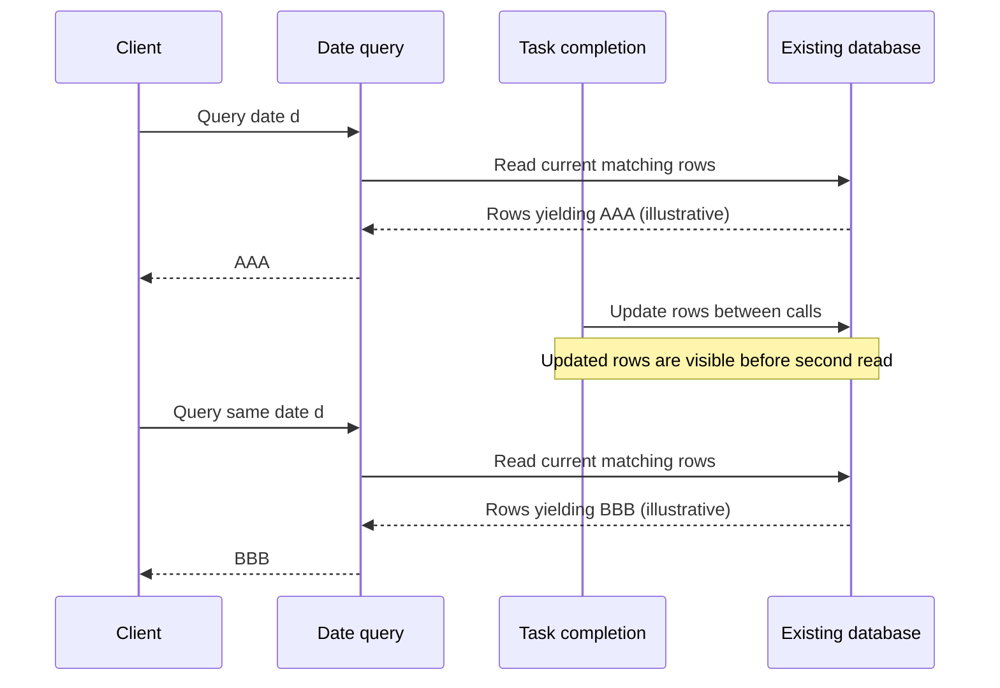

# 日期查询片段：保留原要求，交接暂缓

Author: Codex  
Last updated: 2026-09-07  
Status: Under review；修订提议未获批准，不能交给规划或实施。  
Source requirements: [接受过的原片段与事实](source.md)  
Support lenses: api-designer, sql-style。

## 修订历史

| 版本 | 日期 | 修订及原因 |
|---|---|---|
| V1.0.0 | 2026-09-07 | 保留原片段；将查询稳定性与字符转换冲突列为待裁决；按传输事实纠正客户端表及未渲染的 QA 声明 |

## 摘要

当前行读取不能凭“只读”承诺跨调用结果相同。AC-001 保持可见并标记为未满足，不以建议文字覆盖已接受需求。D-001 的原样返回与 TrimSpace 算法互相矛盾，提出移除该转换但等待裁决。D-002 的内部错误与传输结果分层表达；客户端不能按当前传输读取 `invalid_date`。原 QA 的“已渲染”声明纠正为未渲染。

本次交付只协调文档。没有实现、基础设施变更或计划，也不形成已批准的详细执行契约。

## AC-001 的稳定响应保证仍未解决

原要求：[AC-001](source.md)：“repeated date queries return exactly the same symbols.”

事实是查询读取当前行，任务完成会在两次调用间更新数据库，没有快照或缓存。以下是允许发生的反例，不声称来源提供了实际股票值，也不声称所有更新必然改变结果：假设某日期第一次查询符合条件的符号是 `AAA`；任务完成更新了影响该日期选择结果的行，使第二次查询得到 `BBB`。同一日期不能排除出现不同符号，因此现有事实不足以兑现原保证。稳定排序也不能解决输入行变化。单次读取是否具备快照一致性没有来源证据，本提议不增加该保证。

当前事实下的反例顺序图；箭头表示调用、读写和返回。图只展示一次合法先后顺序，未断言所有并发执行都如此。

**Proposed requirement amendment，尚未接受**：“每次日期查询按当次读取到的当前行计算符号结果；任务完成造成的行变化可能改变后续结果。”该文字改变 AC-001 的跨调用承诺，必须由需求所有者通过 `clarify` 裁决。原保证继续作为未解决要求，不能宣称已通过验收。若所有者坚持原承诺，必须重新裁决与现有约束的冲突；本次不设计快照、缓存、锁或其他基础设施。

## D-001 · Behavior Contract · Proposed correction

来源：[D-001 原文与算法](source.md)；AC 关联：本例没有给 D-001 分配来源 AC，不能把符号转换规则归因于 AC-001。

原文要求 raw stored symbols unchanged，算法却在去重前执行 TrimSpace。对存储符号 `" AAA "`，两者分别要求保留 `" AAA "` 和产生 `"AAA"`。这是值的改变，不能用“raw”描述。

**提议**：优先保留原文的原样返回约束，去掉去重前的 TrimSpace；去重使用未转换的符号，不能仅因裁剪结果相同就合并两个不同原始值。来源没有明确裁决冲突片段中哪一个优先，因此此修订等待原设计所有者确认，不把它当作已批准规则。提议没有增加排序、空白符号过滤或大小写归一化。

下表比较两个互斥的解释，不代表单次请求执行两条路径；用集合列举值，不定义响应排序。

| 共享输入 | 原文的 raw 路径 | 原算法的 TrimSpace 路径 |
|---|---|---|
| `" AAA "`, `"AAA"` | 保留两个不同原始值 | 转换后都为 `"AAA"`，去重后一个值 |
| `"  "` | 保留原始空格符号 | 转换为空字符串；来源没有说明是否随后过滤 |

边界：仅协调符号转换与去重口径，数据库存储、传输表面和其他查询规则不变。下游必须等待裁决；不得自行加入空值过滤来替冲突作决定。

## D-002 · Interface Contract · Evidence-corrected description

来源：[内部错误及既有传输事实](source.md)。AC 关联：来源未提供相关 AC。D-002 的“内部 detail 为 invalid_date”保留；根据证据纠正客户端表，不修改传输格式，也不声称接受了新的公开错误契约。

| 层级 | 可表达/观察内容 |
|---|---|
| 内部错误 | detail `invalid_date` |
| 既有传输输出 | status `Internal`；message `error_code=427012` |
| 客户端收到的错误 | status `Internal`；message `error_code=427012`；没有 detail `invalid_date` 字段 |

下游预期：客户端断言应落在既有传输可见字段，不断言内部 detail 可见。任何导出 detail 的变更均超出本次事实纠正，需要另行裁决公开契约。本记录不补造具体日期格式、校验触发条件、协议或字段位置。

## 专项检查与架构适配

证据范围为 [完整 fixture](source.md)，没有应用路径或代码可供定位；不将假想代码读取包装成现状证据。

- `api-designer`：逐层追踪错误；保留现有状态和消息格式，移除客户端能收到内部 detail 的错误断言。
- `sql-style` 与共享并发契约：只读查询会观察变化后的持久化数据；没有证据支持跨请求快照或稳定响应，不新增锁、事务、重试或缓存。
- 所有权保持现有任务完成逻辑写数据库、查询读取当前行、既有传输转换错误。该文档不创设状态拥有者、并行能力或依赖边界。维护成本是明确修正矛盾的所属段落及对应验收，而不是维持两套运行路径。

## 方案取舍与兼容性

| 方案 | 结论 |
|---|---|
| 修订 AC-001，使保证与当前行读取吻合 | 建议，需需求所有者批准；会弱化原承诺，不能自动采纳 |
| 保留无条件相同结果，并把实现问题交给下游 | 不可交接；现有事实不能保证要求 |
| 添加快照、缓存、锁或重试 | 不属于授权范围，未设计或实施 |
| D-001 保留 TrimSpace，并将“raw unchanged”改为标准化值 | 可供所有者裁决的另一解释；改变原文含义，当前不选为已接受结论 |
| 在传输中暴露 invalid_date | 超出事实纠正范围，会改变客户端表面，未采纳 |

移除 TrimSpace 可能改变返回值和去重结果；因此 D-001 仍为提议。D-002 只纠正文档对既有行为的描述。数据存储和运行架构没有变更。

## 待决与交接

| 问题 | 裁决责任 | 状态与影响 |
|---|---|---|
| AC-001 是否允许数据库变化后结果变化 | 需求所有者，经 clarify | Open；阻塞整体验收与规划交接 |
| D-001 是否以 raw unchanged 原文为准去掉 TrimSpace | 原设计所有者，必要时需求所有者裁决业务语义 | Open；阻塞该详细契约与实现 |

本提案可以评审，不能交给 plan2exec 或执行。未创建详细设计或概要设计，避免将未接受的修订升级为执行契约。上述待决事项不妨碍 D-002 和 QA 事实纠正。

## QA：实际语义检查与呈现证据

人工文档推演已完成，未执行系统、数据库或实现测试。来源没有 TC 编号；未为文档评审新编 TC。

| 来源与决定 | 场景 | 实际文档推演结果 |
|---|---|---|
| [AC-001](#AC-001-conflict) | 相同日期；任务完成在两次读取间改变结果相关行 | 可能得到 AAA / BBB，原保证不能得到支持；保留冲突 |
| [D-001](#D-001) | 原始 `" AAA "` 与 `"AAA"` | 原文和算法的值及去重结果不同；提议未被伪装成已批准 |
| [D-002](#D-002) | 内部错误 detail 为 invalid_date | 客户端只能观察 Internal 和 error_code=427012；表已按事实修正 |

原 QA：“diagrams are rendered”。**纠正：没有渲染发生。** 本次检查 `command -v mmdc`，退出码为 1，未找到该本地命令；未安装工具，也未调用其他渲染器。只人工核对 Mermaid 的参与者、箭头和反例顺序，不声称语法解析、渲染或布局可读性已经验证。缺少渲染证据只限制视觉验证，不能掩盖 AC-001 / D-001 的语义冲突。

本地来源链接和显式锚点已核对，决定唯一归属如下；完整规则只在所属段落维护。

### Design Contract Index

| Anchor | Source AC | Contract type | 状态 | 下游预期 |
|---|---|---|---|---|
| [D-001](#D-001) | 未提供 | Behavior Contract | Proposed correction | 等待原样返回与裁剪冲突裁决 |
| [D-002](#D-002) | 未提供 | Interface Contract | Evidence-corrected description | 保持既有传输，检查客户端真实可见值 |

[AC-001 冲突](#AC-001-conflict)保留原编号，未为一个未接受的猜测分配新 D 编号。
