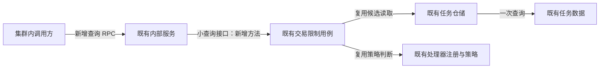
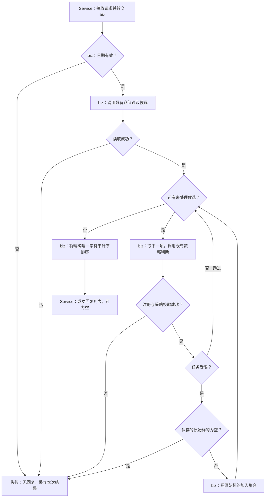

# 交易受限标的查询 · 概要设计（评审版）

| 项 | 内容 |
|---|---|
| 变更等级 | L2：新增集群内服务间 RPC 契约 |
| 版本 | V1.0.0 · 待评审 |
| 需求来源 | [演练输入 source.md](source.md)，2026-09-07；仅作为本次演练证据 |
| 文档权威 | 本文拥有模块边界与核心流程；[详细设计](需求设计文档.md)拥有字段、错误、生成及发布契约 |
| 实现状态 | 未实施；本次只交付设计文档 |
| 决策状态 | 输入明确的方向与技术选择已接受；设计评审尚未发生 |

| 版本 | 日期 | 说明 |
|---|---|---|
| V1.0.0 | 2026-09-07 | 建立模块边界、查询流程和评审范围；依据仅为演练输入 |

## 1. 背景与范围

### 1.1 背景与目标

集群内调用方需要按业务日期查询受交易限制的标的。现有任务候选筛选与处理器策略已能决定哪些任务受限；本次新增查询入口，把符合条件任务中保存的标的返回给调用方。这里返回的原始字符串与 Redis 使用的标的表示不同，不能把 Redis 结果直接当作查询结果。

### 1.2 范围

新增一个内部 unary gRPC 查询，扩展既有交易限制用例并完成服务注入；补充 inner proto 生成入口。请求失败时没有成功回复，成功但没有受限标的时返回空列表。

| 不做 | 理由或归属 |
|---|---|
| HTTP/Gateway、认证边界调整 | 沿用集群内 RPC 边界 |
| 数据表、任务状态规则、日历校验、分页 | 输入未要求；候选读取路径保持原契约 |
| Redis 访问或写入、释放、交易闸门改造 | 属于现有工作流，本 RPC 不调用 Redis |
| 缓存、快照、锁、重试、补偿、新监控基础设施 | 本次是按现有数据查询，不增加这些保证或机制 |

## 2. 总体设计

**D-001 · Behavior Contract · 已接受（演练）**：扩展 `TradingRestrictionUsecase`，通过现有小查询接口供 `Service` 使用，并经 `InnerUsecases` 注入。现有内部服务承载新方法；候选仓储与处理器策略仍是各自规则的所有者，不另建用例或服务。来源：AC-001、AC-008 及 source.md 的模块事实。边界：依赖仍从服务层指向 biz，认证与故障隔离边界不变；下游设计评审和实现必须检查注入与现有接口兼容性。

以下为已接受的模块依赖视图；箭头表示调用方向。“新增”指本次扩展，其他节点和被复用的路径已有。核心业务分支由 [D-002](#D-002) 说明。

`InnerUsecases` 负责装配，不是新增运行阶段。其他现有工作流仍能改变任务状态；查询不接管任务数据的写入所有权。图中没有 Redis 依赖。

| 决策 | 为什么 | 代价 |
|---|---|---|
| 复用候选与策略，独立输出投影，见 [D-004](需求设计文档.md#D-004) | 新查询需要保存的原始标的，Redis 需要既有键表示 | 维护两个明确、有不同语义的投影，不能合并到 Redis helper |
| 只保证相同候选数据与策略下结果稳定，见 [D-005](需求设计文档.md#D-005) | 任务会由其他工作流更新，查询没有快照 | 两次请求可能得到不同列表，调用方不能据此推断查询异常 |

## 3. 分模块方案

### 3.1 交易限制查询

**D-002 · Behavior Contract · 已接受（演练）**：查询由 biz 负责日期校验、候选读取、逐任务策略判断及结果汇总。无候选或全部跳过是成功；任何读取、注册、策略或受限任务原始标的为空的错误使整次请求失败，已汇总项也不返回。来源：AC-001、AC-002、AC-003、AC-007。边界：不按事件类型建立新的白名单，不提供部分列表或字段回退；下游验证必须包含“先汇总有效项，再失败”的场景。

下图是已接受的新 RPC 核心流程，框内标明责任。候选读取与策略判断是既有能力，汇总为本次新增逻辑。失败出口经现有错误转换返回调用方，详见 [D-007](需求设计文档.md#D-007)。

股息和市场转移的既有策略会返回不受限；拆股、合股、退市、改名的既有策略会限制。这个背景用于理解结果，不构成可替代策略注册表的类型名单。空原始标的导致整次失败是需求已定的损坏数据规则，避免把不完整结果误认为完整列表。

### 3.2 内部服务与生成入口

服务只负责协议字段映射及错误传递，不搬入业务筛选规则。新增 RPC 的精确字段由 [D-006](需求设计文档.md#D-006) 定义。生成入口维护 proto 到生成代码的关系，工具版本与产物边界由 [D-008](需求设计文档.md#D-008) 定义。

## 4. 改动清单

| 表面 | 本次变更 |
|---|---|
| 服务间接口 | 新增 `CorporateActionInnerService.ListTradingRestrictedSymbols`；旧 RPC 的注册与契约必须保留 |
| biz 与装配 | 既有用例增加查询方法；小接口、`Service`、`InnerUsecases` 承接注入 |
| proto 与生成 | 新增请求/回复及 RPC 定义、inner 生成脚本；生成代码由工具更新 |
| 既有数据和策略路径 | 无 schema 或状态枚举变更；候选查询、处理器策略、Redis 写入/释放/闸门路径要求零逻辑改动 |

“零逻辑改动”是设计约束，并非已验证的实现结果。后续须用差异检查和 [TC-006 验证策略](需求设计文档.md#verification) 核对；生成文件整体变化不等于旧 RPC 可以改约。

## 5. 对外影响与配合事项

| 相关方 | 要配合的事 |
|---|---|
| 服务提供方 | 按 [发布契约](需求设计文档.md#D-009) 先部署服务，并验证新旧 RPC |
| 集群内调用方 | 接受精确标的字符串及空列表语义；区分失败与空成功；服务回滚后的不支持方法错误必须按失败处理 |
| 测试与评审者 | 按 [AC—D—TC 映射](需求设计文档.md#verification) 核对结果与错误边界，确认待补证项 |

输入没有提供具体团队、负责人或排期，本次不虚构分工人名。

## 6. 风险与待确认

| 风险或证据缺口 | 应对与对交付的影响 |
|---|---|
| 空原始标的错误的具体类型及线路映射未提供 | 已确定整次失败；精确错误仍由 [Q-001](需求设计文档.md#questions) 补证，不能声明完整线路契约就绪 |
| 实际 proto 包、已有生成参数与文件位置未提供 | [Q-002](需求设计文档.md#questions) 要求对真实仓库补证，避免猜文件路径和生成规则 |
| 旧服务无法提供新方法 | 按已接受的 [D-009](需求设计文档.md#D-009) 发布和回滚边界处理 |
| 数据可能在两次查询间变化 | 按 [D-005](需求设计文档.md#D-005) 判断确定性，避免承诺快照 |

没有发现需要改动已接受业务方向的冲突。设计评审尚未发生；准备好评审材料不代表通过评审，也不授予真实项目实施权限。

## 7. 验收要点

业务结果应按精确字符串返回去重升序列表，策略不受限的任务不贡献标的；验证 TC-001、TC-003、TC-004、TC-007。输入和故障边界验证 TC-002、TC-005；保护既有路径验证 TC-006。完整可执行判据与文档推演结果统一维护在[详细设计 QA](需求设计文档.md#verification)。所有实现测试均待执行。

## 附录 · 技术细节备忘（评审可略过）

[字段与协议](需求设计文档.md#D-006)、[错误转换](需求设计文档.md#D-007)、[生成版本](需求设计文档.md#D-008)、[全部设计锚点](需求设计文档.md#contract-index)。目前无评审参与者、意见或通过结论可记录。
