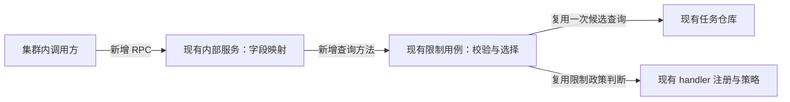
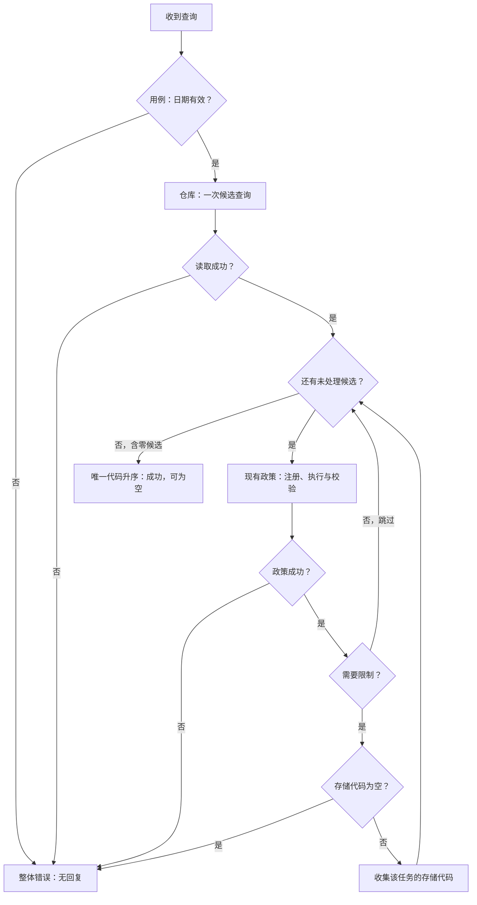

# 交易限制证券查询 · 概要设计

状态：v0.1，待设计评审；来源中的方向与技术选择已在本次演练中接受，本文尚未经过评审，也未实施。
来源：[演练请求、仓库事实与验收](source.md)。字段合同和验证见[需求设计文档](需求设计文档.md)。
修订：2026-09-07 首版；按给定事实形成可评审的只读 RPC 设计，没有新增提案或执行计划。

## 查询解决什么问题

为集群内调用方提供指定业务日期的受交易限制证券列表。结果采用任务中保存的证券代码，让调用方区分 `AAPL` 和 `AAPL.US`。日期符合格式即可进入查询，不新增交易日历判断。

这次增加内部 RPC，沿用现有任务候选范围和 handler 限制政策。候选之外的 record-only RIC 记录不参与查询。查询不访问 Redis；它的返回值不代表 Redis 键集合，也不提供跨请求不变的快照。

## 职责保持在现有边界内

**D-001 · Interface Contract · 演练方向已接受**（AC-008）。在 `CorporateActionInnerService` 增加查询入口，由现有 `TradingRestrictionUsecase` 协调政策。服务层只映射字段和传播错误，通过小查询接口依赖 biz；不增加 usecase 或服务。下游应验证装配和原有两个 RPC 的合同保持完整。

下图展示本次接受的职责增量，箭头表示调用依赖。新增的是查询入口及其连接；仓库查询和 handler 政策是已有复用点。

架构依据仅来自 [source.md](source.md) 的 Repository facts：`TradingRestrictionUsecase` 是政策协调 owner；现有服务使用小查询接口；任务仓库保有读取职责；handler 注册与策略保有政策职责。具体文件、构造函数和真实测试未提供，未声称检查过它们。

最接近的复用候选是 Redis writer 使用的 `restrictedSymbolsFromTasks`，但其结果投影不符合新接口。保留共有候选与政策能力，将新投影放在同一 usecase 的新增方法中，可避免第二份政策来源。精确差别由[投影合同 D-003](需求设计文档.md#D-003)维护。代价是需要维护两个有意不同的输出投影，并用边界测试防止误合并。

共享持久化状态仍由既有工作流管理。错误范围是当前 RPC：不保存中间结果、不产生外部写入。维护和移除范围限于新增协议、现有 owner 的查询方法、服务装配及生成支持；无新后台生命周期或基础设施。

## 一次查询如何得出结果

**D-002 · Behavior Contract · 演练方向已接受**（AC-001、AC-002、AC-003、AC-005、AC-007）。候选和政策均采用既有合同；不限制的任务跳过；仓库、注册、策略或受限制任务空代码错误均结束整个请求。失败前已收集的代码不会成为部分响应。下游测试须区分“跳过一项”“空成功”和“整体失败”。

下图是接受的核心流程，判断与收集由限制用例负责；读取由仓库负责，政策由现有 handler 路径负责。字段及错误转换见[接口合同 D-004](需求设计文档.md#D-004)。

`dividend` 和 `market-transfer` handler 返回不限制，因此跳过；`split`、`reverse-split`、`delisting` 和 `symbol-change` handler 返回限制。源场景 TC-001 中的 AAPL 任务具体为 `delisting-option`，保留该类型名称并经现有 handler 路径判断，不将它改写为 `delisting`。这里解释现有策略结果，不以事件类型白名单替代政策判断。仓库候选规则与精确字符串处理集中在[数据合同 D-003](需求设计文档.md#D-003)。

## 变更影响与评审状态

**D-005 · Operational Contract · 演练方向已接受**（AC-004、AC-008）。保持现有 `HasPendingExecutionToday`、`ListClearingReconciliationDetails`，以及 Redis 写入、释放和 gate 行为。内部 unary gRPC 的权限边界保持不变，不增加 HTTP/Gateway。先部署服务再部署调用方；服务回滚后新调用可能得到 `Unimplemented`，调用方必须视为失败。下游须检查兼容性及回滚后的失败处理，不增加重试或替代数据源。

返回排序只保证同一候选数据与政策产生相同结果。其他工作流可能在两次请求之间推进任务状态，下一次结果可减少；本设计不增加快照、锁或缓存。只读不等于结果冻结。

主要风险是混用 Redis 的规范化证券代码、误把中途失败变成部分成功，以及将内部日期错误详情当作 wire 消息。对应合同与源场景的实际推演见[Verification Strategy](需求设计文档.md#verification)。

设计评审尚未发生，没有评审人、提出的问题或评审结论可记录。已接受方向无需重新批准；当前交付是待评审材料。真实路径、生成配置及未给出的错误外显信息见[证据缺口与交接](需求设计文档.md#handoff)，未解决前不得标记为可实施。图未完成渲染视觉验证，具体检查限制由详细设计 QA 维护。
