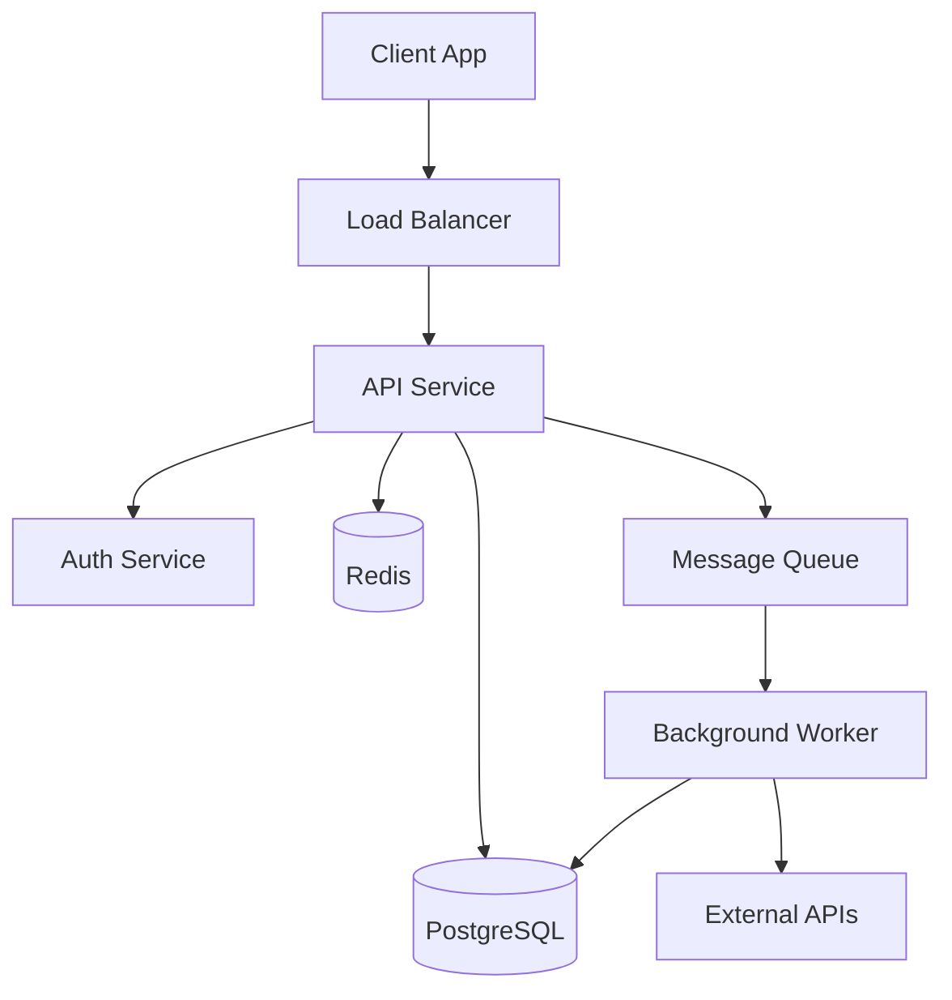
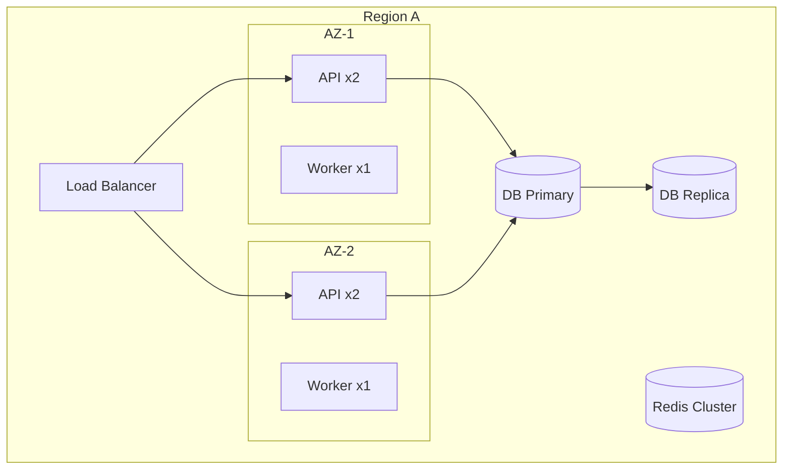

# System Design Template

## Design Document Structure

```markdown
# System: {System Name}

## Requirements

### Functional
- [What the system must do]
- [Core features and capabilities]

### Non-Functional
- **Performance**: Response time < 200ms p95
- **Availability**: 99.9% uptime (8.76 hours downtime/year)
- **Scalability**: Support 10,000 concurrent users
- **Security**: PCI DSS compliance required

### Constraints
- Budget: $X/month for infrastructure
- Timeline: MVP in 3 months
- Team: 5 backend, 3 frontend engineers

## High-Level Architecture

[Component diagram with technology choices]

## Component Details

[Per-component: technology, responsibilities, scaling strategy]

## Key Decisions

[Decision table with rationale]

## Scaling Strategy

[Current → 10x → 100x growth plan]

## Security Considerations

[Auth, encryption, compliance, rate limiting]

## Failure Modes

[Failure scenarios with impact and mitigation]
```

## Capacity Estimation

### Back-of-Envelope Framework

Before selecting technology or sizing infrastructure, estimate the system's load profile.

#### Step 1: Identify Load Drivers

| Driver | Question | Example |
|--------|----------|---------|
| Users | DAU / MAU? | 100K DAU |
| Actions | Actions per user per day? | 10 reads, 2 writes |
| Data | Bytes per action? | 1KB per read, 5KB per write |
| Growth | Monthly growth rate? | 15% |

#### Step 2: Calculate Throughput

```
Read QPS  = DAU × reads_per_user / seconds_per_day
          = 100,000 × 10 / 86,400
          ≈ 12 QPS (average)

Write QPS = DAU × writes_per_user / seconds_per_day
          = 100,000 × 2 / 86,400
          ≈ 2.3 QPS (average)

Peak QPS  = average × peak_factor (typically 3x-10x)
          ≈ 12 × 5 = 60 QPS (peak reads)
```

#### Step 3: Calculate Storage

```
Daily new data   = DAU × writes_per_user × bytes_per_write
                 = 100,000 × 2 × 5KB = 1GB/day

Annual storage   = daily × 365 × replication_factor
                 = 1GB × 365 × 3 = ~1TB/year

With indexes     = storage × 1.3 (30% index overhead)
                 ≈ 1.3TB/year
```

#### Step 4: Calculate Bandwidth

```
Ingress = write_QPS × avg_request_size
        = 2.3 × 5KB ≈ 12KB/s

Egress  = read_QPS × avg_response_size
        = 12 × 10KB ≈ 120KB/s (average)
        = 60 × 10KB ≈ 600KB/s (peak)
```

#### Step 5: Calculate Memory (Cache)

```
Cache size = hot_data_percentage × total_data
           = 20% × 365GB (one year) ≈ 73GB

Or by QPS: cache_entries = peak_QPS × avg_response_time × response_size
           = 60 × 0.2s × 10KB ≈ 120KB active working set
```

### Estimation Quick Reference

| Scale | DAU | QPS (avg) | Storage/year | Typical Architecture |
|-------|-----|-----------|--------------|---------------------|
| Small | 1K | < 1 | < 10GB | Single server |
| Medium | 100K | 10-100 | 100GB-1TB | Load balancer + replicas |
| Large | 10M | 1K-10K | 10TB-100TB | Microservices + sharding |
| Massive | 1B | 100K+ | PB+ | Global distribution |

### Common Capacity Numbers

| Resource | Typical Limit | Planning Target |
|----------|--------------|-----------------|
| Single PostgreSQL | 10K QPS | 5K QPS (headroom) |
| Single Redis | 100K QPS | 50K QPS |
| Single API server | 1K-5K req/s | 1K req/s (with business logic) |
| Network (1Gbps) | 125MB/s | 80MB/s |
| SSD IOPS | 50K-100K | 30K |

## Load / Store / Compute Analysis

Decompose system load into three dimensions to identify bottlenecks.

### Load (Ingress)

| Question | Analysis |
|----------|----------|
| What enters the system? | Requests, events, uploads, streams |
| What rate? | QPS, messages/sec, bytes/sec |
| What pattern? | Steady, bursty, time-of-day, seasonal |
| What size? | Request payload sizes, batch sizes |
| What validation? | Schema validation, auth, rate limits |

### Store (Persistence)

| Question | Analysis |
|----------|----------|
| What must be durable? | Transactions, events, documents, blobs |
| What access pattern? | Random read, sequential scan, time-range |
| What consistency? | Strong, eventual, causal, read-your-writes |
| What retention? | Forever, TTL, tiered (hot/warm/cold) |
| What growth rate? | Linear, exponential, bounded |

### Compute (Processing)

| Question | Analysis |
|----------|----------|
| What transforms data? | Business logic, aggregation, ML inference |
| What latency budget? | Sync (< 200ms), async (seconds-minutes), batch (hours) |
| What parallelism? | Independent per request, fan-out/fan-in, pipeline |
| What failure mode? | Retry, skip, dead-letter, compensate |
| What cost driver? | CPU, memory, GPU, external API calls |

### Bottleneck Identification

```
For each dimension, ask:
  1. What is the current capacity?
  2. What is the current utilization?
  3. At what growth rate does it saturate?
  4. What is the scaling mechanism? (vertical, horizontal, architectural change)
  5. What is the cost curve? (linear, superlinear, cliff)
```

## Caching Strategy Selection

### Cache Decision Framework

```
Should I cache this?
  1. Is it read more than written? (read:write > 3:1) → Yes
  2. Is it expensive to compute/fetch? (> 50ms) → Yes
  3. Can I tolerate stale data? → If no, consider write-through or skip cache
  4. Is the data set bounded? → If no, need eviction strategy
```

### Cache Patterns

| Pattern | How It Works | Best For | Risk |
|---------|-------------|----------|------|
| **Cache-Aside** | App reads cache, on miss reads DB and fills cache | General purpose | Cache stampede on cold start |
| **Read-Through** | Cache reads from DB on miss transparently | Simplify app logic | Cache becomes critical path |
| **Write-Through** | Write to cache and DB synchronously | Strong consistency | Write latency increase |
| **Write-Behind** | Write to cache, async flush to DB | Write-heavy workloads | Data loss on cache failure |
| **Refresh-Ahead** | Proactively refresh before TTL expires | Predictable hot keys | Wasted refreshes for cold keys |

### Cache-Aside (Most Common)

```
Read:
  1. Check cache → hit → return
  2. Miss → read DB → write to cache → return

Write:
  1. Write DB
  2. Invalidate cache (don't update — avoids race conditions)
```

### Cache Invalidation Strategies

| Strategy | Consistency | Complexity | Use When |
|----------|-------------|------------|----------|
| TTL-based | Eventual (bounded staleness) | Low | Staleness within TTL is acceptable |
| Event-driven invalidation | Near real-time | Medium | Write events are available |
| Write-through | Strong | Medium | Cannot tolerate stale reads |
| Versioned keys | Strong for specific version | Low | Immutable data with version |

### Multi-Layer Caching

```
┌─────────┐     ┌──────────┐     ┌─────────┐     ┌──────────┐
│ Browser │────▶│   CDN    │────▶│App Cache│────▶│ Database │
│  Cache  │     │  (edge)  │     │ (Redis) │     │          │
└─────────┘     └──────────┘     └─────────┘     └──────────┘
  seconds         minutes          seconds         source
  per-user        per-region       per-app         of truth
```

| Layer | TTL | Scope | Invalidation |
|-------|-----|-------|-------------|
| Browser | 60s-1h | Per user | Cache-Control headers |
| CDN | 5m-24h | Per region | Purge API or TTL |
| Application (Redis) | 1m-1h | Per app cluster | Event-driven or TTL |
| Database query cache | Automatic | Per instance | On table mutation |

### Cache Sizing

```
Working set = unique_keys × avg_value_size × overhead_factor

Example:
  1M users × 2KB avg profile × 1.5 overhead = 3GB
  → Fits in a single Redis instance (recommend 8GB for headroom)
```

### Anti-Patterns

| Anti-Pattern | Problem | Fix |
|---|---|---|
| Cache everything | Memory waste, cold start storms | Cache only hot, expensive, read-heavy data |
| No TTL | Stale data forever | Always set TTL, even if long |
| Update cache on write | Race condition between concurrent writes | Invalidate on write, let next read fill |
| Unbounded cache | OOM | Set max memory + eviction policy |
| Cache as primary store | Data loss on eviction/restart | Cache is acceleration, DB is truth |

## Architecture Diagram Template

Use Mermaid for component, sequence, and deployment diagrams.

### Component Diagram



### Deployment Diagram



## Quick Reference

| Section | Key Questions |
|---------|---------------|
| Requirements | What must it do? How well? |
| Capacity | How much load? How much data? How fast is it growing? |
| Architecture | What components? How connected? |
| Caching | What is hot? What tolerance for stale? |
| Decisions | Why these choices? What was rejected? |
| Scaling | How to grow 10x? Where is the bottleneck? |
| Failures | What can break? How to recover? What is the blast radius? |
