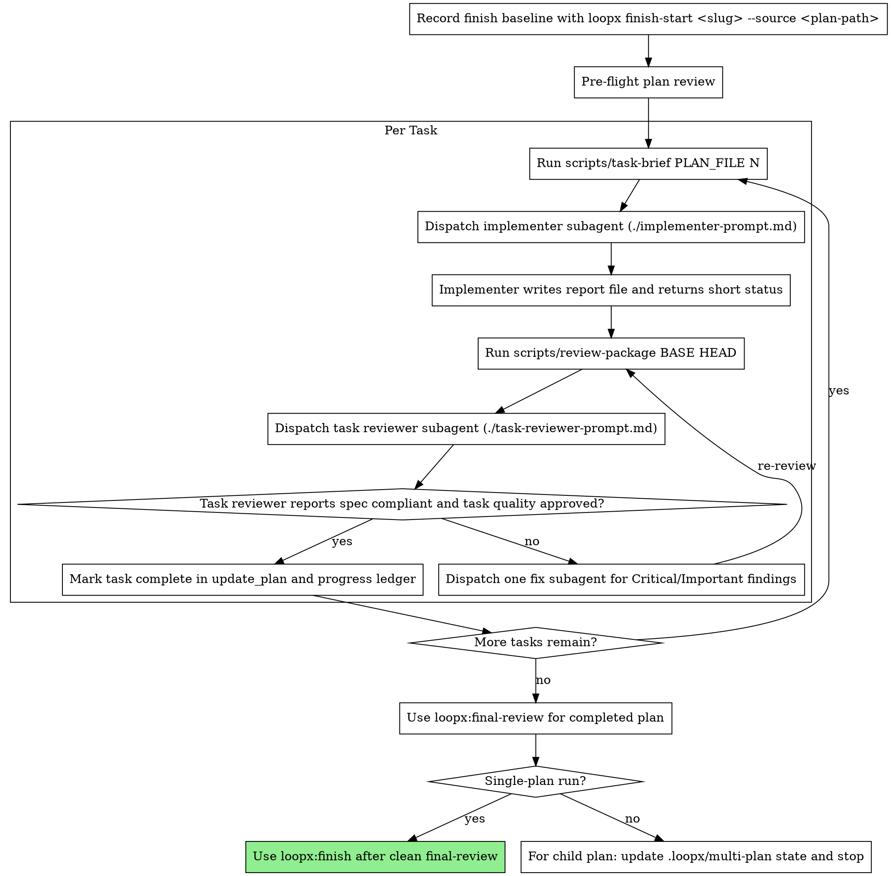

# Subagent Exec

Execute plan by dispatching a fresh implementer subagent per task, one combined
task reviewer after each task, and final review according to plan scope. For
single-plan runs, proceed to `loopx:final-review` and `loopx:finish`. For
numbered multi-plan child runs, stop after plan-level `loopx:final-review` and
multi-plan state update.

**Why subagents:** You delegate tasks to specialized agents with isolated
context. You construct exactly what they need: task brief, anchor context,
surface-change context, report path, and review package path.

**Core principle:** Fresh subagent per task + combined task review (spec +
quality) + final whole-feature review = high quality with fewer subagent turns.

**Continuous execution:** Do not pause to check in between tasks. Execute the
plan without stopping unless you are BLOCKED, real ambiguity prevents progress,
or all tasks are complete.

## When to Use

Use this skill for approved implementation plans whose tasks can be executed
mostly sequentially with isolated subagent context. Use `loopx:exec` when
subagent support is unavailable or edits are too tightly coupled for safe
delegation.

## Multi-Plan Child Plans

When the plan file is a numbered child plan under `docs/loopx/plans/YYYY-MM-DD-<feature-slug>/`, execute only that child plan. Do not execute sibling child plans. Do not proceed to `finish` after the child plan completes.

After all tasks in the child plan pass task review, run plan-level `loopx:final-review` for that child plan and update `.loopx/multi-plan/<feature-slug>/state.json`:

```json
{
  "path": "docs/loopx/plans/YYYY-MM-DD-<feature-slug>/01-example.md",
  "status": "complete",
  "plan_final_review": ".loopx/final-review/YYYY-MM-DD-01-example.md",
  "ready_for_spec_review": true
}
```

Only after every child plan in the package is complete should an agent run spec-level `loopx:final-review` for the source spec and package overview. `loopx:finish` is allowed only after the spec-level final-review is clean.

## Step -1: Confirm Subagent Capability

Before falling back to `loopx:exec`, run the current platform's subagent
capability check. Use the matching platform reference from `./platform-subagents.md`.
Codex may expose multi-agent tools through deferred tool discovery, so do not
treat an initial visible tool list that omits `spawn_agent`, `wait_agent`, or
`close_agent` as final evidence. In non-Codex runtimes, use the platform's
native subagent availability check before declaring subagents unavailable.

## The Process



## Step 0: Record Finish Baseline

Before dispatching the first implementer, run:

```bash
loopx finish-start <slug> --source <plan-path>
```

Use the plan filename slug when no workflow slug is available. This preserves
the starting `HEAD` so `finish-audit` can inspect `baseline..HEAD` even after
implementers commit their work and the current `git diff` is empty.

## Pre-Flight Plan Review

Before dispatching Task 1, scan the plan once for conflicts:

- tasks that contradict each other
- tasks that contradict Global Constraints
- missing Interfaces that downstream tasks rely on
- anything the plan explicitly mandates that the task reviewer rubric treats as
  a defect

Batch findings into one question to the user. Show the plan text and the
conflicting requirement side by side, and ask which governs. If the scan is
clean, proceed without comment.

## File Handoffs

Use files for bulky artifacts so controller context stays small:

- Task brief: run `scripts/task-brief PLAN_FILE N`; pass the printed path to
  the implementer.
- Report file: use the same workspace path with `task-N-report.md`; the
  implementer writes the full report there and returns only a short status.
- Review package: run `scripts/review-package BASE HEAD`; pass the printed path
  to the task reviewer.
- Reviewer prompt: provide the brief path, report path, review package path,
  Global Constraints, ANCHOR_CONTEXT, and SURFACE_CHANGE_CONTEXT.

Use the BASE commit recorded before dispatching the implementer. Never use
`HEAD~1` for multi-commit tasks.

## Durable Progress

At skill start, check the progress ledger:

```bash
workspace=$(scripts/subagent-workspace)
cat "$workspace/progress.md"
```

If the ledger marks a task complete, do not re-dispatch it. After a clean task
review, append:

```text
Task N: complete (commits <base7>..<head7>, review clean, brief <path>, report <path>, review <path>)
```

The progress ledger is gitignored scratch. If `git clean -fdx` removes it,
recover from `git log` and existing commits.

## Anchor Context Contract

Before dispatching an implementer, provide an `ANCHOR_CONTEXT` block:

```text
ANCHOR_CONTEXT:
- anchor ids relevant to this task
- original anchor text summary
- coverage rows relevant to this task
- source requirement path
```

If a task has no direct anchor, classify it as exactly one of:

```text
infrastructure
test-only
docs-only
refactor-only
```

Implementer and reviewer reports must preserve:

```yaml
anchor_coverage:
  REQ-001: implemented
implemented_anchor_ids:
  - REQ-001
tests_for_anchor_ids:
  - REQ-001
extra_behavior: none
missing_context: none
```

Allowed anchor statuses are `implemented`, `tested`, `not_applicable`,
`blocked`, and `needs_context`.

## Lancet Context Contract

When a task or source plan names `lancet` as a support lens, provide a
`LANCET_CONTEXT` block to implementers and reviewers. Use `lancet` discipline:
check deletion, repo reuse, stdlib, native platform, and already-installed
dependencies before new code, files, or dependencies. Require the smallest
correct diff while preserving validation, error handling, security,
accessibility, and regression coverage.

If `lancet` does not apply, write:

```text
LANCET_CONTEXT:
not_applicable
```

## Surface Change Contract

Use this contract for any task that removes, replaces, narrows, migrates, or
changes compatibility for existing behavior or public surface. This includes
commands, APIs, schemas, events, config, package contents, templates, generated
artifacts, docs, hooks, background jobs, permissions, migrations, and
user-visible workflows.

Before dispatching an implementer, provide a `SURFACE_CHANGE_CONTEXT` block:

```text
SURFACE_CHANGE_CONTEXT:
- surface being changed:
- strict current product paths to scan:
- historical/frozen paths that may mention old behavior:
- caller proof commands from the plan:
- negative assertion commands from the plan:
- package/deploy/governance checks required:
```

If the plan omits caller proof or negative assertions for a surface-changing
task, stop and treat it as a plan defect. Do not let implementers infer deletion
scope from prose.

Implementer reports for surface-changing tasks must include:

```yaml
surface_change:
  removed_or_changed:
    - <command/api/module/file/doc claim>
  retained_with_caller_proof:
    - item: <item>
      caller: <current-source caller or none>
  negative_assertions:
    - command: <command>
      result: <expected absence confirmed>
  package_or_governance_checks:
    - command: <command>
      result: <pass/fail>
```

The task reviewer must check removed behavior against strict current product
paths. Historical docs, release notes, old plans, and frozen external content do
not count as retained callers.

## Model Selection

Use the least powerful model that can handle each role to conserve cost and
increase speed.

**Mechanical implementation tasks** (isolated functions, clear specs, 1-2
files): use a fast, cheap model.

**Integration and judgment tasks** (multi-file coordination, pattern matching,
debugging): use a standard model.

**Architecture and final review tasks:** use the most capable available model.

**Review tasks:** use a model with enough judgment for the diff's size,
complexity, and risk. Use a mid-tier floor for reviewers and prose-driven
implementers; use the cheapest tier only for transcription-level tasks or
single-file mechanical fixes.

Always specify the model explicitly when dispatching a subagent. An omitted
model inherits the session default and can silently put cheap review work on the
most expensive model.

## Handling Implementer Status

**DONE:** Generate the review package with `scripts/review-package BASE HEAD`,
then dispatch the task reviewer with the printed path.

**DONE_WITH_CONCERNS:** Read the concerns before review. If they affect
correctness or scope, address them before review. Otherwise note them and
proceed to review.

**NEEDS_CONTEXT:** Provide the missing context and re-dispatch.

**BLOCKED:** Assess whether to provide more context, use a stronger model, split
the task, or escalate a plan defect to the user.

Never ignore an escalation or force the same model to retry without changes.

## Handling Task Reviewer Results

The task reviewer returns both required gates:

- Spec Compliance: `SPEC_COMPLIANT` | `ISSUES_FOUND` | `NEEDS_CONTEXT`
- Task quality: `Approved` | `Needs fixes`

Do not mark a task complete unless spec compliance is `SPEC_COMPLIANT` and task
quality is `Approved`. Resolve `Cannot verify from diff` items yourself before
marking the task complete.

Dispatch one fix subagent with all Critical and Important findings. The fixer
must re-run focused tests covering the amended code and append results to the
same report file. Then re-run `scripts/review-package` and dispatch the task
reviewer again.

## Constructing Reviewer Prompts

Do not tell a reviewer what not to flag, do not pre-rate severity, and do not
paste accumulated history. If your dispatch says "do not flag", "at most
Minor", or "the plan chose this", stop and remove that pre-judgment. The task
reviewer gets only the task brief, report file, review package, Global
Constraints, ANCHOR_CONTEXT, and SURFACE_CHANGE_CONTEXT.

## Prompt Templates

- `./platform-subagents.md` - Choose the platform-specific subagent reference
- `./codex-subagents.md` - Codex subagent tool mapping and required runtime support
- `./claude-subagents.md` - Claude Code subagent dispatch and availability rules
- `./cursor-subagents.md` - Cursor Cloud Agent compatibility and fallback rules
- `./implementer-prompt.md` - Dispatch implementer subagent
- `./task-reviewer-prompt.md` - Dispatch task reviewer subagent

## Red Flags

**Never:**
- Skip task review
- Proceed with unfixed Critical or Important issues
- Dispatch multiple implementation subagents in parallel when their write scopes overlap
- Make a subagent read the whole plan file instead of a task brief
- Ignore subagent questions
- Accept "close enough" on spec compliance
- Move to the next task while the task reviewer has open blocking issues
- Re-dispatch a task the progress ledger marks complete

## Integration

**Required workflow skills:**
- **loopx:plan-to-exec** - Creates the plan this skill executes
- **loopx:final-review** - Final runtime and integration risk review. Single-plan runs use it before `finish`; multi-plan child runs use plan-level final-review and stop after updating multi-plan state.
- **loopx:fix-review** - Handles findings returned by task review or final review
- **loopx:finish** - Completes development after verification. Only start `loopx:finish` after single-plan `loopx:final-review` is clean, or for multi-plan packages after the spec-level `loopx:final-review` is clean and all Critical/Important feedback has been handled and rechecked.

**Subagents should use:**
- **loopx:tdd** - Subagents follow TDD for each task when the plan requires it

**Alternative workflow:**
- **loopx:exec** - Use when subagents are unavailable or the work must remain in one context
